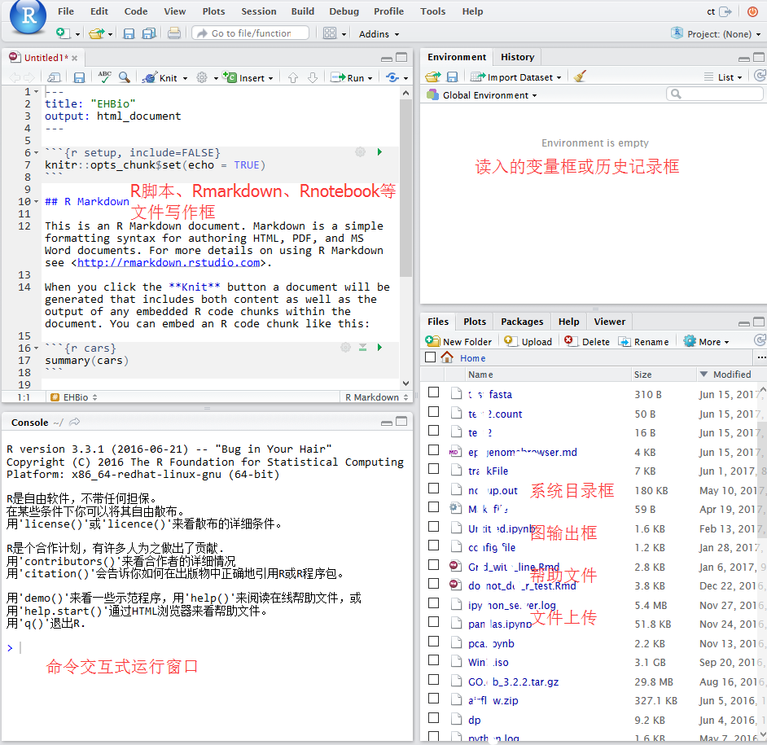
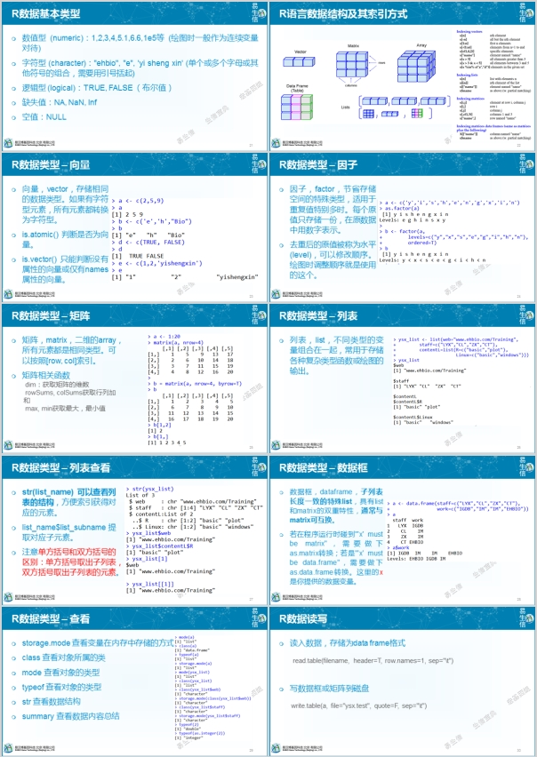

# R基础 {#Rbasic}

R语言是比较常用的统计分析和绘图语言，拥有强大的统计库、绘图库和生信分析的Bioconductor库，是学习生物信息分析的必备语言之一。

## R安装

**Linux下安装**

如果使用的是新版的操作系统。直接可以用`sudo apt-get install r-base` 或者`yum install r-base`来安装。

若系统版本老，或没有根用户权限，则需要下载编译源码安装，最新地址为<https://cran.r-project.org/src/base/R-latest.tar.gz>。

具体编译方式为 (Linux下软件安装见 <http://blog.genesino.com/2016/06/bash1>):

```
# configure是收集系统信息，生成Makefile的过程
# --enable-R-shlib 需要设置，使得其他程序包括Rstudio可以使用R的动态库
# --prefix指定软件安装目录，需使用绝对路径
./configure --prefix=/home/ehbio/R/4.0.2 --enable-R-shlib

# 也可以使用这个命令，共享系统的blas库，提高运输速度
#./configure --prefix=/home/ehbio/R/4.0.2 --enable-R-shlib --with-blas --with-lapack

# make是编译的过程
make

# 安装到指定目录的过程
make install
```

安装完成之后，在Linux终端输入`R`即可启动交互式运行界面，`ctrl+d`退出`R`运行界面。若提示`找不到命令`，需要判断有没有加入进环境变量。

**Windows下安装**

下载 <https://cran.r-project.org/bin/windows/>双击就可以了。

两者都需要考虑环境变量，若有问题，见文后的参考。

## Rstudio基础

Rstudio是编辑、运行R语言的最为理想的工具之一，支持纯R脚本、Rmarkdown (脚本文档混排)、Bookdown (脚本文档混排成书)、Shiny (交互式网络应用)等。

### Rstudio版本

Rsdutio分为桌面版和服务器版，桌面版可以在单机使用，服务器版可以从浏览器访问供多人使用。

服务器版安装好之后，访问地址为<服务器IP:8787> (8787为默认端口号)，用户名和密码为Linux用户的用户名和密码。

```{r,echo=F}

```

### Rstudio安装

**Linux下安装服务器版**

安装参考 <https://www.rstudio.com/products/rstudio/download-server/>
  
```
# 自己根据自己安装时间自己去获取最新软件的下载地址
wget https://download2.rstudio.org/rstudio-server-rhel-1.2.5001-x86_64.rpm
sudo yum install --nogpgcheck rstudio-server-rhel-1.2.5001-x86_64.rpm
```

安装完之后的检测、启动和配置
  
```
sudo rstudio-server verify-installation #查看是否安装正确
sudo rstudio-server start ## 启动
sudo rstudio-server status ## 查看状态
sudo rstudio-server stop ## 停止
ifconfig | grep 'inet addr' ## 查看服务端ip地址
sudo rstudio-server start ## 修改配置文件后重启
sudo rstudio-server active-sessions ## 列出活跃的sessions:
sudo rstudio-server suspend-session <pid> ## 暂停session
sudo rstudio-server suspend-all ##暂停所有session
```

* Rstudio日志目录，方便查看错误信息：/var/log/rstudio-server/
* 配置文件：
  * /etc/rstudio/rserver.conf 
  	
```bash
www-port=8787 (default)
www-address=0.0.0.0 (default)
rsession-ld-library-path=/opt/local/lib:/opt/local/someapp/lib
rsession-which-r=/usr/local/bin/R
```

  * /etc/rstudio/rsession.conf
    * Timeout
	
```
[user]
session-timeout-minutes=30
[@powerusers]
session-timeout-minutes=0
```

**Windows下安装桌面版**

下载之后 (<https://www.rstudio.com/products/rstudio/download2/>)双击安装 (若windows登录名为中文，需要使用**管理员权限**)，其它无需要注意的。


### Rstudio 使用

Windows下桌面版直接双击打开即可使用，Linux服务器版访问地址为**服务器IP:8787**，用户名和密码为Linux用户的用户名和密码。

#### Rstudio 界面

```{r, echo=F}

```

#### Rstudio中新建或打开文件

如果是桌面版，直接就可以访问"我的电脑"去打开之前写过的脚本。如果是服务器版，可直接访问服务器上写过的脚本。Rstudio右下1/4部分可以切换目录，点击more，设置工作目录。可以上传本地的脚本到对应目录打开。


```{r eval=html,echo=F}
knitr::include_graphics("images/Rstudio.gif")
```

## R基本语法

```{r}

```

### 获取帮助文档，查看命令或函数的使用方法、事例或适用范围

```r
>>> ?command
>>> ??command #深度搜索或模糊搜索此命令

>>> example(command) #得到命令的例子

>>> example(plot)
```

### R中的变量及其初始化

```{r, echo=T}
# 数字变量
a <- 10
a
```

```{r, echo=T}
# 字符串变量
a <- "abc"
a
```


```{r, echo=T}
# 逻辑变量
a <- TRUE
a
```

```{r, echo=T}
b <- T
b
```


```{r, echo=T}
d <- FALSE
d
```


```{r, echo=T}
# 向量
a <- vector(mode="logical", length=5)
a
```


```{r, echo=T}
a <- c(1,2,3,4)
# 判断一个变量是不是vector
is.vector(a)
```

```{r, echo=T}
a <- list(element1=c(1,2,3,4), element2=1:5)
a
```

```{r, echo=T}
# 矩阵
a <- matrix(1:20,nrow=5,ncol=4,byrow=T)
a
```

```{r, echo=T}
is.matrix(a)
```


```{r, echo=T}
dim(a) #查看或设置数组的维度向量
```

```{r, echo=T}
# 错误的用法
# dim(a) <- c(4,4)
```

```{r, echo=T}
# 正确的用法
a <- 1:20
dim(a) <- c(5,4) #转换向量为矩阵
a
```

```{r, echo=T}
print(paste("矩阵a的行数", nrow(a)))
```

```{r, echo=T}
print(paste("矩阵a的列数", ncol(a)))
```

```{r, echo=T}
#查看或设置行列名
rownames(a)
```


```{r, echo=T}
rownames(a) <- c('a','b','c','d','e')
a
```

```{r, echo=T}
# R中获取一系列的字母
letters[1:4]
```

```{r, echo=T}
colnames(a) <- letters[1:4]
a
```

### 变量类型和转换

不同的变量类型有不同的操作方式，`is`系列和`as`系列函数用来判断变量的属性和转换变量的属性

```{r, echo=T}
is.character(a)
```

```{r, echo=T}
is.numeric(a)
```

```{r, echo=T}
is.matrix(a)
```

```{r, echo=T}
is.data.frame(a)
```

```{r, echo=T}
is.data.frame(as.data.frame(a))
```

### R中矩阵运算

```{r, echo=T}
# 获得随机的正态分布数据
# random generation for the normal distribution with mean equal to ‘mean’
# and standard deviation equal to ‘sd’.
rnorm(10, mean = 0, sd = 1) # 正态分布的随机数
```

```{r, echo=T}
# 获得随机的均匀分布的数据
# random generation for the uniform distribution with mean equal to ‘mean’
# and standard deviation equal to ‘sd’.
runif(10, min = 0, max = 1) # 平均分布的随机数
```

```{r, echo=T}
rep(1,5) # 把1重复5次
```

```{r, echo=T}
scale(1:5) # 标准化数据
```

`scale`默认操作对等于

```{r, echo=T}
# 标准化数据
a <- 1:5
(a - mean(a)) / sd(a)
```


```{r, echo=T}
a <- c(rnorm(5), rnorm(5,1), runif(5), runif(5,-1,1), 1:5, rep(0,5), c(2,10,11,13,4), 
		scale(1:5)[1:5])
a
```


```{r, echo=T}
# ncol=5 5列
# byrow=T: 先填充行
a <- matrix(a, ncol=5, byrow=T)
a
```


```{r, echo=T}
# 按行加和
rowSums(a)
```


```{r, echo=T}
# 注意检查括号的配对
#a <- a[rowSums(abs(a)!=0,]
#错误: 意外的']' in "a <- a[rowSums(abs(a)!=0,]"

# 去除全部为0的行
a <- a[rowSums(abs(a))!=0,]

# 另外一种方式去除全部为0的行
#a[rowSums(a==0)<ncol(a),]

a
```

矩阵运算，R默认针对整个数据进行常见运算

```{r, echo=T}
#所有值都乘以2
a * 2
```

```{r, echo=T}
# 所有值取绝对值，再取对数 （取对数前一般加一个数避免对0或负值取对数）
log2(abs(a)+1)
```


```{r, echo=T}

# 取出最大值、最小值、行数、列数
max(a)
```

```{r, echo=T}
min(a)
```

```{r, echo=T}
nrow(a)
```

```{r, echo=T}
ncol(a)
```

```{r, echo=T}
#增加一列或一行
#cbind: column bind
cbind(a, 1:7)
```

 
```{r, echo=T}
# rbind: row bind
rbind(a,1:5)
```


```{r, echo=T}
# 计算每一行的var (方差)
# apply表示对数据（第一个参数）的每一行 (第二个参数赋值为1) 或每一列 (2)操作
#      最后返回一个列表
apply(a,1,var)
```


```{r, echo=T}
# 计算每一行的mad (中值绝对偏差)
# 一般认为比方差的鲁棒性更强，更少受异常值的影响，更能反映数据间的差异)
# 函数中的第二个参数 1 表示安行操作
apply(a,1,mad)
```

```{r, echo=T}
# 计算每一列的平均值
apply(a,2,mean)
```


```{r, echo=T}
# 取出中值绝对偏差大于0.5的行
b = a[apply(a,1,mad)>0.5,]
b
```

```{r,echo=T}
# 输出 1 4 2 3 5
# 解释：原列表第一个元素显示在第一位
#       原列表第四个元素显示在第二位
#       原列表第二个元素显示在第三位
order(c(1,3,4,2,5))
```

```{r, echo=T}
# 产生新的顺序
# 
order(apply(b,1,mad), decreasing=T)
```

```{r, echo=T}
# 矩阵按照mad的大小降序排列
c = b[order(apply(b,1,mad), decreasing=T),]
c
```

```{r, echo=T}
rownames(c) <- paste('Gene', letters[1:nrow(c)], sep="_")
colnames(c) <- toupper(letters[1:ncol(c)])
c
```

```{r, echo=T}
# 矩阵转置
expr = t(c)
expr
```


```{r, echo=T}
# 矩阵值的替换
expr2 = expr
expr2[expr2<0] = 0
expr2
```


```{r, echo=T}
# 矩阵中只针对某一列替换
# expr2是个矩阵不是数据框，不能使用列名字索引
# expr2[expr2$Gene_b<1, "Gene_b"] <- 1
```


```{r, echo=T}
# str是一个最为常用、好用的查看变量信息的工具，尤其是对特别复杂的变量，
#    可以看清其层级结构，便于提取数据
str(expr2)
```


```{r, echo=T}
# 转换为数据框，再进行相应的操作
expr2 <- as.data.frame(expr2)
str(expr2)
```

```{r, echo=T}
expr2[expr2$Gene_b<1, "Gene_b"] <- 1
expr2
```


### R中矩阵筛选合并

```{r, echo=T}
# 读入样品信息
sampleInfo = "Samp;Group;Genotype
A;Control;WT
B;Control;WT
D;Treatment;Mutant
C;Treatment;Mutant
E;Treatment;WT
F;Treatment;WT"

phenoData = read.table(text=sampleInfo,sep=";", header=T, row.names=1, quote="")
phenoData
```


```{r, echo=T}
# 把样品信息按照基因表达矩阵中的样品信息排序，并只保留有基因表达信息的样品
# ‘%in%’ is a more intuitive interface as a binary operator, which
#     returns a logical vector indicating if there is a match or not for
#     its left operand.
	 
phenoData = phenoData[rownames(phenoData) %in% rownames(expr),]
phenoData
```

```{r, echo=T}
# 合并矩阵
# by=0 表示按照行的名字排序
# by=columnname 表示按照共有的某一列合并
# 合并后多出了新的一列Row.names
merge_data = merge(expr, phenoData, by=0, all.x=T)
merge_data
```

```{r, echo=T}
rownames(merge_data) <- merge_data$Row.names
merge_data
```

```{r, echo=T}
# 去除一列；-1表示去除第一列
merge_data = merge_data[,-1]
merge_data
```


```{r, echo=T}
# 提取出所有的数值列
merge_data[sapply(merge_data, is.numeric)]
```


### `str`的应用

`str`:  Compactly display the internal *str*ucture of an R object, a
     diagnostic function and an alternative to 'summary (and to some
     extent, 'dput').  Ideally, only one line for each 'basic'
     structure is displayed.  It is especially well suited to compactly
     display the (abbreviated) contents of (possibly nested) lists.
     The idea is to give reasonable output for *any* R object.  It
     calls ‘args’ for (non-primitive) function objects.

`str`用来告诉结果的构成方式，对于不少Bioconductor的包，或者复杂的R函数的输出，都是一堆列表的嵌套，`str(complex_result)`会输出每个列表的名字，方便提取对应的信息。
	 
```{r, echo=T}
# str的一个应用例子
str(list(a = "A", L = as.list(1:100)), list.len = 9)
```


利用`str`查看`pca`的结果，具体的`PCA`应用查看 <http://mp.weixin.qq.com/s/sRElBMkyR9rGa4TQp9KjNQ>。

```{r, echo=T}
pca_result <- prcomp(expr)
pca_result
```

```{r, echo=T}
str(pca_result)
```

```{r, echo=T}
# 取出每个主成分解释的差异
pca_result$sdev

```

### R的包管理


什么时候需要安装包

```r
library('unExistedPackage')
Error in library("unExistedPackage") : 
  不存在叫‘unExistedPackage’这个名字的程辑包
```

如何安装R包

```
install.packages("package_name")
# 指定安装来源
install.packages("package_name", repo="http://cran.us.r-project.org")

# 安装Bioconductor的包
if (!requireNamespace("BiocManager", quietly = TRUE))
      install.packages("BiocManager", update = F)
BiocManager::install(c("RUVSeq","pcaMethods"))

# 安装Github的R包
install.packages("devtools")
devtools::install_github("JustinaZ/pcaReduce")

# 手动安装, 首先下载包的源文件（压缩版就可），然后在终端运行下面的命令。
ct@ehbio:~$ R CMD INSTALL package.tar.gz

# 移除包
remove.packages("package_name")

# 查看所有安装的包
library()

# 查看特定安装包的版本
installed.packages()[c("ggplot2"), c("Package", "Version")]

#  Package  Version 
# "ggplot2" "3.3.2" 

# 查看默认安装包的位置
.libPaths()

# 查看已加载的包
.packages()

# 调用安装的包
library(package_name)
```

自动安装包

```r
usePackage <- function(p) {
	if (!requireNamespace(p, quietly = TRUE))
      BiocManager::install(p, update = F)
	require(p, character.only = TRUE)
}
```

## ggplot2绘图

```{r, echo=T}
data <- "Gene;Sample;Group;Abundance
Gene1;KO1;KO;1.2
Gene2;KO1;KO;1.4
Gene3;KO1;KO;16
Gene4;KO1;KO;10
Gene5;KO1;KO;25
Gene6;KO1;KO;30
Gene7;KO1;KO;2
Gene8;KO1;KO;3
Gene1;KO2;KO;1.2
Gene2;KO2;KO;1.4
Gene3;KO2;KO;16
Gene4;KO2;KO;10
Gene5;KO2;KO;25
Gene6;KO2;KO;30
Gene7;KO2;KO;2
Gene8;KO2;KO;3
Gene1;KO3;KO;1.2
Gene2;KO3;KO;1.4
Gene3;KO3;KO;16
Gene4;KO3;KO;10
Gene5;KO3;KO;25
Gene6;KO3;KO;30
Gene7;KO3;KO;2
Gene8;KO3;KO;3
Gene8;WT1;WT;1.2
Gene7;WT1;WT;1.4
Gene6;WT1;WT;16
Gene5;WT1;WT;10
Gene4;WT1;WT;25
Gene3;WT1;WT;30
Gene2;WT1;WT;2
Gene1;WT1;WT;3
Gene8;WT2;WT;1.2
Gene7;WT2;WT;1.4
Gene6;WT2;WT;16
Gene5;WT2;WT;10
Gene4;WT2;WT;25
Gene3;WT2;WT;30
Gene2;WT2;WT;2
Gene1;WT2;WT;3
Gene8;WT3;WT;1.2
Gene7;WT3;WT;1.4
Gene6;WT3;WT;16
Gene5;WT3;WT;10
Gene4;WT3;WT;25
Gene3;WT3;WT;30
Gene2;WT3;WT;2
Gene1;WT3;WT;3"

data <- read.table(text=data, header=T, row.names=NULL, sep=";")

data[sample(1:nrow(data),6),]
```

```{r, echo=T}
# 加载包
library(ggplot2)
```

初始化ggplot，建立坐标系

```{r, echo=T}
p <- ggplot(data, aes(x=Sample, y=Gene))
p
```
绘制几何属性

```{r, echo=T}
p + geom_point()
```
映射数据到几何形状的属性，如颜色

```{r, echo=T}
p + geom_point(aes(color=Abundance))
```

映射数据到几何形状的属性，如大小

```{r, echo=T}
p + geom_point(aes(size=Abundance))
```

自定义颜色

```{r, echo=T}
p + geom_point(aes(color=Abundance)) + scale_color_continuous(low="green", high="red")
```

设置主题属性

```{r, echo=T}
p + geom_point(aes(color=Abundance)) + scale_color_continuous(low="green", high="red") + theme_classic()
```

放大点，并添加文字作为label

```{r, echo=T}
p + geom_point(aes(color=Abundance), size=10) + 
                 scale_color_continuous(low="green", high="red") + 
                 geom_text(aes(label=Abundance)) +
                 theme_classic()
```

自定义注释

```{r, echo=T}
p + geom_point(aes(color=Abundance), size=10) + 
  scale_color_continuous(low="green", high="red") + 
  geom_text(aes(label=Abundance)) +
  annotate("rect",xmin=0.5, xmax=3.5, ymin=5.5,ymax=6.5,alpha=0.2) + 
  theme_classic()
```

绘制热图

```{r, echo=T}
p + geom_tile(aes(fill=Abundance)) + 
  scale_fill_continuous(low="green", high="red") + 
  geom_text(aes(label=Abundance)) +
  theme_classic()
```

转换坐标系

```{r, echo=T}
p + geom_tile(aes(fill=Abundance)) + 
  scale_fill_gradient(low = "white", high = "steelblue") +
  geom_text(aes(label=Abundance)) +
  coord_polar(theta="x") + 
  theme(panel.background=element_blank(),
           axis.title=element_blank(),
           panel.grid=element_blank(),
           axis.ticks=element_blank(),
           axis.text.y=element_text(size=5))
```


更改横轴的顺序

```{r, echo=T}
# paste0(rep(c("WT","KO"),each=3), rep(1:3))
data$Sample <- factor(data$Sample,levels=c("WT1","WT2","WT3","KO1","KO2","KO3"), ordered=T)
p <- ggplot(data, aes(x=Sample, y=Gene)) + 
  geom_tile(aes(fill=Abundance)) + 
  scale_fill_continuous(low="green", high="red") + 
  geom_text(aes(label=Abundance)) +
  theme_classic()
p
```

箱线图展示

```{r, echo=T}
p <- ggplot(data, aes(x=Sample, y=Abundance)) + 
  geom_boxplot(aes(fill=Group))
p
```


小提琴图加点的连线

```{r, echo=T}
# geom_line把同一个Gene的数据作为一组
p <- ggplot(data, aes(x=Group, y=Abundance)) + 
  geom_violin(aes(fill=Group), alpha=0.5) +
  geom_line(aes(group=Gene), alpha=0.5)
p
```

```{r}
library(ggpubr)
ggviolin(data, x="Group", y="Abundance", fill="Group", palette = "npg", add=c("jitter")) + stat_compare_means(comparisons = list(c("KO", "WT")))
```


### 数据格式转换和字符串处理

假如我们的数据如下形式，如何完成上面的图的绘制？

```
KO1;KO2;KO3;WT1;WT2;WT3
Gene1;1.2;1.2;1.2;3.0;3.0;3.0
Gene2;1.4;1.4;1.4;2.0;2.0;2.0
Gene3;16.0;16.0;16.0;30.0;30.0;30.0
Gene4;10.0;10.0;10.0;25.0;25.0;25.0
Gene5;25.0;25.0;25.0;10.0;10.0;10.0
Gene6;30.0;30.0;30.0;16.0;16.0;16.0
Gene7;2.0;2.0;2.0;1.4;1.4;1.4
Gene8;3.0;3.0;3.0;1.2;1.2;1.2
```

读入数据，查看数据格式 (注意：`read.table`中参数与之前的不同地方在哪？为什么？)

```{r, echo=T}
data_matrix = "KO1;KO2;KO3;WT1;WT2;WT3
Gene1;1.3;1.2;1.4;3.1;3.2;3.3
Gene2;1.1;1.9;1.6;2.3;2.2;2.1
Gene3;16.8;17.0;18.0;33.0;30.0;35.0
Gene4;11.0;13.0;12.0;25.0;26.0;28.0
Gene5;20.0;25.0;23.0;9.0;10.0;13.0
Gene6;33.0;30.0;35.0;16.0;17.0;16.0
Gene7;2.0;2.3;2.0;1.4;1.8;1.4
Gene8;3.0;3.6;3.0;1.2;1.9;1.2"
data_matrix <- read.table(text=data_matrix, header=T, row.names=1, sep=";")
data_matrix
```

宽矩阵转换为长矩阵

```{r}
library(tidyr)

data_matrix$Gene <- rownames(data_matrix) 

data_matrix_long <- gather(data_matrix, key="Sample", value="Abundance", -Gene)

head(data_matrix_long)
```

```{r}
data_matrix_long <- data_matrix_long %>% separate("Sample", c("Group", "Rep"), sep=2, remove=F)

head(data_matrix_long)
```

获取分组信息 (分组名字等长)

```{r, echo=T, eval=F}
library(stringr)
data_matrix_long$Group2 <- str_sub(data_matrix_long$Sample,start=1,end=2)

head(data_matrix_long)
```


另外一种拆分样本名字的方式 (分组名字和生物重复之间分隔符固定)

```{r, echo=T}
library(stringr)
library(tidyr)

data_matrix2 = "KO_1;KO_2;KO_3;WT_1;WT_2;WT_3
Gene1;1.3;1.2;1.4;3.1;3.2;3.3
Gene2;1.1;1.9;1.6;2.3;2.2;2.1
Gene3;16.8;17.0;18.0;33.0;30.0;35.0
Gene4;11.0;13.0;12.0;25.0;26.0;28.0
Gene5;20.0;25.0;23.0;9.0;10.0;13.0
Gene6;33.0;30.0;35.0;16.0;17.0;16.0
Gene7;2.0;2.3;2.0;1.4;1.8;1.4
Gene8;3.0;3.6;3.0;1.2;1.9;1.2"
data_matrix2 <- read.table(text=data_matrix2, header=T, row.names=1, sep=";")

data_matrix2$Gene <- rownames(data_matrix2) 

data_matrix_long2 <- gather(data_matrix2, key="Sample", value="Abundance", -Gene)

head(data_matrix_long2)
```

```{r}
data_matrix_long2$Group <- str_split(data_matrix_long2$Sample, pattern="_", simplify=T)[,1]
head(data_matrix_long2)
```

使用`separate`更简单

```{r}
data_matrix_long2 %>% separate(Sample, c("Group", "Rep"),sep="_", remove=F)
```


字符串拼合

```{r}
library(tidyr)
# group_rep <- as.data.frame(str_split(data_matrix_long2$Sample, pattern="_", simplify=T))
# colnames(group_rep) <- c("Group", "Rep")
# unite(group_rep, col="Sample", sep="_")

data_matrix_long2 %>% separate(Sample, c("Group", "Rep"),sep="_", remove=F) %>% unite(col="Sample2", c("Group","Rep"), sep="-", remove=F)

```

用柱状图看下每个Gene在不同组的表达情况

```{r}
library(ggplot2)
library(dplyr)
# 给定数据，和x轴、y轴所在列名字
# 直接使用geom_bar就可以绘制柱状图
# position: dodge: 柱子并排放置
p <- ggplot(data_matrix_long, aes(x=Gene, y=Abundance))
p + geom_bar(stat="identity", position="dodge", aes(fill=Sample))

# 如果没有图形界面，运行下面的语句把图存在工作目录下的Rplots.pdf文件中
#dev.off()
```
柱子有点多，也可以利用mean±SD的形式展现

首先计算平均值和标准差，使用`group_by`按`Gene, Group`分组，对每组做`summarize`。

```{r}
data_matrix_long %>% arrange(Gene)
```


```{r}
library(dplyr)
# 获取平均值和标准差
data_m_sd_mean <- data_matrix_long %>% group_by(Gene, Group) %>% 
	dplyr::summarise(sd=sd(Abundance), mean_value=mean(Abundance))
data_m_sd_mean <- as.data.frame(data_m_sd_mean)
data_m_sd_mean
```


使用`geom_errorbar`添加误差线

```{r}
p <- ggplot(data_m_sd_mean, aes(x=Gene, y=mean_value, group=Group)) + 
	   geom_bar(stat="identity", position="dodge", aes(fill=Group)) +
     geom_errorbar(aes(ymin=mean_value-sd, ymax=mean_value+sd), width=0.2, position=position_dodge(width=0.9))
p
```

采用`ggpubr`绘制`barplot+errorbar`

```{r}
library(ggpubr)
ggbarplot(data_matrix_long, x = "Gene", y = "Abundance", color = "Group", #add.params = list(group = "Group"),
 add = c("mean_se","jitter"), palette = c("#00AFBB", "#E7B800"),
 position = position_dodge())
```

绘制带Error-bar的堆叠柱状图

```{r}
library(plyr) 
data_m_sd_mean_stack <- data_m_sd_mean
factor_level <- unique(data_m_sd_mean_stack$Group)
data_m_sd_mean_stack$Group <- factor(data_m_sd_mean_stack$Group, levels=factor_level, ordered=T)
mydata2 <- ddply(data_m_sd_mean_stack,.(Gene),transform,ymin = cumsum(mean_value) - sd,ymax = cumsum(mean_value) + sd)  
mydata2
```

```{r}
library(RColorBrewer)

cols = colorRampPalette(brewer.pal(9, "Paired"))(length(factor_level))
mydata2$Group <- factor(mydata2$Group, levels=rev(factor_level), ordered=T)
p <- ggplot(mydata2, aes(x=Gene, y=mean_value, group=Group)) + 
	   geom_bar(stat="identity", aes(fill=Group), position = "stack") +
     scale_fill_manual(values=cols) + 
     geom_errorbar(aes(ymin=ymin, ymax=ymax), width=0.2,color="black", position=position_identity())
p
```

在柱子中标记百分比值

首先计算百分比，同样是`group_by` (按照给定的变量分组，然后按组操作)和`mutate`两个函数(在当前数据表增加新变量)

```{r}
# group_by: 按照给定的变量分组，然后按组操作
# mutate: 在当前数据表增加新变量
# 第一步增加每个组的加和，第二步计算比例
data_m <- data_matrix_long
data_m <- data_m %>% group_by(Gene) %>% mutate(count=sum(Abundance), freq=round(100*Abundance/count,2)) %>% arrange(Gene, Sample)

head(data_m)
```

再标记相对比例信息

```{r}
p <- ggplot(data_m, aes(x=Gene, y=Abundance, group=Group)) +
	geom_bar(stat="identity", position="fill", aes(fill=Sample)) +
	scale_y_continuous(labels = scales::percent) +
	geom_text(aes(label=freq), position=position_fill(vjust=0.5))
p
```


### 配色

序列型颜色板适用于从低到高排序明显的数据，浅色数字小，深色数字大。

```{r}
library(RColorBrewer)
display.brewer.all(type = "seq")
```

离散型颜色板适合带“正、负”的，对极值和中间值比较注重的数据。

```{r}
display.brewer.all(type = "div")
```


分类型颜色板比较适合区分分类型的数据。

```{r}
display.brewer.all(type = "qual")
```


### pheatmap绘制热图


```{r, echo=T}
data_matrix = "KO1;KO2;KO3;WT1;WT2;WT3
Gene1;1.2;1.2;1.2;3.0;3.0;3.0
Gene2;1.4;1.4;1.4;2.0;2.0;2.0
Gene3;16.0;16.0;16.0;30.0;30.0;30.0
Gene4;10.0;10.0;10.0;25.0;25.0;25.0
Gene5;25.0;25.0;25.0;10.0;10.0;10.0
Gene6;30.0;30.0;30.0;16.0;16.0;16.0
Gene7;2.0;2.0;2.0;1.4;1.4;1.4
Gene8;3.0;3.0;3.0;1.2;1.2;1.2"

data_matrix <- read.table(text=data_matrix, header=T, row.names=1, sep=";")

head(data_matrix)
```

```{r, eval=F}
#data_matrix <- read.table("gene_expr_mat.txt", header=T, row.names=1, sep="\t")

#head(data_matrix)
```

```{r, echo=T}
library(pheatmap)
pheatmap(data_matrix)
```


```{r, echo=T}
metadata <- "samp;Grp
WT1;WT
WT2;WT
WT3;WT
KO1;KO
KO2;KO
KO3;KO"

metadata <- read.table(text=metadata, header=T, row.names=1, sep=";")

pheatmap(data_matrix, annotation_col = metadata)
```


```{r, echo=T}
colorL = colorRampPalette(c("green","red"))(30)

pheatmap(data_matrix, annotation_col = metadata, color = colorL)
```


## CheetSheets

<https://www.rstudio.com/resources/cheatsheets/>

## 参考

* [生信宝典Linux系列](https://mp.weixin.qq.com/mp/appmsgalbum?__biz=MzI5MTcwNjA4NQ==&action=getalbum&album_id=1336510271359385600&subscene=21&scenenote=https%3A%2F%2Fmp.weixin.qq.com%2Fs%3F__biz%3DMzI5MTcwNjA4NQ%3D%3D%26mid%3D2247491983%26idx%3D1%26sn%3D2052e7a038f2db52eb282b88495a7dfd%26scene%3D21%26key%3Dbbd9db2a3d7572cddf07b767465efb56a0803b43fcdfeb1e1e9a662169975f57a1db506a826a6c934f03cc98245cd6cc1251c956555a9bdbb33b71e6fc4aec05daa254d390b8f4e2faee9da13572aa4d%26ascene%3D7%26uin%3DOTY2MDEyMzgw%26devicetype%3DWindows%2B10%2Bx64%26version%3D62090529%26lang%3Dzh_CN%26exportkey%3DARBvdJ7O%252BwuOu7%252FdoD45yto%253D%26pass_ticket%3D6oR4VId9JNdCLZp2iJjodI21oAREmYTa3D%252F9nfZlbY8TG5eZ3ToAoRlMm5nwdtwk%26winzoom%3D1#wechat_redirect)
* [生信宝典R系列](https://mp.weixin.qq.com/mp/appmsgalbum?__biz=MzI5MTcwNjA4NQ==&action=getalbum&album_id=1335864997100224512&subscene=21&scenenote=https%3A%2F%2Fmp.weixin.qq.com%2Fs%3F__biz%3DMzI5MTcwNjA4NQ%3D%3D%26mid%3D2247490572%26idx%3D1%26sn%3Dc2ba3cb9e8117efff6bfd53c9f797109%26scene%3D21%26key%3D14893ff72db1d5ee36ae599230370c4cdd9e49dbfdd44fe73757d5c60d26ff6e698d2ccc26b16c7898a5164ac9ddb35f990c0bfeb88037b926c9eb29fbaf9867d2ad02e4b2e6da694013a82c124b6e44%26ascene%3D7%26uin%3DOTY2MDEyMzgw%26devicetype%3DWindows%2B10%2Bx64%26version%3D62090529%26lang%3Dzh_CN%26exportkey%3DAWleeoJ2D3RuwW6exYsshOM%253D%26pass_ticket%3D6oR4VId9JNdCLZp2iJjodI21oAREmYTa3D%252F9nfZlbY8TG5eZ3ToAoRlMm5nwdtwk%26winzoom%3D1#wechat_redirect)

