# R plots {#Rplots}

## qplot绘制图形 (王绪宁) {#plot}

ggplot2中两大精髓的函数分别为 `qplot` (快速作图quick plot)，类似于R中基本的`plot`和`ggplot` (更符合ggplot2图层式绘图理念，一层层添加修改)。

测试数据是`ggplot2`包中自带的`diamond`数据，每一行为一种钻石，每一列为钻石不同的属性，如`carat` (克拉), `cut` (切工), `color` (色泽), `clarity` (透明度)等。


```{r}
library(ggplot2)
set.seed(23)
dat <- diamonds[sample(nrow(diamonds), 1000),]
head(dat)
```

数据读进来后，怎么绘制呢？

1. 绘制散点图，横轴是克拉数，纵轴是价格 (正相关)

```{r}
qplot(carat,price,data=dat)
```

绘制散点图，对x,y值取log

```{r}
qplot(log(carat),log(price),data=dat)
```

颜色、大小、性状和其他属性的设置

```{r}
qplot(carat,price,data=dat,colour=color)
```

```{r}
qplot(carat,price,data=dat,shape=cut)#以cut为分类依据设置不同的形状
```

**几何对象**

`qplot()`函数配合不同的几何对象便可绘制出不同的图形:

* 点图 `geom="point"`   
* 平滑曲线 `geom="smooth"`    
* 箱线图 `geom="boxplot"`
* 任意方向的路径性`geom="path"`   
* 线条图 `geom="line"` (从左到右连接)
* 对于连续变量，直方图`geom="histogram"`    
* 频率多边图 `geom="freqpoly"`
* 绘制密度曲线 `geom="density"`
* 如果只有x参数传递给qplot(),那么默认是直方图
* 对于离散变量，geom=“bar”绘制条形图

```{r}
#向图形中加入平滑曲线(#从本张图片可以逐渐体会ggplot绘图的强大，
#后期应用ggplot()函数后，可以更加自由的绘制各种组合图形)
qplot(carat,price,data=dat,geom=c("point","smooth"))#添加了一条拟合曲线
#拟合曲线默认的方法为method="loss",程序会根据数据点的多少自动选取，曲线周围的灰色部分为标准误，可以用se=FALSE曲线
```

**绘制其他常见图形**

1. 箱线图

```{r}
qplot(color,price/carat,data=dat,geom="boxplot")
```


2. 绕动图 (抖动图)

```{r}
qplot(color,price/carat,data=diamonds,geom="jitter")
```

3. 直方图

```{r}
qplot(carat,data=dat,geom="histogram")
```

4. 密度曲线图

```{r}
qplot(carat,data=dat,geom="density")
```

5. 条形图

```{r}
qplot(color,data=dat,geom="bar")
```

6. 时间序列线条图,采用另一个数据集economics

```{r}
qplot(date,unemploy/pop,data=economics,geom="line")
```

7. 分面绘图`facet`=分类变量

```{r, fig.height=10}
qplot(carat,data=dat,facets=color ~ .,geom="histogram",binwidth=0.1,xlim=c(0,3))
```

以上为ggplot2包中常见图形的快速绘制 (`quickplot`)即`qplot`函数的应用。
`qplot`函数还有很多其他的参数, 对`xlim`,`ylim`设置`x`,`y`轴的区间例如`xlim=c(0,20)`; 对轴取`log`值，`log="x"`,对x轴取对数，`log="xy"`表示对x轴和y轴取对数;main：图形的主题main="qplot title"; #xlab,ylab:设置轴标签文字

```{r}
qplot(carat,price,data=dat,
     xlab="Price($)",ylab="Weight(carat)",
     main="Price-Weight relationship")
```


## 热图绘制 {#ggplot2_heatmap}

热图是做分析时常用的展示方式，简单、直观、清晰。可以用来显示基因在不同样品中表达的高低、表观修饰水平的高低、样品之间的相关性等。任何一个数值矩阵都可以通过合适的方式用热图展示。

本篇使用R的`ggplot2`包实现从原始数据读入到热图输出的过程，并在教程结束后提供一份封装好的命令行绘图工具，只需要提供矩阵，即可一键绘图。

上一篇讲述了Rstudio的使用作为R写作和编译环境的入门，后面的命令都可以拷贝到Rstudio中运行，或写成一个R脚本，使用`Rscript heatmap.r`运行。我们还提供了Bash的封装，在不修改R脚本的情况下，改变参数绘制出不同的图形。


### 生成测试数据 {#ggplot2_heatmap_data}

绘图首先需要数据。通过生成几组向量，转换为矩阵，得到想要的数据。

```{r}
data <- c(1:6,6:1,6:1,1:6, (6:1)/10,(1:6)/10,(1:6)/10,(6:1)/10,1:6,6:1,6:1,1:6,
		6:1,1:6,1:6,6:1)
data
```
	
**注意**：运算符的优先级。

```{r}
1:3+4
```

```{r}
(1:3)+4
```

```{r}
1:(3+4)
```

Vector转为矩阵 (matrix)，再转为数据框 (data.frame)。

```{r}
# ncol: 指定列数
# byrow: 先按行填充数据
# ?matrix 可查看函数的使用方法
# as.data.frame的as系列是转换用的
data <- as.data.frame(matrix(data, ncol=12, byrow=T))
data
```


```{r}
# 增加列的名字
colnames(data) <- c("Zygote","2_cell","4_cell","8_cell","Morula","ICM","ESC",
		"4 week PGC","7 week PGC","10 week PGC","17 week PGC", "OOcyte")

# 增加行的名字
# 注意paste和paste0的使用
rownames(data) <- paste("Gene", 1:8, sep="_")

# 只显示前6行和前4列
head(data)[,1:4]
```

虽然方法比较繁琐，但一个数值矩阵已经获得了。

还有另外2种获取数值矩阵的方式。

* 读入字符串

```{r}
# 使用字符串的好处是不需要额外提供文件
# 简单测试时可使用，写起来不繁琐，又方便重复
# 尤其适用于在线提问时作为测试案例
txt <- "ID;Zygote;2_cell;4_cell;8_cell
+ Gene_1;1;2;3;4
+ Gene_2;6;5;4;5
+ Gene_3;0.6;0.5;0.4;0.4"

# 习惯设置quote为空，避免部分基因名字或注释中存在引号，导致读入文件错误。
# 具体错误可查看 http://blog.genesino.com/collections/R_tips/ 中的记录
data2 <- read.table(text=txt,sep=";", header=T, row.names=1, quote="")
head(data2)
```

可以看到列名字中以数字开头的列都加了**X**。一般要尽量避免行或列名字以**数字开头**，会给后续分析带来匹配问题；另外名字中出现的非字母、数字、下划线、点的字符都会被转为**点**，也需要注意，尽量只用字母、下划线和数字。

```{r}
# 读入时，增加一个参数`check.names=F`也可以解决问题。
# 这次数字前没有再加 X 了
data2 <- read.table(text=txt,sep=";", header=T, row.names=1, quote="", check.names = F)
head(data2)
```

* 读入文件

与上一步类似，只是把`txt`代表的文字存到文件中，再利用文件名读取，不再赘述。

```{r}
#data2 <- read.table("filename",sep=";", header=T, row.names=1, quote="")
```

### 转换数据格式 {#ggplot2_heatmap_dataformat}

数据读入后，还需要一步格式转换。在使用ggplot2作图时，有一种长表格模式是最为常用的，尤其是数据不规则时，更应该使用 （这点，我们在讲解箱线图时再说）。


`melt`：把正常矩阵转换为长表格模式的函数。工作原理是把全部的非id列的`数值列`转为1列 (列名默认为`value`)；所有字符列转为一列，列名默认为`variable`。

```{r}
# 如果包没有安装，运行下面一句，安装包
#install.packages(c("reshape2","ggplot2"))

library(reshape2)
library(ggplot2)

# 转换前，先增加一列ID列，保存行名字
data$ID <- rownames(data)


# id.vars 列用于指定哪些列为id列；这些列不会被merge，会保留为完整一列。
data_m <- melt(data, id.vars=c("ID"))
head(data_m)
```


### 分解绘图 {#ggplot2_heatmap_split}

数据转换后就可以画图了，分解命令如下：

```{r}
# data_m: 是前面费了九牛二虎之力得到的数据表
# aes: aesthetic的缩写，一般指定整体的X轴、Y轴、颜色、形状、大小等。
#      在最开始读入数据时，一般只指定x和y，其它后续指定
p <- ggplot(data_m, aes(x=variable,y=ID)) 

# 热图就是一堆方块根据其值赋予不同的颜色，所以这里使用fill=value, 用数值做填充色。
p <- p + geom_tile(aes(fill=value)) 

# ggplot2为图层绘制，一层层添加，存储在p中，在输出p的内容时才会出图。
p

## 如果你没有使用Rstudio或其它R图形版工具，而是在远程登录的服务器上运行的交互式R，
## 需要输入下面的语句，获得输出图形 （图形存储于R的工作目录下的Rplots.pdf文件中）。

## 如何指定输出，后面会讲到。
#dev.off()
```

热图出来了，但有点不对劲，横轴重叠一起了。一个办法是调整图像的宽度，另一个是旋转横轴标记。

```{r}
# theme: 是处理图美观的一个函数，可以调整横纵轴label的选择、图例的位置等。
# 这里选择X轴标签45度。
# hjust和vjust调整标签的相对位置，
# 具体见下图。
# 简单说，hjust是水平的对齐方式，0为左，1为右，0.5居中，0-1之间可以取任意值。
# vjust是垂直对齐方式，0底对齐，1为顶对齐，0.5居中，0-1之间可以取任意值。

p <- p + theme(axis.text.x=element_text(angle=45,hjust=1, vjust=1))
p
```

```{r}
#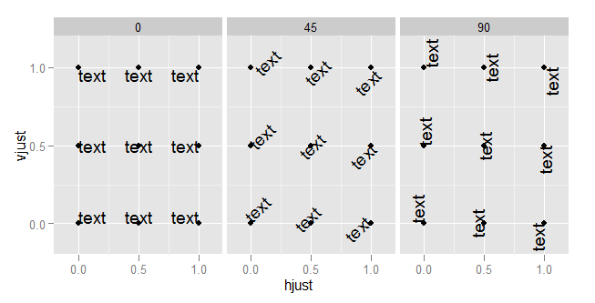
td <- expand.grid(
	hjust=c(0, 0.5, 1),
	vjust=c(0, 0.5, 1),
	angle=c(0, 45, 90),
	text="text"
)

ggplot(td, aes(x=hjust, y=vjust)) + 
    geom_point() +
	geom_text(aes(label=text, angle=angle, hjust=hjust, vjust=vjust)) + 
	facet_grid(~angle) +
	scale_x_continuous(breaks=c(0, 0.5, 1), expand=c(0, 0.2)) +
	scale_y_continuous(breaks=c(0, 0.5, 1), expand=c(0, 0.2))
```

<http://stackoverflow.com/questions/7263849/what-do-hjust-and-vjust-do-when-making-a-plot-using-ggplot>

设置想要的颜色。

```{r}
# 连续的数字，指定最小数值代表的颜色和最大数值赋予的颜色
# 注意fill和color的区别，fill是填充，color只针对边缘
p <- p + scale_fill_gradient(low = "white", high = "red")
p
```

调整legend的位置, `legend.position`, 可以接受的值有 `top`, `bottom`, `left`, `right`, 和一个坐标 `c(0.05,0.8)` (左上角，坐标是相对于图的左下角(即**原点**)计算的）

```{r}
p <- p + theme(legend.position="top")
p
```

调整背景和背景格线以及X轴、Y轴的标题。

```{r}
p <- p + xlab("samples") + theme_bw() + theme(panel.grid.major = element_blank()) + 
	theme(legend.key=element_blank())
p
```


为了使横轴旋转45度，需要把这句话`theme(axis.text.x=element_text(angle=45,hjust=1, vjust=1))`放在`theme_bw()`的后面。

```{r}
p <- p + theme(axis.text.x=element_text(angle=45,hjust=1, vjust=1))
p
```

合并以上命令，就得到了下面这个看似复杂的绘图命令。

```{r}
p <- ggplot(data_m, aes(x=variable,y=ID)) + xlab("samples") + theme_bw() + 
	theme(panel.grid.major = element_blank()) + theme(legend.key=element_blank()) + 
	theme(axis.text.x=element_text(angle=45,hjust=1, vjust=1)) + 
	theme(legend.position="top") +  geom_tile(aes(fill=value)) + 
	scale_fill_gradient(low = "white", high = "red") +
  geom_point(aes(color=value), size=6) +
  geom_text(aes(label=value))
p
```

也可以只用Point

```{r}
p <- ggplot(data_m, aes(x=variable,y=ID)) + xlab("samples") + theme_bw() + 
	theme(panel.grid.major = element_blank()) + theme(legend.key=element_blank()) + 
	theme(axis.text.x=element_text(angle=45,hjust=1, vjust=1)) + 
	theme(legend.position="top") +  	
  geom_point(aes(color=value), size=6) +
  scale_color_gradient(low = "white", high = "red") +
  geom_text(aes(label=value))
p
```


### 图形存储 {#ggplot2_heatmapsave}

图形出来了，就得考虑存储了，一般输出为`PDF`格式，方便后期的修改。

```{r}
# 可以跟输出文件不同的后缀，以获得不同的输出格式
# colormode支持srgb （屏幕）和cmyk （打印，部分杂志需要，看上去有点褪色的感觉）格式
ggsave(p, filename="heatmap.pdf", width=10,
        height=15, units=c("cm"),colormodel="srgb")
```

点击下载：[pdf](heatmap.pdf) 

至此，完成了简单的heatmap的绘图。但实际绘制时，经常会碰到由于数值变化很大，导致颜色过于集中，使得图的可读性下降很多。因此需要对数据进行一些处理，具体的下次再说。

## 热图美化 {#ggplot2_heatmapmeihua}

上面的测试数据，数值的分布比较均一，相差不是太大，但是`Gene_4`和`Gene_5`由于整体的值低于其它的基因，从颜色上看，不仔细看，看不出差别。

```{r}
data <- c(rnorm(5,mean=5), rnorm(5,mean=20), rnorm(5, mean=100), c(600,700,800,900,10000))
data <- matrix(data, ncol=5, byrow=T)
data <- as.data.frame(data)
rownames(data) <- letters[1:4]
colnames(data) <- paste("Grp", 1:5, sep="_")
data
```


```{r}
data$ID <- rownames(data)
data
```

```{r}
data_m <- melt(data, id.vars=c("ID"))
head(data_m)
```


```{r}
p <- ggplot(data_m, aes(x=variable,y=ID)) + xlab("samples") + theme_bw() + 
	theme(panel.grid.major = element_blank()) + theme(legend.key=element_blank()) + 
	theme(axis.text.x=element_text(angle=45,hjust=1, vjust=1)) + 
	theme(legend.position="top") +  geom_tile(aes(fill=value)) + 
	scale_fill_gradient(low = "white", high = "red")
p
#dev.off()
```

图中只有右上角可以看到红色，其他地方就没了颜色的差异。这通常不是我们想要的。为了更好的可视化效果，需要对数据做些预处理，主要有 `对数转换`，`Z-score转换`，`抹去异常值`，`非线性颜色`等方式。

### 对数转换 {#ggplot2_heatmap_log}

假设下面的数据是基因表达数据，4个基因 (a, b, c, d)和5个样品 (Grp_1, Grp_2, Grp_3, Grp_4)，矩阵中的值代表基因表达FPKM值。

```{r}
data <- c(rnorm(5,mean=5), rnorm(5,mean=20), rnorm(5, mean=100), c(600,700,800,900,10000))
data <- matrix(data, ncol=5, byrow=T)
data <- as.data.frame(data)
rownames(data) <- letters[1:4]
colnames(data) <- paste("Grp", 1:5, sep="_")
data
```

```{r}
data_log <- log2(data+1)
data_log
```

```{r}
data_log$ID = rownames(data_log)
data_log_m = melt(data_log, id.vars=c("ID"))

p <- ggplot(data_log_m, aes(x=variable,y=ID)) + xlab("samples") + ylab(NULL) + 
	theme_bw() + theme(panel.grid.major = element_blank()) + 
	theme(legend.key=element_blank()) + theme(legend.position="top") +
	theme(axis.text.x=element_text(angle=45,hjust=1,vjust=1)) + 
	geom_tile(aes(fill=value)) + scale_fill_gradient(low = "white", high = "red")
p
#ggsave(p, filename="heatmap_log.pdf", width=8, height=12, units=c("cm"),colormodel="srgb")
```

对数转换后的数据，看起来就清晰的多了。而且对数转换后，数据还保留着之前的变化趋势，不只是基因在不同样品之间的表达可比 (同一行的不同列)，不同基因在同一样品的值也可比 (同一列的不同行) (不同基因之间比较表达值存在理论上的问题，即便是按照长度标准化之后的FPKM也不代表基因之间是完全可比的)。


### Z-score转换 {#ggplot2_heatmapzscore}

`Z-score`又称为标准分数，是一组数中的每个数减去这一组数的平均值再除以这一组数的标准差，代表的是原始分数距离原始平均值的距离，以标准差为单位。可以对不同分布的各原始分数进行比较，用来反映数据的相对变化趋势，而非绝对变化量。

```{r}
data_ori <- "Grp_1;Grp_2;Grp_3;Grp_4;Grp_5
a;6.6;20.9;100.1;600.0;5.2
b;20.8;99.8;700.0;3.7;19.2
c;100.0;800.0;6.2;21.4;98.6
d;900;3.3;20.3;101.1;10000"

data <- read.table(text=data_ori, header=T, row.names=1, sep=";", quote="")

# 去掉方差为0的行，也就是值全都一致的行
data <- data[apply(data,1,var)!=0,]

data
```

```{r}
# 标准化数据，并转换为data.frame
data_scale <- as.data.frame(t(apply(data,1,scale)))

# 重命名列
colnames(data_scale) <- colnames(data)
data_scale
```


```{r}
data_scale$ID = rownames(data_scale)
data_scale_m = melt(data_scale, id.vars=c("ID"))
data_scale_m$value <- as.numeric(prettyNum(data_scale_m$value, digits=2))
p <- ggplot(data_scale_m, aes(x=variable,y=ID)) + xlab("samples") + ylab(NULL) + 
	theme_bw() + theme(panel.grid.major = element_blank()) + 
	theme(legend.key=element_blank()) + 
	theme(axis.text.x=element_text(angle=45,hjust=1, vjust=1)) + 
	geom_tile(aes(fill=value)) + scale_fill_gradient(low = "white", high = "red") +
  geom_text(aes(label=value))
p
#ggsave(p, filename="heatmap_scale.pdf", width=8, height=12, units=c("cm"), 
#    colormodel="srgb")
```

`Z-score`转换后，颜色分布也相对均一了，每个基因在不同样品之间的表达的高低一目了然。但是不同基因之间就完全不可比了。


### 抹去异常值 {#ggplot2_heatmapoutlier}

粗暴一点，假设检测饱和度为100，大于100的值都视为100对待。

```{r}
data_ori <- "Grp_1;Grp_2;Grp_3;Grp_4;Grp_5
a;6.6;20.9;100.1;600.0;5.2
b;20.8;99.8;700.0;3.7;19.2
c;100.0;800.0;6.2;21.4;98.6
d;900;3.3;20.3;101.1;10000"

data <- read.table(text=data_ori, header=T, row.names=1, sep=";", quote="")

data[data>100] <- 100
data
```

```{r}
data$ID = rownames(data)
data_m = melt(data, id.vars=c("ID"))

p <- ggplot(data_m, aes(x=variable,y=ID)) + xlab("samples") + ylab(NULL) + theme_bw() + 
	theme(panel.grid.major = element_blank()) + theme(legend.key=element_blank()) + 
	theme(axis.text.x=element_text(angle=45,hjust=1, vjust=1)) + 
	geom_tile(aes(fill=value)) + scale_fill_gradient(low = "white", high = "red") +
  geom_text(aes(label=value))
p
#ggsave(p, filename="heatmap_nooutlier.pdf", width=8, height=12, units=c("cm"),
#    colormodel="srgb")
```

虽然损失了一部分信息，但整体模式还是出来了。**但是在选择异常值标准时需要根据实际确认**。

### 非线性颜色 {#ggplot2_heatmapnonlinear}

正常来讲，颜色的赋予在最小值到最大值之间是均匀分布的。如果最小值到最大值之间用100个颜色区分，则其中每一个`bin`，不论其大小、有没有值都会赋予一个颜色。非线性颜色则是对数据比较小但密集的地方赋予更多颜色，数据大但分布散的地方赋予更少颜色，这样既能加大区分度，又最小的影响原始数值。通常可以根据数据模式，手动设置颜色区间。为了方便自动化处理，也可选择用**四分位数**的方式设置颜色区间。

```{r}
data_ori <- "Grp_1;Grp_2;Grp_3;Grp_4;Grp_5
a;6.6;20.9;100.1;600.0;5.2
b;20.8;99.8;700.0;3.7;19.2
c;100.0;800.0;6.2;21.4;98.6
d;900;3.3;20.3;101.1;10000"

data <- read.table(text=data_ori, header=T, row.names=1, sep=";", quote="")

data
```

获取数据的最大、最小、第一四分位数、中位数、第三四分位数

```{r}
data$ID = rownames(data)
data_m = melt(data, id.vars=c("ID"))
summary_v <- summary(data_m$value)
summary_v
```

在最小值和第一四分位数之间划出6个区间，第一四分位数和中位数之间划出6个区间，中位数和第三四分位数之间划出5个区间，最后的数划出5个区间

```{r}
break_v <- unique(c(seq(summary_v[1]*0.95,summary_v[2],length=6), 
		seq(summary_v[2],summary_v[3],length=6),seq(summary_v[3],summary_v[5],length=5),
		seq(summary_v[5],summary_v[6]*1.05,length=5)))
break_v
```

按照设定的区间分割数据, 原始数据替换为了其所在的区间的数值

```{r}
data_m$value <- cut(data_m$value, breaks=break_v,labels=break_v[2:length(break_v)])
break_v=unique(data_m$value)

data_m
```

虽然看上去还是数值，但已经不是数字类型了，而是不同的因子了，这样就可以对不同的因子赋予不同的颜色了

```{r}
is.numeric(data_m$value)
```

```{r}
is.factor(data_m$value)
```
	
```{r}
break_v
```

产生对应数目的颜色

```{r}
gradientC=c('green','yellow','red')
col <- colorRampPalette(gradientC)(length(break_v))
col
```

```{r}
p <- ggplot(data_m, aes(x=variable,y=ID)) + xlab("samples") + ylab(NULL) + theme_bw() + 
	theme(panel.grid.major = element_blank()) + theme(legend.key=element_blank()) + 
	theme(axis.text.x=element_text(angle=45,hjust=1, vjust=1)) + geom_tile(aes(fill=value))

# 与上面不同的地方，使用的是scale_fill_manual逐个赋值
p <- p + scale_fill_manual(values=col)
p
#ggsave(p, filename="heatmap_nonlinear.pdf", width=8, height=12, units=c("cm"),colormodel="srgb")
```

### 调整行或列的顺序 {#ggplot2_heatmaporder}

如果想保持图中每一行的顺序与输入的数据框一致，需要设置因子的水平。这也是`ggplot2`中调整图例或横纵轴字符顺序的常用方式。

```{r}
data_rowname <- rownames(data)
data_rowname <- as.vector(rownames(data))
data_rownames <- rev(data_rowname)
data_log_m$ID <- factor(data_log_m$ID, levels=data_rownames, ordered=T)
p <- ggplot(data_log_m, aes(x=variable,y=ID)) + xlab(NULL) + ylab(NULL) + theme_bw() + 
	theme(panel.grid.major = element_blank()) + theme(legend.key=element_blank()) + 
	theme(axis.text.x=element_text(angle=45,hjust=1, vjust=1)) + 
	theme(legend.position="top") +  geom_tile(aes(fill=value)) + 
	scale_fill_gradient(low = "white", high = "red")
p
#ggsave(p, filename="heatmap_log.pdf", width=8, height=12, units=c("cm"),colormodel="srgb")
```

基于ggplot2的heatmap绘制到现在就差不多了，但总是这么画下去也会觉得有点累，有没有办法更简化呢？。


## 热图绘制 - pheatmap {#pheatmap_simple}

绘制热图除了使用`ggplot2`，还可以有其它的包或函数，比如`pheatmap::pheatmap` (pheatmap包中的pheatmap函数)、`gplots::heatmap.2`等。

相比于`ggplot2`作heatmap, `pheatmap`会更为简单一些，一个函数设置不同的参数，可以完成行列聚类、行列注释、`Z-score`计算、颜色自定义等。那我们来看看效果怎样。

```{r}
data_ori <- "Grp_1;Grp_2;Grp_3;Grp_4;Grp_5
a;6.6;20.9;100.1;600.0;5.2
b;20.8;99.8;700.0;3.7;19.2
c;100.0;800.0;6.2;21.4;98.6
d;900;3.3;20.3;101.1;10000"

data <- read.table(text=data_ori, header=T, row.names=1, sep=";", quote="")
```


```{r}
#pheatmap::pheatmap(data, filename="pheatmap_1.pdf")
pheatmap::pheatmap(data)
```

虽然有点丑，但一步就出来了。

在`heatmap美化`篇提到的数据前期处理方式，都可以用于`pheatmap`的画图。此外`Z-score`计算在`pheatmap`中只要一个参数就可以实现。

```{r}
pheatmap::pheatmap(data, scale="row")
```

有时可能不需要行或列的聚类，原始展示就可以了。

```{r}
pheatmap::pheatmap(data, scale="row", cluster_rows=FALSE, cluster_cols=FALSE)
```

给矩阵 (`data`)中行和列不同的分组注释。假如有两个文件，第一个文件为行注释，其第一列与矩阵中的第一列内容相同 (顺序没有关系)，其它列为第一列的不同的标记，如下面示例中(假设行为基因，列为样品)的2,3列对应基因的不同类型 (TF or enzyme)和不同分组。第二个文件为列注释，其第一列与矩阵中第一行内容相同，其它列则为样品的注释。

```{r}
row_anno = data.frame(type=c("TF","Enzyme","Enzyme","TF"), 
		class=c("clu1","clu1","clu2","clu2"), row.names=rownames(data))
row_anno
```
	
```{r}
col_anno = data.frame(grp=c("A","A","A","B","B"), size=1:5, row.names=colnames(data))
col_anno
```

```{r}
pheatmap::pheatmap(data, scale="row", 
cluster_rows=FALSE, annotation_col=col_anno, annotation_row=row_anno)
```

自定义下颜色吧。

```{r}
# <bias> values larger than 1 will give more color for high end. 
# Values between 0-1 will give more color for low end.
pheatmap::pheatmap(data, scale="row", cluster_rows=FALSE, 
annotation_col=col_anno, annotation_row=row_anno,
color=colorRampPalette(c('green','yellow','red'), bias=1)(50))
```

`heatmap.2`的使用在上一期转录组分析绘制相关性热图时有提到，这次就不介绍了，跟`pheatmap`有些类似，而且也有不少教程。


## 聚类热图如何按自己的意愿调整分支顺序？ {#pheatmap_branchorder}

### 数据示例 {#pheatmap_branchorderdata}

```{r}
exprTable <- read.table("exprTable.txt", sep="\t", row.names=1, header=T, check.names = F)
exprTable
```

测试时直接拷贝这个数据即可

```
##        Zygote 2_cell 4_cell 8_cell Morula  ICM
## Pou5f1    1.0    2.0    4.0    8.0   16.0 32.0
## Sox2      0.5    1.0    2.0    4.0    8.0 16.0
## Gata2     0.3    0.6    1.3    2.6    5.2 10.4
## cMyc     10.4    5.2    2.6    1.3    0.6  0.3
## Tet1     16.0    8.0    4.0    2.0    1.0  0.5
## Tet3     32.0   16.0    8.0    4.0    2.0  1.0
```

### 绘制一个聚类热图很简单 {#pheatmap_branchorder1}

```{r}
library(pheatmap)
pheatmap(exprTable)
```

### 如何自定义分支顺序呢 {#pheatmap_branchorder2}

自己做个`hclust`传进去，顺序跟pheatmap默认是一样的

```{r}
exprTable_t <- as.data.frame(t(exprTable))

col_dist = dist(exprTable_t)

hclust_1 <- hclust(col_dist)

pheatmap(exprTable, cluster_cols = hclust_1)
```

### 人为指定顺序排序样品 {#pheatmap_branchorder3}

按发育时间排序样品

```{r}
manual_order = c("Zygote", "2_cell", "4_cell", "8_cell", "Morula",  "ICM")

dend = reorder(as.dendrogram(hclust_1), wts=order(match(manual_order, rownames(exprTable_t))))

# 默认为mean，无效时使用其他函数尝试
# dend = reorder(as.dendrogram(hclust_1), wts=order(match(manual_order, rownames(exprTable_t))), agglo.FUN = max)

col_cluster <- as.hclust(dend)

pheatmap(exprTable, cluster_cols = col_cluster)
```

### 按某个基因的表达由小到大排序 {#pheatmap_branchorder4}

可以按任意指标排序，基因表达是一个例子。

```{r}
dend = reorder(as.dendrogram(hclust_1), wts=exprTable_t$Tet3)

col_cluster <- as.hclust(dend)

pheatmap(exprTable, cluster_cols = col_cluster)
```

### 按某个基因的表达由大到小排序 {#pheatmap_branchorder5}

```{r}
dend = reorder(as.dendrogram(hclust_1), wts=exprTable_t$Tet3*(-1))

col_cluster <- as.hclust(dend)

pheatmap(exprTable, cluster_cols = col_cluster)
```


### 按分支名字（样品名字）的字母顺序排序 {#pheatmap_branchorder6}

```{r}
library(dendextend)
col_cluster <- hclust_1 %>% as.dendrogram %>% sort %>% as.hclust
pheatmap(exprTable, cluster_cols = col_cluster)
```

### 梯子形排序：最小的分支在右侧  {#pheatmap_branchorder7}

```{r}
col_cluster <- hclust_1 %>% as.dendrogram %>% ladderize(TRUE) %>% as.hclust
pheatmap(exprTable, cluster_cols = col_cluster)
```

### 梯子形排序：最小的分支在左侧 {#pheatmap_branchorder8}

```{r}
col_cluster <- hclust_1 %>% as.dendrogram %>% ladderize(FALSE) %>% as.hclust
pheatmap(exprTable, cluster_cols = col_cluster)
```

### 按特征值排序 {#pheatmap_branchorder9}

样本量多时的自动较忧排序

```{r}
sv = svd(exprTable)$v[,1]
dend = reorder(as.dendrogram(hclust_1), wts=sv)
col_cluster <- as.hclust(dend)

pheatmap(exprTable, cluster_cols = col_cluster)
```


```{r}
exprTable_cor <- cor(exprTable)
exprTable_cor
```

```{r}
pheatmap(exprTable_cor, cluster_rows = T, cluster_cols = T)
```

```{r}
cor_cluster = hclust(as.dist(1-exprTable_cor))
pheatmap(exprTable_cor, cluster_rows = cor_cluster, cluster_cols = cor_cluster)
```

```{r}
cor_sum <- rowSums(exprTable_cor)
dend = reorder(as.dendrogram(cor_cluster), wts=cor_sum)

col_cluster <- as.hclust(dend)

pheatmap(exprTable_cor, cluster_rows = col_cluster, cluster_cols = col_cluster)
```

```{r}
manual_order = c("Zygote", "2_cell", "4_cell", "8_cell", "Morula",  "ICM")

dend = reorder(as.dendrogram(cor_cluster), wts=order(match(manual_order, rownames(exprTable_cor))),agglo.FUN = max)
col_cluster <- as.hclust(dend)

pheatmap(exprTable_cor, cluster_rows = col_cluster, cluster_cols = col_cluster)
```


## 箱线图 {#ggplot2boxplot}

箱线图是能同时反映数据统计量和整体分布，又很漂亮的展示图。在2014年的Nature Method上有2篇`Correspondence`论述了使用箱线图的好处和一个在线绘制箱线图的工具。就这样都可以发两篇Nature method，没天理，但也说明了箱线图的重要意义。

下面这张图展示了`Bar plot`、`Box plot`、`Volin plot`和`Bean plot`对数据分布的反应。从Bar plot上只能看到数据标准差或标准误不同；Box plot可以看到数据分布的集中性不同；Violin plot和Bean plot展示的是数据真正的分布，尤其是对Biomodal数据的展示。

Boxplot从下到上展示的是最小值，第一四分位数 (箱子的下边线)、中位数 (箱子中间的线)、第三四分位数 (箱子上边线)、最大值，具体解读参见 http://mp.weixin.qq.com/s/t3UTI_qAIi0cy1g6ZmHtwg。

```{r, echo=F}
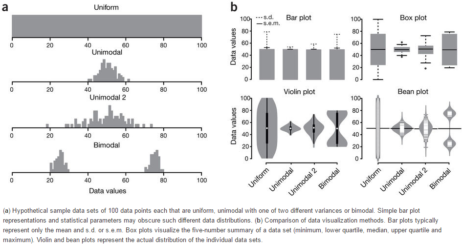
```

* Nature Method文章 <http://www.nature.com/nmeth/journal/v11/n2/full/nmeth.2811.html>

### 一步步解析箱线图绘制  {#ggplot2boxplot1}

假设有这么一个基因表达矩阵，第一列为基因名字，第一行为样品名字，想绘制样品中基因表达的整体分布。

```{r}
profile="Name;2cell_1;2cell_2;2cell_3;4cell_1;4cell_2;4cell_3;zygote_1;zygote_2;zygote_3
A;4;6;7;3.2;5.2;5.6;2;4;3
B;6;8;9;5.2;7.2;7.6;4;6;5
C;8;10;11;7.2;9.2;9.6;6;8;7
D;10;12;13;9.2;11.2;11.6;8;10;9
E;12;14;15;11.2;13.2;13.6;10;12;11
F;14;16;17;13.2;15.2;15.6;12;14;13
G;15;17;18;14.2;16.2;16.6;13;15;14
H;16;18;19;15.2;17.2;17.6;14;16;15
I;17;19;20;16.2;18.2;18.6;15;17;16
J;18;20;21;17.2;19.2;19.6;16;18;17
L;19;21;22;18.2;20.2;20.6;17;19;18
M;20;22;23;19.2;21.2;21.6;18;20;19
N;21;23;24;20.2;22.2;22.6;19;21;20
O;22;24;25;21.2;23.2;23.6;20;22;21"
```

读入数据并转换为ggplot2需要的长数据表格式，好好体会下这个格式，虽然多占用了不少空间，但是确实很方便。
	
```{r}
profile_text <- read.table(text=profile, header=T, row.names=1, quote="",sep=";", check.names=F)
# 在melt时保留位置信息
# melt格式是ggplot2画图最喜欢的格式
# 

library(ggplot2)
library(reshape2)
data_m <- melt(profile_text)
head(data_m)
```

```{r}
summary(data_m)
```

`variable`和`value`为矩阵`melt`后的两列的名字，内部变量, 可以通过`?melt`查看如何修改。`variable`代表了点线的属性，`value`代表对应的值。
像往常一样，就可以直接画图了。

```{r}
p <- ggplot(data_m, aes(x=variable, y=value,color=variable)) + 
geom_boxplot() + 
theme(axis.text.x=element_text(angle=50,hjust=0.5, vjust=0.5)) +
theme(legend.position="none")
p
# 图会存储在当前目录的Rplots.pdf文件中，如果用Rstudio，可以不运行dev.off()
# dev.off()
```

箱线图出来了，看上去还可以，再加点色彩 (`fill`)。

```{r}
# variable和value为矩阵melt后的两列的名字，内部变量, variable代表了点线的属性，value代表对应的值。
p <- ggplot(data_m, aes(x=variable, y=value)) + 
geom_boxplot(aes(fill=factor(variable))) + 
theme(axis.text.x=element_text(angle=50,hjust=0.5, vjust=0.5)) +
theme(legend.position="none")
p
# 图会存储在当前目录的Rplots.pdf文件中，如果用Rstudio，可以不运行dev.off()
#dev.off()
```

再看看`Violin plot`

```{r}
# variable和value为矩阵melt后的两列的名字，内部变量, variable代表了点线的属性，value代表对应的值。
p <- ggplot(data_m, aes(x=variable, y=value)) + 
geom_violin(aes(fill=factor(variable))) + 
theme(axis.text.x=element_text(angle=50,hjust=0.5, vjust=0.5)) +
theme(legend.position="none")
p
# 图会存储在当前目录的Rplots.pdf文件中，如果用Rstudio，可以不运行dev.off()
#dev.off()
```
```{r}
# variable和value为矩阵melt后的两列的名字，内部变量, variable代表了点线的属性，value代表对应的值。
p <- ggplot(data_m, aes(x=variable, y=value)) + 
geom_jitter(aes(color=factor(variable))) + 
theme(axis.text.x=element_text(angle=50,hjust=0.5, vjust=0.5)) +
theme(legend.position="none")
p
# 图会存储在当前目录的Rplots.pdf文件中，如果用Rstudio，可以不运行dev.off()
#dev.off()
```


还有Jitter plot (这里使用的是ggbeeswarm包)

```{r}
library(ggbeeswarm)
# 为了更好的效果，只保留其中一个样品的数据
# grepl类似于Linux的grep命令，获取特定模式的字符串

data_m2 <- data_m[grepl("_3", data_m$variable),]

# variable和value为矩阵melt后的两列的名字，内部变量, 
# variable代表了点线的属性，value代表对应的值。
p <- ggplot(data_m2, aes(x=variable, y=value),color=variable) + 
geom_quasirandom(aes(colour=factor(variable))) + 
theme_bw() + theme(panel.grid.major = element_blank(),
panel.grid.minor = element_blank(), legend.key=element_blank()) +
theme(legend.position="none")
p
#ggsave(p, filename="jitterplot.pdf", width=14, height=8, units=c("cm"))
```

```{r, echo=F}
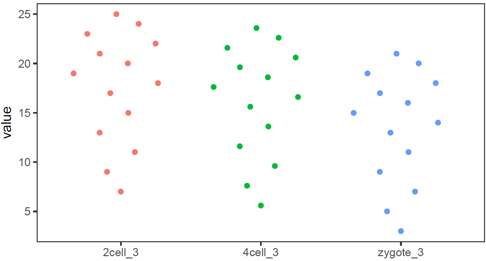
```

也可以用`geom_jitter(aes(colour=factor(variable)))`代替`geom_quasirandom(aes(colour=factor(variable)))`绘制抖动图，但个人认为geom_quasirandom给出的结果更有特色。

### 绘制单个基因 (A)的箱线图 {#ggplot2boxplot2}

为了更好的展示效果，下面的矩阵增加了样品数量和样品的分组信息。

```{r}
#profile="Name;2cell_1;2cell_2;2cell_3;2cell_4;2cell_5;2cell_6;4cell_1;4cell_2;4cell_3;\
#4cell_4;4cell_5;4cell_6;zygote_1;zygote_2;zygote_3;zygote_4;zygote_5;zygote_6
#A;4;6;7;5;8;6;3.2;5.2;5.6;3.6;7.6;4.8;2;4;3;2;4;2.5
#B;6;8;9;7;10;8;5.2;7.2;7.6;5.6;9.6;6.8;4;6;5;4;6;4.5"

profile_text <- read.table("data/boxplot_singleGene.data", header=T, row.names=1, quote="", 
		sep="\t", check.names=F)

data_m = data.frame(t(profile_text['A',]))
data_m$sample = rownames(data_m)
# 只挑选显示部分
# grepl前面已经讲过用于匹配
data_m[grepl('_[123]', data_m$sample),]
```


获得样品分组信息 (这个例子比较特殊，样品的分组信息就是样品名字下划线前面的部分)

```{r}
# 可以利用strsplit分割，取出其前面的字符串
# R中复杂的输出结果多数以列表的形式体现，在之前的矩阵操作教程中
# 提到过用str函数来查看复杂结果的结构，并从中获取信息
group = unlist(lapply(strsplit(data_m$sample,"_"), function(x) x[1]))
data_m$group = group
data_m[grepl('_[123]', data_m$sample),]
```

如果没有这个规律，也可以提到类似于下面的文件，指定样品所属的组的信息。
	
```{r}
sampleGroup_text="Sample;Group
zygote_1;zygote
zygote_2;zygote
zygote_3;zygote
zygote_4;zygote
zygote_5;zygote
zygote_6;zygote
2cell_1;2cell
2cell_2;2cell
2cell_3;2cell
2cell_4;2cell
2cell_5;2cell
2cell_6;2cell
4cell_1;4cell
4cell_2;4cell
4cell_3;4cell
4cell_4;4cell
4cell_5;4cell
4cell_6;4cell"

#sampleGroup = read.table(text=sampleGroup_text,sep="\t",header=1,check.names=F,row.names=1)

#data_m <- merge(data_m, sampleGroup, by="row.names")

# 会获得相同的结果，脚本注释掉了以免重复执行引起问题。
```

矩阵准备好了，开始画图了 (小提琴图做例子，其它类似)

```{r}
# 调整下样品出现的顺序
data_m$group <- factor(data_m$group, levels=c("zygote","2cell","4cell"))
# group和A为矩阵中两列的名字，group代表了值的属性，A代表基因A对应的表达值。
# 注意看修改了的地方
p <- ggplot(data_m, aes(x=group, y=A)) + 
  geom_violin(aes(fill=factor(group))) + 
  theme(axis.text.x=element_text(angle=50,hjust=0.5, vjust=0.5)) +
  theme(legend.position="none")
p
# 图会存储在当前目录的Rplots.pdf文件中，如果用Rstudio，可以不运行dev.off()
#dev.off()
```

### 长矩阵绘制箱线图 {#ggplot2boxplot3}

常规矩阵绘制箱线图要求必须是个方正的矩阵输入，而有时想比较的几个组里面检测的值数目不同。比如有三个组，GrpA组检测了6个病人，GrpB组检测了10个病人，GrpC组是12个正常人的检测数据。这时就很难形成一个行为检测值，列为样品的矩阵，就需要长表格模式解决这一问题。

```{r}
long_table <- "Grp;Value
GrpA;10
GrpA;11
GrpA;11
GrpA;11
GrpA;12
GrpA;11
GrpA;15
GrpB;5
GrpB;4
GrpB;3
GrpB;2
GrpB;4
GrpB;3
GrpB;2
GrpB;3
GrpB;3.1
GrpC;2
GrpC;1
GrpC;1
GrpC;1.1
GrpC;1.5
GrpC;1.1
GrpC;1.5
GrpC;1.8
GrpC;2"

long_table <- read.table(text=long_table,sep=";",header=T,check.names=F)

p <- ggplot(long_table, aes(x=Grp, y=Value)) + 
geom_violin(aes(fill=factor(Grp))) + 
theme(axis.text.x=element_text(angle=50,hjust=0.5, vjust=0.5)) +
theme(legend.position="none")
p
```


```{r}
a = c(rep(c('F',"M"),12), 'F')
long_table$gender <- a

p <- ggplot(long_table, aes(x=Grp, y=Value)) + 
  geom_boxplot(aes(fill=factor(gender))) +
  geom_quasirandom()
p
```


长表格形式自身就是常规矩阵melt后的格式，这种用来绘制箱线图就很简单了，就不举例子了。


## 线图  {#ggplot2lineplot}

线图是反映趋势变化的一种方式，其输入数据一般也是一个矩阵。

### 单线图  {#ggplot2singleline}

假设有这么一个矩阵，第一列为转录起始位点及其上下游`5 kb`的区域，第二列为`H3K27ac`修饰在这些区域的丰度，想绘制一张线图展示。


```{r}
profile="Pos;H3K27ac
-5000;8.7
-4000;8.4
-3000;8.3
-2000;7.2
-1000;3.6
0;3.6
1000;7.1
2000;8.2
3000;8.4
4000;8.5
5000;8.5"
```

读入数据

```{r}
profile_text <- read.table(text=profile, header=T, row.names=NULL, quote="",sep=";")
profile_text
```

```{r}
plot(profile_text$Pos, profile_text$H3K27ac,type = "l")
```

```{r}
ggplot(profile_text, aes(x=Pos, y=H3K27ac)) + geom_line()
```

```{r}
profile_text <- read.table(text=profile, header=T, row.names=1, quote="",sep=";")
profile_text
```

```{r}
# 在melt时保留位置信息
# melt格式是ggplot2画图最喜欢的格式
# 好好体会下这个格式，虽然多占用了不少空间，但是确实很方便

# 这里可以用 `xvariable`，也可以是其它字符串，但需要保证后面与这里的一致
# 因为这一列是要在X轴显示，所以起名为`xvariable`。
profile_text$xvariable = rownames(profile_text)
#library(ggplot2)
#library(reshape2)
data_m <- melt(profile_text, id.vars=c("xvariable"))
data_m
```

然后开始画图，与上面画heatmap一样。

```{r}
# variable和value为矩阵melt后的两列的名字，内部变量, variable代表了点线的属性，value代表对应的值。
p <- ggplot(data_m, aes(x=xvariable, y=value,color=variable)) + geom_line()
p
# 图会存储在当前目录的Rplots.pdf文件中，如果用Rstudio，可以不运行dev.off()
# dev.off()
```

满心期待一个倒钟形曲线，结果，什么也没有。

仔细看，出来一段提示

```
geom_path: Each group consists of only one observation. 
Do you need to adjust the group aesthetic?
```

原来默认ggplot2把每个点都视作了一个分组，什么都没画出来。而`data_m`中的数据都来源于一个分组`H3K27ac`，分组的名字为`variable`，修改下脚本，看看效果。

```{r}
p <- ggplot(data_m, aes(x=xvariable, y=value,color=variable,group=variable)) + 
     geom_line() + theme(legend.position=c(0.1,0.9))
p
# dev.off()
```

图出来了，一条线，看一眼没问题；再仔细看，不对了，怎么还不是倒钟形，原来横坐标错位了。

检查下数据格式

```{r}
summary(data_m)
```


问题来了，`xvariable`虽然看上去数字，但存储的实际是字符串 (因为是作为行名字读取的)，需要转换为数字。
									 
```{r}
data_m$xvariable <- as.numeric(data_m$xvariable)

#再检验下
summary(data_m)
```

好了，继续画图。
	
```{r}
# 注意断行时，加号在行尾，不能放在行首
p <- ggplot(data_m, aes(x=xvariable, y=value,color=variable,group=variable)) +
     geom_line() + theme(legend.position=c(0.07,0.7))
p
#dev.off()
```

图终于出来了，调了下legend的位置，看上去有点意思了。

有点难看，如果平滑下，会不会好一些，`stat_smooth`可以对绘制的线进行局部拟合。在不影响变化趋势的情况下，可以使用 (但慎用)。
	
```{r}
p <- ggplot(data_m, aes(x=xvariable, y=value,color=variable,group=variable)) + 
     geom_line() + stat_smooth(method="auto", se=FALSE) + 
	 theme(legend.position=c(0.06,0.5))
p
#dev.off()
```	

从图中看，趋势还是一致的，线条更优美了。另外一个方式是增加区间的数量，线也会好些，而且更真实。

`stat_smooth`和`geom_line`各绘制了一条线，只保留一条就好。

```{r}
p <- ggplot(data_m, aes(x=xvariable, y=value,color=variable,group=variable)) + 
     stat_smooth(method="auto", se=FALSE) + theme(legend.position=c(0.06,0.5))
p
#dev.off()
```

好了，终于完成了单条线图的绘制。

### 多线图 {#ggplot2multipleline}

那么再来一个多线图的例子吧，只要给之前的数据矩阵多加几列就好了。

```{r}
profile = "Pos;h3k27ac;ctcf;enhancer;h3k4me3;polII
-5000;8.7;10.7;11.7;10;8.3
-4000;8.4;10.8;11.8;9.8;7.8
-3000;8.3;10.5;12.2;9.4;7
-2000;7.2;10.9;12.7;8.4;4.8
-1000;3.6;8.5;12.8;4.8;1.3
0;3.6;8.5;13.4;5.2;1.5
1000;7.1;10.9;12.4;8.1;4.9
2000;8.2;10.7;12.4;9.5;7.7
3000;8.4;10.4;12;9.8;7.9
4000;8.5;10.6;11.7;9.7;8.2
5000;8.5;10.6;11.7;10;8.2"

profile_text <- read.table(text=profile, header=T, row.names=1, quote="",sep=";")

profile_text$xvariable = rownames(profile_text)
data_m <- melt(profile_text, id.vars=c("xvariable"))
data_m$xvariable <- as.numeric(data_m$xvariable)

# 这里group=variable，而不是group=1 (如果上面你用的是1的话)
# variable和value为矩阵melt后的两列的名字，内部变量, 
# variable代表了点线的属性，value代表对应的值。
p <- ggplot(data_m, aes(x=xvariable, y=value,color=variable,group=variable)) + 
     stat_smooth(method="auto", se=FALSE) + theme(legend.position=c(0.85,0.2))
p
#dev.off()
```


### 横轴文本线图 {#ggplot2xaxistext}

如果横轴是文本，又该怎么调整顺序呢？还记得之前热图旁的行或列的顺序调整吗？重新设置变量的`factor`水平就可以控制其顺序。

```{r fig, fig.height=8, fig.width=16}
profile = "Pos;h3k27ac;ctcf;enhancer;h3k4me3;polII
-5000;8.7;10.7;11.7;10;8.3
-4000;8.4;10.8;11.8;9.8;7.8
-3000;8.3;10.5;12.2;9.4;7
-2000;7.2;10.9;12.7;8.4;4.8
-1000;3.6;8.5;12.8;4.8;1.3
0;3.6;8.5;13.4;5.2;1.5
1000;7.1;10.9;12.4;8.1;4.9
2000;8.2;10.7;12.4;9.5;7.7
3000;8.4;10.4;12;9.8;7.9
4000;8.5;10.6;11.7;9.7;8.2
5000;8.5;10.6;11.7;10;8.2"

profile_text <- read.table(text=profile, header=T, row.names=1, quote="",sep=";")

profile_text_rownames <- row.names(profile_text)

profile_text$xvariable = rownames(profile_text)
data_m <- melt(profile_text, id.vars=c("xvariable"))
data_m$xvariable <- factor(data_m$xvariable, levels=profile_text_rownames, ordered=T)

# geom_line设置线的粗细和透明度
p1 <- ggplot(data_m, aes(x=xvariable, y=value,color=variable,group=variable)) + 
     geom_line(size=1, alpha=0.9) + theme(legend.position=c(0.8,0.25)) +
	 theme(axis.text.x=element_text(angle=45,hjust=1, vjust=1))

# stat_smooth
p2 <- ggplot(data_m, aes(x=xvariable, y=value,color=variable,group=variable)) + 
     stat_smooth(method="auto", se=FALSE) + theme(legend.position=c(0.8,0.25)) +
	 theme(axis.text.x=element_text(angle=45,hjust=1, vjust=1))
	 
library("cowplot")
plot_grid(p1,p2, labels=c("A","B"), ncol=2, nrow=1)
#dev.off()
```

比较下位置信息做为数字(前面的线图)和位置信息横轴的差别。当为数值时，ggplot2会选择合适的几个刻度做标记，当为文本时，会全部标记。另外文本横轴，`smooth`效果不明显。


## 散点图 {#ggplot2scatter}

散点图在生物信息分析中是应用比较广的一个图，常见的差异基因火山图、功能富集分析泡泡图、相关性分析散点图、抖动图、PCA样品分类图等。凡是想展示分布状态的都可以用散点图。

### 横纵轴都为数字的散点图解析 {#ggplot2scatter1}

绘制散点图的输入一般都是规规矩矩的矩阵，可以让不同的列分别代表X轴、Y轴、点的大小、颜色、形状、名称等。

#### 输入数据格式 (使用火山图的输入数据为例) {#ggplot2scatter2}

火山图用于展示基因表达差异的分布，横轴为`Log2 Fold Change`，越偏离中心差异倍数越大；纵轴为`(-1)*Log10 P_adjust`，值越大差异越显著。一般横轴越偏离中心的点其纵轴值也会比较大，因此呈现火山喷发的形状。

火山图需要的数据格式如下

* id: 不是必须的，但一般的软件输出结果中都会包含，表示基因名字。
* log2FoldChange: 差异倍数的对数，一般的差异分析输出结果中也会给出对数处理的值, 因此程序没有提供这一步的计算操作。
* padj: 多重假设检验矫正过的差异显著性P值；一般的差异分析输出结果为原始值，程序提供一个参数对其求取负对数。
* significant: 可选列，标记哪些基因是上调、下调、无差异；若无此列或未在参数中指定此列，默认程序会根据`padj`列和`log2FoldChange`列根据给定的阈值自动计算差异基因，并作出不同颜色的标记。
* label: 可选列，一般用于在图中标记出感兴趣的基因的名字。非`-`行的字符串都会标记在图上。

```{r}
volcano = "id;log2FoldChange;padj;significant;label
E00007;4.28238;0;EHBIO_UP;A
E00008;-1.1036;0.476466843393901;Unchanged;-
E00009;-0.274368;1;Unchanged;-
E00010;4.62347;7.37606076333335e-103;EHBIO_UP;-
E00012;0.973987;0.482982440163204;Unchanged;-
E00017;-1.30205;0.000555693857439792;Baodian_UP;B
E00024;0.617636;2.78047837287061e-13;Unchanged;-
E00033;1.48669;2.56000581595275e-60;EHBIO_UP;-
E00034;-0.783716;0.00341521725291801;Unchanged;-
E00036;2.01592;6.03136656016401e-06;EHBIO_UP;C
E00040;-1.89657;4.73663890849056e-21;Baodian_UP;-
E00041;-0.268168;0.563429434558031;Unchanged;-
E00042;0.0861048;0.367700939634328;Unchanged;-
E00043;-1.19328;1.42673872027352e-153;Baodian_UP;-
E00044;-0.887981;2.43067804654905e-26;Unchanged;-
E00047;-0.610941;5.51696648645932e-57;Unchanged;-"

# 数据的读取之前的R语言统计和绘图系列都已解释过，不再赘述
# 文末也有链接可直达之前的文章，新学者建议从头开始
#volcanoData <- read.table(text=volcano, sep=";", header=T, quote="", check.names=F)
volcanoData <- read.table("data/volcano.txt", sep="\t", header=T, 
                          row.names=NULL, quote="", check.names=F)
head(volcanoData)
```
```{r}
dim(volcanoData)
```

绘制散点图，只需要指定X轴和Y轴，再加上`geom_point`即可。

```{r}
#library(ggplot2)
p <- ggplot(volcanoData, aes(x=log2FoldChange, y=padj))
p <- p + geom_point()
# 前面是给p不断添加图层的过程
# 单输入一个p是真正作图
# 前面有人说，上面都输完了，怎么没出图
# 就因为差了一个p
p
```

说好的火山图的例子，但怎么也看不出喷发的态势。


对数据坐下预处理，差异大的基因`padj`小，先对其求取负对数，所谓负负得正，差异大的基因就会处于图的上方了。

```{r}
# 从示例数据中看到，最小的padj值为0，求取负对数为正无穷。
# 实际上padj值小到一个点对我们来讲就是个数
# 所以可以给所有小于1e-6的padj都让其等于1e-6，再小也没意义
# 
volcanoData[volcanoData$padj<1e-6, "padj"] <- 1e-6
volcanoData$padj <- (-1)* log10(volcanoData$padj)
```

```{r}
summary(volcanoData)
```

数据中基因的上调倍数远高于下调倍数，使得出来的图是偏的，这次画图时调整下X轴的区间使图对称。

```{r}
log2fc_max_abs = max(abs(volcanoData$log2FoldChange)) + 0.1
padj_max = max(volcanoData$padj) + 0.1 
p <- ggplot(volcanoData,  aes(x=log2FoldChange,  y=padj)) +
     geom_point() + xlim(-1*log2fc_max_abs, log2fc_max_abs) + ylim(0,padj_max)
p
```


有点意思了，数据太少不明显，下一步加上颜色看看。

```{r}
p <- ggplot(volcanoData,  aes(x=log2FoldChange,  y=padj)) +
     geom_point(aes(color=significant)) +  xlim(-1*log2fc_max_abs, log2fc_max_abs) + ylim(0,padj_max)
p
```

```{r}
volcanoData[volcanoData$label=="-", "label"] =  NA
p <- ggplot(volcanoData,  aes(x=log2FoldChange,  y=padj)) +
     geom_point(aes(color=significant)) +  xlim(-1*log2fc_max_abs, log2fc_max_abs) + 
     ylim(0,padj_max) + 
     geom_text(aes(label=label))
p
```

利用现有的数据，基本上就是这个样子了。虽然还不太像，原理都已经都点到了。

```{r}
volcanoData$sig <- ifelse(
    volcanoData$padj>1.30103, 
    ifelse(
      volcanoData$log2FoldChange>=1, 
      "UP", 
      ifelse(
        volcanoData$log2FoldChange<=-1, 
        "DW", 
        "NoDiff")
    ), 
    "NoDiff")
volcanoData$sig <- factor(volcanoData$sig, levels=c("UP", "DW", "NoDiff"))
summary(volcanoData)
```

### 横纵轴都为字符串的散点图展示 {#ggplot2scatter3}

#### 输入数据格式如下 {#ggplot2scatter4}

这个数据是FASTQC结果总结中的直观的查看所有样品测序碱基质量和GC含量的散点图的示例数据。

```{r}
fastqc<-"ID;GC_quality;Base_quality
ehbio_1_1;PASS;PASS
ehbio_1_2;PASS;PASS
ehbio_2_1;WARN;PASS
ehbio_2_2;WARN;PASS
Other_1_1;FAIL;FAIL
Other_1_2;FAIL;FAIL"

fastqc_data <- read.table(text=fastqc, sep=";", header=T)
# 就不查看了
```

```{r}
p <- ggplot(fastqc_data, aes(x=GC_quality, y=Base_quality)) + geom_point()
p
```

```{r}
p <- ggplot(fastqc_data, aes(x=GC_quality, y=Base_quality)) + geom_jitter() + geom_text(aes(label=ID), position="jitter")
p
```

六个点少了只剩下了3个，重叠在一起了，而且也不知道哪个点代表什么样品。这时需要把点抖动下，用到一个包`ggbeeswarm`，抖动图的神器。

```{r}
library(ggbeeswarm)
p <- ggplot(fastqc_data, aes(x=GC_quality, y=Base_quality)) + geom_quasirandom()
# 使用geom_text增加点的标记
# label表示标记哪一列的数值
# position_quasirandom获取点偏移后的位置
# xjust调整对齐方式; hjust是水平的对齐方式，0为左，1为右，0.5居中，0-1之间可以取任意值。
# vjust是垂直对齐方式，0底对齐，1为顶对齐，0.5居中，0-1之间可以取任意值。
# check_overlap检查名字在图上是否重叠，若有重叠，只显示一个
p <- p + geom_text(aes(label=ID), position=position_quasirandom(),hjust=1.1,check_overlap=T)
p
```


## 功能富集泡泡图 {#ggplot2enrichment}

功能富集分析用来展示某一组基因(一般是单个样品上调或下调的基因)倾向参与哪些功能调控通路，对从整体理解变化了的基因的功能和潜在的调控意义具有指导作用，也是文章发表中一个有意义的美图。通常会用柱状图、泡泡图和热图进行展示。热图的画法之前已经介绍过，这次介绍下富集分析泡泡图, 其展示的信息是最为全面的，也是比较抓人眼球的。

假设有这么一个富集分析结果矩阵 (文件名为GOenrichement.xls) 存储了EHBIO样品和Baodian样品中各自上调的基因富集的通路。

http://omicslab.genetics.ac.cn/GOEAST

* Description 为GO通路的描述，也可以是KEGG通路。
* GeneRatio 为对应通路差异基因占总差异基因的比例，本列可以用分数或小数表示，都可以处理。
* qvalue 表示对应通路富集的显著性程度，可以是log处理过的，也可以是原始的。
* Count 为对应通路差异基因数目。 
* Type 这个矩阵合并了EHBIO样品和Baodian样品中各自上调的基因富集的通路，用Type列做区分。如果只有一个样品可不要。


```
Description	GeneRatio	qvalue	Count	Type
ERBB signaling pathway	7/320	0.001836081	7	EHBIO_up
regulation of ERBB signaling pathway	5/320	0.003886659	5	EHBIO_up
negative regulation of cell cycle G1/S phase transition	4/320	0.016153254	4	EHBIO_up
Wnt signaling pathway	13/320	0.01680096	13	EHBIO_up
cell-cell signaling by wnt	13/320	0.0171473	13	EHBIO_up
negative regulation of cell cycle process	8/320	0.019453085	8	EHBIO_up
extrinsic apoptotic signaling pathway	9/320	0.024164034	9	EHBIO_up
positive regulation of extrinsic apoptotic signaling pathway	4/320	0.025708228	4	EHBIO_up
cell cycle G1/S phase transition	7/320	0.035797856	7	EHBIO_up
negative regulation of apoptotic signaling pathway	8/320	0.038684745	8	EHBIO_up
regulation of Notch signaling pathway	4/320	0.041592045	4	EHBIO_up
regulation of cell cycle G1/S phase transition	5/320	0.047407619	5	EHBIO_up
negative regulation of BMP signaling pathway	3/320	0.049460847	3	EHBIO_up
regulation of ERK1 and ERK2 cascade	14/342	0.000629602	14	Baodian_up
positive regulation of cell adhesion	17/342	0.000827275	17	Baodian_up
ERK1 and ERK2 cascade	14/342	0.001086508	14	Baodian_up
regulation of cell growth	17/342	0.002228511	17	Baodian_up
positive regulation of cytoskeleton organization	10/342	0.004406867	10	Baodian_up
regulation of cell-cell adhesion	15/342	0.005075219	15	Baodian_up
regulation of cytoskeleton organization	15/342	0.019685646	15	Baodian_up
negative regulation of Notch signaling pathway	3/342	0.020578211	3	Baodian_up
neuron apoptotic process	10/342	0.040284925	10	Baodian_up
```

```{r}
enrichment = read.table("data/GOenrichement.xls", header=T, row.names=NULL, 
	sep="\t", quote="")
head(enrichment)
```

### 单样品分开绘制 {#ggplot2enric2hment}

示例矩阵中包含两个样品上调基因的富集通路，现在先取出一个样品绘制。

```{r}
enrichment_sxbd = droplevels(enrichment[enrichment$Type=="Baodian_up", ])
```

构造一个函数，转换分数为小数。

```{r}
library(plyr)
library(stringr)
library(ggplot2)
library(grid)

# Function get from https://stackoverflow.com/questions/10674992/convert-a-character-vector-of-mixed-numbers-fractions-and-integers-to-numeric?rq=1
# With little modifications
mixedToFloat <- function(x){
  x <- sapply(x, as.character)
  is.integer  <- grepl("^-?\\d+$", x)
  is.fraction <- grepl("^-?\\d+\\/\\d+$", x)
  is.float <- grepl("^-?\\d+\\.\\d+$", x)
  is.mixed    <- grepl("^-?\\d+ \\d+\\/\\d+$", x)
  stopifnot(all(is.integer | is.fraction | is.float | is.mixed))

  numbers <- strsplit(x, "[ /]")

  ifelse(is.integer,  as.numeric(sapply(numbers, `[`, 1)),
  ifelse(is.float,    as.numeric(sapply(numbers, `[`, 1)),
  ifelse(is.fraction, as.numeric(sapply(numbers, `[`, 1)) /
                      as.numeric(sapply(numbers, `[`, 2)),
                      as.numeric(sapply(numbers, `[`, 1)) +
                      as.numeric(sapply(numbers, `[`, 2)) /
                      as.numeric(sapply(numbers, `[`, 3)))))
  
}

mixedToFloat(c('1 1/2', '2 3/4', '2/3', '11 1/4', '1'))
```

转换数据列为小数或整数

```{r}
enrichment_sxbd$GeneRatio = mixedToFloat(enrichment_sxbd$GeneRatio)
enrichment_sxbd$Count = mixedToFloat(enrichment_sxbd$Count)
```

qvalue转换负对数，并作为新的一列

```{r}
# qvalue转换
log_name = paste0("negLog10_", "qvalue")
col_name_enrichment_sxbd <- colnames(enrichment_sxbd)
col_name_enrichment_sxbd <- c(col_name_enrichment_sxbd, log_name)
enrichment_sxbd$log_name <- log10(enrichment_sxbd$qvalue) * (-1)
colnames(enrichment_sxbd) <- col_name_enrichment_sxbd
```

Term排序

1. 获取Term出现的次数

```{r}
# 计算每个Term出现的顺序，用于排序，出现次数最多的排在前面
enrichment_sxbd_freq <- as.data.frame(table(enrichment_sxbd$Description))
colnames(enrichment_sxbd_freq) <- c("Description", "IDctct")
head(enrichment_sxbd_freq)
```

根据出现次数、GeneRatio、-log10(qvalue)排序

```{r}
enrichment_sxbd2 <- merge(enrichment_sxbd, enrichment_sxbd_freq, by="Description")

# 首先根据出现次数排序、然后根据GeneRatio、然后根据-log10(qvalue)
enrichment_sxbd3 <- enrichment_sxbd2[order(enrichment_sxbd2$IDctct, 
	enrichment_sxbd2$GeneRatio, enrichment_sxbd2$negLog10_qvalue), ]

term_order <- unique(enrichment_sxbd3$Description)

# 设置排序顺序
enrichment_sxbd$Description <- factor(enrichment_sxbd$Description, 
	levels=term_order, ordered=T)
```

```{r}
color_v <- c("green", "red")

# 指定x,y
p <- ggplot(enrichment_sxbd, aes(x=GeneRatio,y=Description)) + 
	labs(x="GeneRatio", y="GO description") + labs(title="")

p <- p + geom_point(aes(size=Count, color=negLog10_qvalue )) + 
	scale_colour_gradient(low=color_v[1], high=color_v[2], name="negLog10_qvalue")

# Term单行长度不超过60字符
p <- p + scale_y_discrete(labels=function(x) str_wrap(x, width=60))

p <- p + theme_bw() + 
	theme(panel.grid.major = element_blank(), panel.grid.minor = element_blank())


top='top'
bottom='bottom'
left='left'
right='right'
none='none'
legend_pos_par <- right


uwid = 0
vhig = 12

# 自动估算图形长宽
if (uwid == 0 || vhig == 0) {
	x_len = length(unique(enrichment_sxbd$Description))
	if(x_len<10){
		vhig = 10
	} else if(x_len<20) {
		vhig = 10 + (x_len-10)/3
	} else if(x_len<100) {
		vhig = 13 + (x_len-20)/5
	} else {
		vhig = 40
	}
	uwid = vhig 
	if(legend_pos_par %in% c("left", "right")){
		uwid = 1.5 * uwid
	}
}

p <- p + theme(legend.position=legend_pos_par)

p <- p + theme(	panel.grid = element_blank(), panel.border=element_blank(), 
	legend.background = element_blank(),
	axis.line.x=element_line(size=0.4, colour="black", linetype='solid'),
	axis.line.y=element_line(size=0.4, colour="black", linetype='solid'),
	axis.ticks = element_line(size=0.4)
	)


#ggsave(p, filename="GOenrichement.ehbio.xls.scatterplot.dv.pdf", dpi=300, width=uwid,
#height=vhig, units=c("cm"))
p
```

### 多样品合并绘制 {#ggplot2enrichmen2t}

```{r}
#enrichment$Type <- factor(enrichment$Type, levels=sample_ho, ordered=T)

# First order by Term, then order by Sample
enrichment <- enrichment[order(enrichment$Description, enrichment$Type), ]

enrichment$GeneRatio = mixedToFloat(enrichment$GeneRatio)
enrichment$Count = mixedToFloat(enrichment$Count)


log_name = paste0("negLog10_", "qvalue")
col_name_enrichment <- colnames(enrichment)
col_name_enrichment <- c(col_name_enrichment, log_name)
enrichment$log_name <- log10(enrichment$qvalue) * (-1)
colnames(enrichment) <- col_name_enrichment

# Get the count of each unique Term
enrichment_freq <- as.data.frame(table(enrichment$Description))
colnames(enrichment_freq) <- c("Description", "IDctct")
enrichment2 <- merge(enrichment, enrichment_freq, by="Description")

# 增加一列，样品信息用于排序
enrichment_samp <- ddply(enrichment2, "Description", summarize,
	sam_ct_ct_ct=paste(Type, collapse="_"))

enrichment2 <- merge(enrichment2, enrichment_samp, by="Description")

# 排序与上面相同，但增加了按样品组合排序
enrichment3 <- enrichment2[order(enrichment2$IDctct, enrichment2$sam_ct_ct_ct, 
	enrichment2$Type, enrichment2$GeneRatio, enrichment2$negLog10_qvalue), ]
#print(enrichment3)

term_order <- unique(enrichment3$Description)

enrichment$Description <- factor(enrichment$Description, levels=term_order, ordered=T)

#print(enrichment)
rm(enrichment_freq, enrichment2, enrichment3)

color_v <- c("green", "red")

p <- ggplot(enrichment, aes(x=GeneRatio,y=Description)) + 
	labs(x="GeneRatio", y="GO description") + labs(title="")

p <- p + geom_point(aes(size=Count, color=negLog10_qvalue, shape=Type)) +
	scale_colour_gradient(low=color_v[1], high=color_v[2], name="negLog10_qvalue")

p <- p + scale_y_discrete(labels=function(x) str_wrap(x, width=60))
 
p <- p + theme_bw() + theme(panel.grid.major = element_blank(), 
	panel.grid.minor = element_blank())

p <- p + theme(axis.text.x=element_text(angle=45,hjust=0.5, vjust=1))

top='top'
bottom='bottom'
left='left'
right='right'
none='none'
legend_pos_par <- right


uwid = 0
vhig = 12

if (uwid == 0 || vhig == 0) {
	x_len = length(unique(enrichment$Description))
	if(x_len<10){
		vhig = 10
	} else if(x_len<20) {
		vhig = 10 + (x_len-10)/3
	} else if(x_len<100) {
		vhig = 13 + (x_len-20)/5
	} else {
		vhig = 40
	}
	uwid = vhig 
	if(legend_pos_par %in% c("left", "right")){
		uwid = 1.5 * uwid
	}
}

p <- p + theme(legend.position=legend_pos_par)

p <- p + theme(	panel.grid = element_blank(), panel.border=element_blank(), 
	legend.background = element_blank(),
	axis.line.x=element_line(size=0.4, colour="black", linetype='solid'),
	axis.line.y=element_line(size=0.4, colour="black", linetype='solid'),
	axis.ticks = element_line(size=0.4)
	)


#ggsave(p, filename="GOenrichement.xls.scatterplot.dv.pdf", dpi=300, width=uwid,
#height=vhig, units=c("cm"))
p
```

通过这张图解释下，富集分析的结果怎么解读。富集分析实际是查找哪些通路里面包含的差异基因占总差异基因的比例显著高于通路中总基因占所有已经注释的基因的比例。这一显著性通常用多重假设检验矫正过的`pvalue`(又称qvalue, FDR或p.adjust)来表示。在图中体现为点的颜色。从绿到红富集显著性逐渐增高。点的大小表示对应通路中包含的差异基因的数目。点的形状代表了不同类型的基因，如EHBIO中上调的基因和Baodian中上调的基因。横轴表示对应通路包含的差异基因占总的差异基因的比例, 本图中最高不过5%, 这个值越大说明通路被影响的越多。


## 韦恩图 {#venn}

维恩图是用来反映不同集合之间的交集和并集情况的展示图。一般用于展示2-5个集合之间的交并关系。集合数目更多时，将会比较难分辨，更多集合的展示方式一般使用`upSetView`。

较早的文章列举了多个在线工具<http://mp.weixin.qq.com/s/zn654JqG9OeO71rJUTDr2Q>。

### 韦恩图三个圈 {#venn2}

```{r}
library(VennDiagram)
list1 = sample(letters,20)
list2 = sample(letters,20)
list3 = sample(letters,20)

color_v <- c("dodgerblue", "goldenrod1", "darkorange1")


label_size = 1
margin = 0.1
p <- venn.diagram( 
	x = list(ehbio1=list1, ehbio2=list2, ehbio3=list3),
	filename = NULL, col = "black", lwd = 1, 
	fill = color_v, alpha = 0.50, main="", 
	label.col = c("black"), cex = 1, fontfamily = "Helvetica",
	cat.col = color_v,cat.cex = label_size, 
	margin=margin, 
	cat.fontfamily = "Helvetica"
)
grid.draw(p)

```

### 韦恩图五个圈 {#venn5}

假设有这么一个矩阵，第一列为不同集合中的ID，第二列为集合的名字，无标题行，存储为`venn.txt`。

```
a	ehbio1
b	ehbio1
c	ehbio1
d	ehbio1
e	ehbio1
f	ehbio1
g	ehbio1
h	ehbio2
i	ehbio2
j	ehbio2
k	ehbio2
e	ehbio2
f	ehbio2
g	ehbio2
a	ehbio3
b	ehbio3
h	ehbio3
j	ehbio3
i	ehbio3
f	ehbio3
g	ehbio3
a	ehbio4
b	ehbio4
h	ehbio4
d	ehbio5
e	ehbio5
y	ehbio5
x	ehbio5
```

```{r}
library(VennDiagram)

#pdf(file="venn.txt.vennDiagram.pdf", onefile=FALSE, paper="special")

data <- read.table(file="data/venn.txt", sep="\t", quote="")

num <- 0

ehbio1 <- data[grepl("\\<ehbio1\\>",data[,2]),1]
num <- num + 1

ehbio2 <- data[grepl("\\<ehbio2\\>",data[,2]),1]
num <- num + 1

ehbio3 <- data[grepl("\\<ehbio3\\>",data[,2]),1]
num <- num + 1

ehbio4 <- data[grepl("\\<ehbio4\\>",data[,2]),1]
num <- num + 1

ehbio5 <- data[grepl("\\<ehbio5\\>",data[,2]),1]
num <- num + 1

color_v <- c("dodgerblue", "goldenrod1", "darkorange1", "seagreen3", "orchid3")[1:num]
# label.col = c("orange", "white", "darkorchid4", "white", "white", "white", "white", 
	#"white", "darkblue", "white", "white", "white", "white", "darkgreen", "white"),

label_size = 0.8
margin = 0.3
p <- venn.diagram( 
	x = list(ehbio1=ehbio1, ehbio4=ehbio4,
	ehbio5=ehbio5, ehbio2=ehbio2,
	ehbio3=ehbio3),
	filename = NULL, col = "black", lwd = 1, 
	fill = color_v,
	alpha = 0.50, main="", 
	label.col = c("black"),
	cex = 1, fontfamily = "Helvetica",
	cat.col = color_v,cat.cex = label_size, 
	margin=margin, 
	cat.fontfamily = "Helvetica"
)
grid.draw(p)
#dev.off()
```


### UpSetView展示 {#UpSetView}

对于集合比较多的时候，包括上面提到的5个集合的交并集情况，如果只是为了展示个炫图，还可以，但如果想解释结果，就会比较头疼，难判断区域的归属。

因此对于这种多集合情况，推荐使用`UpSetView`展示，看效果如下。

测试数据，存储为`upsetview.txt` （第一行为集合的名，每个集合一列；每一行为一个ID，如果对应ID出现在这个集合则标记1，否则标记0）：

```bash
pattern	ehbio1	ehbio2	ehbio3	ehbio4	ehbio5
a	1	0	1	1	0
b	1	0	1	1	0
c	1	0	0	0	0
d	1	0	0	0	1
e	1	1	0	0	1
f	1	1	1	0	0
g	1	1	1	0	0
h	0	1	1	1	0
i	0	1	1	0	0
j	0	1	1	0	0
k	0	1	0	0	0
x	0	0	0	0	1
y	0	0	0	0	1
```

```{r}
library(UpSetR)
matrix = read.table("data/upsetview.txt", header=T, row.names=NULL, sep="\t")
nsets = dim(matrix)[2]-1

#pdf(file="upsetview.txt.upsetV.pdf", onefile=FALSE, paper="special", width=10, 
#height=5, bg="white", pointsize=12)
upset(matrix, nsets=nsets, sets.bar.color = "#56B4E9", order.by = "freq", 
	empty.intersections = "on")
#dev.off()
```

UpSetR: http://www.caleydo.org/tools/upset/ 采用连线的方式展示不同的组合之间共有的和特有的项目，对于特别多的组合尤其适用。

单个点表示特有，连起来的点表示共有，相当于venn图中重叠的部分。

垂直的柱子代表的是Venn图中的数字，看连接的点判断归属。

水平的柱子代表对应样品中Item的总数。


## 柱状图绘制  {#Barplot}

柱状图也是较为常见的一种数据展示方式，可以展示基因的表达量，也可以展示GO富集分析结果，基因注释数据等。[39个转录组分析工具，120种组合评估(转录组分析工具哪家强-导读版)](http://mp.weixin.qq.com/s?__biz=MzI5MTcwNjA4NQ==&mid=2247484106&idx=1&sn=687a0def51f6ea91a335754eb3dc9ca9&chksm=ec0dc740db7a4e564e5b1e93a36e5d9447581e262eec9c2983d1d4e76788d673c9c07dec8f8e#rd)中提到了较多**堆积柱状图**的使用。下面就详细介绍下怎么绘制。

### 常规矩阵柱状图绘制  {#Barplot1}

有如下4个基因在5组样品中的表达值

```{r}
data_ori <- "Grp_1;Grp_2;Grp_3;Grp_4;Grp_5
a;2.6;2.9;2.1;2.0;2.2
b;20.8;9.8;7.0;3.7;19.2
c;10.0;11.0;9.2;12.4;9.6
d;9;3.3;10.3;11.1;10"

data <- read.table(text=data_ori, header=T, row.names=1, sep=";", quote="")
data
```


整理数据格式，保留基因名字信息

```{r}
library(ggplot2)
library(reshape2)
library(dplyr)
data_rownames <- rownames(data)
data_colnames <- colnames(data)
data$gene <- data_rownames
data_m <- melt(data, id.vars=c("gene"))
data_m
```


首先看下每个基因在不同组的表达情况

```{r}
# 给定数据，和x轴、y轴所在列名字
# 直接使用geom_bar就可以绘制柱状图
# position: dodge: 柱子并排放置
p <- ggplot(data_m, aes(x=gene, y=value))
p + geom_bar(stat="identity", position="dodge", aes(fill=variable))

# 如果没有图形界面，运行下面的语句把图存在工作目录下的Rplots.pdf文件中
#dev.off()
```


柱子有点多，也可以利用mean±SD的形式展现

首先计算平均值和标准差，使用`group_by`按`gene`分组，对每组做`summarize`

```{r}
# 获取平均值和标准差
data_m_sd_mean <- data_m %>% group_by(gene) %>% 
	dplyr::summarise(sd=sd(value), mean_value=mean(value))
data_m_sd_mean <- as.data.frame(data_m_sd_mean)
data_m_sd_mean
```


使用`geom_errorbar`添加误差线

```{r}
p <- ggplot(data_m_sd_mean, aes(x=gene, y=mean_value)) + 
	   geom_bar(stat="identity") +
     geom_errorbar(aes(ymin=mean_value-sd, ymax=mean_value+sd))
p
```


设置误差线的宽度和位置

```{r}
p <- ggplot(data_m_sd_mean, aes(x=gene, y=mean_value)) + 
	geom_bar(stat="identity", aes(fill=gene)) +
    geom_errorbar(aes(ymin=mean_value-sd, ymax=mean_value+sd), width=0.2, 
		position=position_dodge(width=0.75))
p
```


每个基因的原始表达值堆积柱状图 (只需要修改`positon=stack`)

```{r}
# position="fill" 展示的是堆积柱状图各部分的相对比例
# position="stack" 展示的是堆积柱状图的原始值
p <- ggplot(data_m, aes(x=variable, y=value)) +
	geom_bar(stat="identity", position="stack", aes(fill=gene)) +
	geom_text(aes(label=value), position=position_stack(vjust=0.5))
p
```

堆积柱状图显示没问题，但文本标记错位了


指定下分组信息，位置计算就正确了

```{r}
# position="fill" 展示的是堆积柱状图各部分的相对比例
# position="stack" 展示的是堆积柱状图的原始值
p <- ggplot(data_m, aes(x=variable, y=value, group=gene)) +
	geom_bar(stat="identity", position="stack", aes(fill=gene)) +
	geom_text(aes(label=value), position=position_stack(vjust=0.5))
p
```


比较每组各个基因的相对表达 (`position=fill`)

```{r}
# position="fill" 展示的是堆积柱状图各部分的相对比例
# position="stack" 展示的是堆积柱状图的原始值，可以自己体现下看卡差别
p <- ggplot(data_m, aes(x=variable, y=value)) +
	geom_bar(stat="identity", position="fill", aes(fill=gene))
p
```


纵轴的显示改为百分比

```{r}
p <- ggplot(data_m, aes(x=variable, y=value)) +
	geom_bar(stat="identity", position="fill", aes(fill=gene)) +
	scale_y_continuous(labels = scales::percent)
p
```


在柱子中标记百分比值

首先计算百分比，同样是`group_by` (按照给定的变量分组，然后按组操作)和`mutate`两个函数(在当前数据表增加新变量)

```{r}
# group_by: 按照给定的变量分组，然后按组操作
# mutate: 在当前数据表增加新变量
# 第一步增加每个组的加和，第二步计算比例
data_m <- data_m %>% group_by(variable) %>% mutate(count=sum(value)) %>% 
	mutate(freq=round(100*value/count,2))
head(data_m)
```

再标记相对比例信息

```{r}
p <- ggplot(data_m, aes(x=variable, y=value, group=gene)) +
	geom_bar(stat="identity", position="fill", aes(fill=gene)) +
	scale_y_continuous(labels = scales::percent) +
	geom_text(aes(label=freq), position=position_fill(vjust=0.5))
p
```


### 长矩阵分面绘制  {#Barplot2}

再复杂一些的矩阵 (除了有不同时间点的信息，再增加对照和处理的信息)

```{r}
library(ggplot2)
library(reshape2)
library(dplyr)

data_ori <- "Gene;Group;Expr;Condition
a;T1;2.6;Control
b;T1;20.8;Control
c;T1;10;Control
d;T1;9;Control
a;T2;2.9;Control
b;T2;9.8;Control
c;T2;11;Control
d;T2;3.3;Control
a;T3;2.1;Control
b;T3;7;Control
c;T3;9.2;Control
d;T3;10.3;Control
a;T4;2;Control
b;T4;3.7;Control
c;T4;12.4;Control
d;T4;11.1;Control
a;T5;2.2;Control
b;T5;19.2;Control
c;T5;9.6;Control
d;T5;10;Control
d;T1;2.6;Treatment
b;T1;20.8;Treatment
c;T1;10;Treatment
a;T1;9;Treatment
d;T2;2.9;Treatment
b;T2;9.8;Treatment
c;T2;11;Treatment
a;T2;3.3;Treatment
a;T3;2.1;Treatment
c;T3;7;Treatment
b;T3;9.2;Treatment
d;T3;10.3;Treatment
a;T4;2;Treatment
c;T4;3.7;Treatment
b;T4;12.4;Treatment
d;T4;11.1;Treatment
a;T5;2.2;Treatment
d;T5;19.2;Treatment
c;T5;9.6;Treatment
b;T5;10;Treatment"

data_m <- read.table(text=data_ori, header=T, sep=";", quote="")
head(data_m)
```


首先看下每个基因在不同组的表达情况, `facet_grid`和`facet_wrap`可以对图形分面显示。

```{r}
# scales: free_y 表示不同子图之间使用独立的Y轴信息
#         但x轴使用同样的信息。
#         其它可选参数有free_x, free, fixed
p <- ggplot(data_m, aes(x=Gene, y=Expr)) + 
	geom_bar(stat="identity", position="dodge", aes(fill=Group)) +
	facet_grid(Condition~., scales="free_y")
p
# 如果没有图形界面，运行下面的语句把图存在工作目录下的Rplots.pdf文件中
#dev.off()
```


柱子有点多，也可以利用`mean±SD`的形式展现

```{r}
# 获取平均值和标准差
# 分组时不只Gene一个变量了，还需要考虑Condition
data_m_sd_mean <- data_m %>% group_by(Gene, Condition) %>% 
	dplyr::summarise(sd=sd(Expr), value=mean(Expr))
data_m_sd_mean <- as.data.frame(data_m_sd_mean)
data_m_sd_mean
```


```{r}
p <- ggplot(data_m_sd_mean, aes(x=Gene, y=value)) + 
	geom_bar(stat="identity", aes(fill=Gene)) +
    geom_errorbar(aes(ymin=value-sd, ymax=value+sd), width=0.2, 
			position=position_dodge(width=0.75)) +
	facet_wrap(~Condition, ncol=1)
p
```


每组里面各个基因的相对表达, 纵轴的显示改为百分比

```{r}
# position="fill" 展示的是堆积柱状图各部分的相对比例
# position="stack" 展示的是堆积柱状图的原始值，可以自己体现下看卡差别
p <- ggplot(data_m, aes(x=Group, y=Expr)) +
	geom_bar(stat="identity", position="fill", aes(fill=Gene)) +
	scale_y_continuous(labels = scales::percent) +
	facet_wrap(~Condition, ncol=1)
p
```

`facet`后，显示正常，不需要做特别的修改

在柱子中标记百分比值 (计算百分比值需要注意了, 文本显示位置还是跟之前一致)

```{r}
# group_by: 按照给定的变量分组，然后按组操作
# mutate: 在当前数据表增加新变量
# 第一步增加每个组 (Group和Condition共同定义分组)的加和，第二步计算比例
data_m <- data_m %>% group_by(Group, Condition) %>% mutate(count=sum(Expr)) %>%
	mutate(freq=round(100*Expr/count,2))
head(data_m)
```

```{r}
p <- ggplot(data_m, aes(x=Group, y=Expr, group=Group)) +
	geom_bar(stat="identity", position="fill", aes(fill=Gene)) +
	scale_y_continuous(labels = scales::percent) +
	geom_text(aes(label=freq), position=position_fill(vjust=0.5)) +
	facet_wrap(~Condition, ncol=1)
p
```

文本显示位置没有问题，但柱子的位置有些奇怪，使得两组之间不可比。


先对数据做下排序，然后再标记文本 (这部分可以看下视频，或者自己输出下数据看看为什么要排序。底层原因可能是这种新的数据结构的问题。)

```{r}
# with: 产生一个由data_m组成的局部环境，再这个环境里，列名字可以直接使用
data_m <- data_m[with(data_m, order(Condition, Group, Gene)),] 
p <- ggplot(data_m, aes(x=Group, y=Expr, group=Group)) +
	geom_bar(stat="identity", position="fill", aes(fill=Gene)) +
	scale_y_continuous(labels = scales::percent) +
	geom_text(aes(label=freq), position=position_fill(vjust=0.5)) +
	facet_wrap(~Condition, ncol=1)
p
```

这样两种条件下的比较更容易了。


## 图形支持中文字体  {#Barplot3}

### 修改图形的字体  {#Barplot4}

ggplot2中修改图形字体。

```
# 修改坐标轴和legend、标题的字体
theme(text=element_text(family="Arial"))
# 或者
theme_bw(base_family="Arial")

# 修改geom_text的字体
geom_text(family="Arial")
```

### ggplot2支持中文字体输出PDF  {#Barplot41}

`showtext`包可给定字体文件，加载到R环境中，生成新的字体家族名字，后期调用这个名字设定字体，并且支持中文写入pdf不乱码

```
library(showtext)
showtext.auto(enable=TRUE)

font_path = "FZSTK.TTF"
font_name = tools::file_path_sans_ext(basename(font_path))
font.add(font_name, font_path)

# 修改坐标轴和legend、标题的字体
theme(text=element_text(family=font_name))

# 修改geom_text的字体
geom_text(family=font_name)
```


### 系统可用字体  {#Barplot5}

* Linux字体一般在 `/usr/share/fonts`下，也可以使用`fc-list`列出所以加载的字体。

* Windows字体在 `C:\Windows\Fonts\`下，直接可以看到，也可以拷贝到Linux下使用。

### 合并字体支持中英文  {#Barplot6}

通常情况下，作图的字体都是英文，ggplot2默认的或按需求加载一种字体就可以了。但如果中英文混合出现时，单个字体只能支持一种文字，最好的方式是合并两种字体，类似于Word中设置中英文分别使用不同的字体。

软件[FontForge](https://github.com/fontforge/fontforge)可以方便的合并中英文字体，其安装也比较简单，直接 `yum install fontforge.x86_64`。

假如需要合并`FZSTK.TTF` (windows下获取)和`Schoolbell-Regular.ttf` (谷歌下载)，这两个都是手写字体。按如下，把字体文件和程序脚本`mergefont.pe`放在同一目录下，运行`fontforge -script mergefont.pe`即可获得合并后的字体`FZ_School.ttf`。

```
ct@ehbio $ ls
FZSTK.TTF mergefont.pe Schoolbell-Regular.ttf
ct@ehbio $ cat mergefont.pe
Open("FZSTK.TTF")
SelectAll()
ScaleToEm(1024)
Generate("temp.ttf", "", 0x14)
Close()

# Open English font and merge to the Chinese font
Open("Schoolbell-Regular.ttf")
SelectAll()
ScaleToEm(1024)

MergeFonts("temp.ttf")
SetFontNames("FZ_School", "FZST", "Schoolbel", "Regular", "")
Generate("FZ_School.ttf", "", 0x14)
Close()

ct@ehbio $ fontforge -script mergefont.pe
ct@ehbio $ ls
FZ_School.ttf FZSTK.TTF mergefont.pe Schoolbell-Regular.ttf
```

然后安装前面的介绍使用`showtext`导入即可使用。

### 一个示例  {#Barplot7}

字体文件自己从Windows获取，School bell从Google fonts获取。

```
library(showtext)
## Add fonts that are available on current path

# 方正字体+schoole bell (中英混合)
font.add("FZ_School", "font/FZ_School.ttf")
# 黑体
font.add("simhei", "font/simhei.ttf")
font.add("Arial","font/arial.ttf")

# 黑体和Arial的合体
font.add("HeiArial", "font/HeiArial.ttf")
showtext.auto()  ## automatically use showtext for new devices

library(ggplot2)

p = ggplot(NULL, aes(x = 1:10, y = 2^(1:10), group=1)) + geom_line() +
  theme(axis.title.y=element_text(family="Arial"), 
		axis.title.x=element_text(family="HeiArial"), 
        plot.title=element_text(family="simhei")) +
  xlab("Days spent on 生信宝典") + 
  ylab("Things you have learned") +
  ggtitle("生信宝典，换个角度学生信") + 
  annotate("text", 7, 300, family = "FZ_School", size = 8,
           label = "收获曲线 (Harvest curve)", angle=15) 

# annotate指定的是文字的中间部分的位置

#ggsave(p, filename="example-SXBD.pdf", width = 7, height = 4)  ## PDF device
p
```

```{r, echo=F}
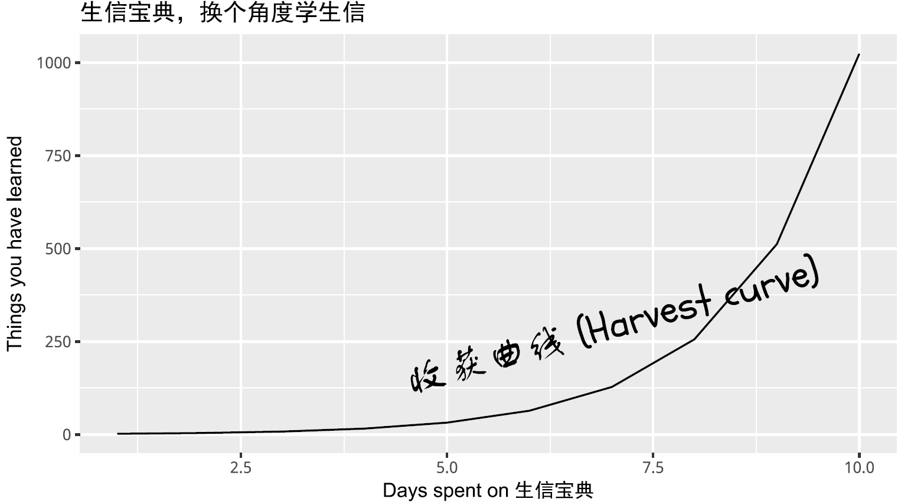
```

## PCA原理解析和图形绘制 {#pca}

```{r usedpackages}
library(knitr)
library(psych)
library(reshape2)
library(ggplot2)
library(ggbeeswarm)
library(scatterplot3d)
library(useful)
library(ggfortify)
```

```{r selfdefinedfunctions, echo=FALSE}
mat_show <- function(matr) {

    printmrow <- function(x) {
        ret <- paste(paste(x,collapse = " & "),"\\\\\n")
        sprintf(ret)
    }
    
    align_str <- paste0('{',paste0(rep('r',ncol(matr)), collapse=""),'}')

    format_mat <- apply(matr,1,printmrow)
    add_env <- paste("\\left[\\begin{array}", align_str, 
		paste(format_mat, collapse=' '),"\\end{array}\\right]")
    return(add_env)
}
```

### 主成分分析简介 {#pcaintroduc}

主成分分析 (PCA, principal component analysis)是一种数学降维方法, 利用正交变换 (orthogonal transformation)把一系列可能**线性相关的变量**转换为一组**线性不相关的新变量**，也称为主成分，从而利用新变量在更小的维度下展示数据的特征。

主成分是原有变量的线性组合，其数目不多于原始变量。组合之后，相当于我们获得了一批新的观测数据，这些数据的含义不同于原有数据，但包含了之前数据的大部分特征，并且有着较低的维度，便于进一步的分析。

在空间上，PCA可以理解为把原始数据投射到一个新的坐标系统，第一主成分为第一坐标轴，它的含义代表了原始数据中多个变量经过某种变换得到的新变量的变化区间；第二成分为第二坐标轴，代表了原始数据中多个变量经过某种变换得到的第二个新变量的变化区间。这样我们把利用原始数据解释样品的差异转变为利用新变量解释样品的差异。

这种投射方式会有很多，为了最大限度保留对原始数据的解释，一般会用最大方差理论或最小损失理论，使得第一主成分有着最大的方差或变异数 (就是说其能尽量多的解释原始数据的差异)；随后的每一个主成分都与前面的主成分正交，且有着仅次于前一主成分的最大方差 (正交简单的理解就是两个主成分空间夹角为90°，两者之间无线性关联，从而完成去冗余操作)。


### 主成分分析的意义  {#pcaintroduc1}

1. 简化运算。

       在问题研究中，为了全面系统地分析问题，我们通常会收集众多的影响因素也就是众多的变量。这样会使得研究更丰富，通常也会带来较多的冗余数据和复杂的计算量。
       
       比如我们我们测序了100种样品的基因表达谱借以通过分子表达水平的差异对这100种样品进行分类。在这个问题中，研究的变量就是不同的基因。每个基因的表达都可以在一定程度上反应样品之间的差异，但某些基因之间却有着调控、协同或拮抗的关系，表现为它们的表达值存在一些相关性，这就造成了统计数据所反映的信息存在一定程度的冗余。另外假如某些基因如持家基因在所有样本中表达都一样，它们对于解释样本的差异也没有意义。这么多的变量在后续统计分析中会增大运算量和计算复杂度，应用PCA就可以在尽量多的保持变量所包含的信息又能维持尽量少的变量数目，帮助简化运算和结果解释。


2. 去除数据噪音。

       比如说我们在样品的制备过程中，由于不完全一致的操作，导致样品的状态有细微的改变，从而造成一些持家基因也发生了相应的变化，但变化幅度远小于核心基因 (一般认为噪音的方差小于信息的方差）。而PCA在降维的过程中滤去了这些变化幅度较小的噪音变化，增大了数据的信噪比。

3. 利用散点图实现多维数据可视化。

       在上面的表达谱分析中，假如我们有1个基因，可以在线性层面对样本进行分类；如果我们有2个基因，可以在一个平面对样本进行分类；如果我们有3个基因，可以在一个立体空间对样本进行分类；如果有更多的基因，比如说n个，那么每个样品就是n维空间的一个点，则很难在图形上展示样品的分类关系。利用PCA分析，我们可以选取贡献最大的2个或3个主成分作为数据代表用以可视化。这比直接选取三个表达变化最大的基因更能反映样品之间的差异。（利用Pearson相关系数对样品进行聚类在样品数目比较少时是一个解决办法）

4. 发现隐性相关变量。

      我们在合并冗余原始变量得到主成分过程中，会发现某些原始变量对同一主成分有着相似的贡献，也就是说这些变量之间存在着某种相关性，为相关变量。同时也可以获得这些变量对主成分的贡献程度。对基因表达数据可以理解为发现了存在协同或拮抗关系的基因。

### 示例展示原始变量对样品的分类 {#pcaintroduc2}

假设有一套数据集，包含100个样品中某一基因的表达量。如下所示，每一行为一个样品，每一列为基因的表达值。这也是做PCA分析的基本数据组织方式，每一行代表一个样品，每一列代表一组观察数据即一个变量。


```{r datainit1}
count <- 50
Gene1_a <- rnorm(count,5,0.5)
Gene1_b <- rnorm(count,20,0.5)
grp_a <- rep('a', count)
grp_b <- rep('b', count)
cy_data <- data.frame(Gene1 = c(Gene1_a, Gene1_b), Group=c(grp_a, grp_b))
cy_data <- as.data.frame(cy_data)
label <- c(paste0(grp_a, 1:count), paste0(grp_b, 1:count))
row.names(cy_data) <- label
library(knitr)
library(psych)
# Add additional column to data only for plotting
cy_data$Y <- rep(0,count*2)
kable(headTail(cy_data), booktabs=TRUE, caption="Expression profile for Gene1 in 100 samples")
```

从下图可以看出，100个样品根据`Gene1`表达量的不同在横轴上被被分为了2类，可以看做是在线性水平的分类。

```{r jitteroneDdata}
library("ggplot2")
library("ggbeeswarm")

# geom_quasirandom:用于画Jitter Plot
# theme(axis.*.y): 去除Y轴
# xlim, ylim设定坐标轴的区间
ggplot(cy_data,aes(Gene1, Y))+geom_quasirandom(aes(color=factor(Group)))+
	theme(legend.position=c(0.5,0.7)) + theme(legend.title=element_blank()) + 
	scale_fill_discrete(name="Group") + theme(axis.line.y=element_blank(), 
	axis.text.y=element_blank(), axis.ticks.y=element_blank(), 
	axis.title.y=element_blank()) + ylim(-0.5,5) + xlim(0,25)
```

那么如果有2个基因呢？

```{r datainit2}
count <- 50
Gene2_a <- rnorm(count,5,0.2)
Gene2_b <- rnorm(count,5,0.2)

cy_data2 <- data.frame(Gene1 = c(Gene1_a, Gene1_b), Gene2 = c(Gene2_a, Gene2_b), 
		Group=c(grp_a, grp_b))
cy_data2 <- as.data.frame(cy_data2)

row.names(cy_data2) <- label

kable(headTail(cy_data2), booktabs=T, 
		caption="Expression profile for Gene1 and Gene2 in 100 samples")
```

从下图可以看出，100个样品根据`Gene1`和`Gene2`的表达量的不同在坐标轴上被被分为了2类，可以看做是在平面水平的分类。而且在这个例子中，我们可以很容易的看出`Gene1`对样品分类的贡献要比`Gene2`大，因为`Gene1`在样品间的表达差异大。

```{r jitter2Ddata}
ggplot(cy_data2,aes(Gene1, Gene2))+geom_point(aes(color=factor(Group)))+
	theme(legend.position=c(0.5,0.9)) + theme(legend.title=element_blank()) + 
	ylim(0,10) + xlim(0,25)
```

如果有3个基因呢？

```{r datainit3}
count <- 50
Gene3_a <- c(rnorm(count/2,5,0.2), rnorm(count/2,15,0.2))
Gene3_b <- c(rnorm(count/2,15,0.2), rnorm(count/2,5,0.2))

data3 <- data.frame(Gene1 = c(Gene1_a, Gene1_b), Gene2 = c(Gene2_a, Gene2_b), 
		Gene3 = c(Gene3_a, Gene3_b), Group=c(grp_a, grp_b))
data3 <- as.data.frame(data3)
data3$Group <- as.factor(data3$Group)

row.names(data3) <- label

kable(headTail(data3), booktabs=T, caption="Expression profile for 3 genes in 100 samples")
```

从下图可以看出，100个样品根据`Gene1`、`Gene2`和`Gene3`的表达量的不同在坐标轴上被被分为了4类，可以看做是立体空间的分类。而且在这个例子中，我们可以很容易的看出`Gene1`和`Gene3`对样品分类的贡献要比`Gene2`大。

```{r jitter3Ddata1}
library(scatterplot3d)
colorl <- c("#E69F00", "#56B4E9")
# Extract same number of colors as the Group and same Group would have same color.
colors <- colorl[as.numeric(data3$Group)]
scatterplot3d(data3[,1:3], color=colors, xlim=c(0,25), ylim=c(0,25), zlim=c(0,25), 
	angle=55, pch=16)
legend("top", legend=levels(data3$Group), col=colorl, pch=16, xpd=T, horiz=T)
```

当我们向由`Gene1`和`Gene2`构成的`X-Y`平面做垂线时，可以很明显的看出，`Gene2`所在的轴对样品的分类没有贡献。因为投射到`X-Y`屏幕上的点在`Y`轴几乎处于同一位置。

```{r jitter3Ddata2}
library(scatterplot3d)
colorl <- c("#E69F00", "#56B4E9")
colors <- colorl[as.numeric(data3$Group)]
scatterplot3d(data3[,1:3], color=colors, xlim=c(0,25), ylim=c(0,25), zlim=c(0,25),type='h')
legend("top", legend=levels(data3$Group), col=colorl, pch=16, xpd=T, horiz=T)
```

我们把坐标轴做一个转换，可以看到在由`Gene1`和`Gene3`构成的`X-Y`平面上，样品被分为了4类。`Gene2`对样品的分类几乎没有贡献，因为几乎所有样品在Gene2维度上的值都一样。

```{r jitter3Ddata3}
library(scatterplot3d)
colorl <- c("#E69F00", "#56B4E9")
colors <- colorl[as.numeric(data3$Group)]
scatterplot3d(x=data3$Gene1, y= data3$Gene3, z= data3$Gene2, color=colors, 
		xlim=c(0,25), ylim=c(0,25), zlim=c(0,25),type='h')
legend("top", legend=levels(data3$Group), col=colorl, pch=16, xpd=T, horiz=T)
```

在上述例子中，我们可以很容易的区分出`Gene1`和`Gene3`可以作为分类的主成分，而`Gene2`则对分类没有帮助，可以在计算中去除。

但是如果我们测序了几万个基因的表达时，就很难通过肉眼去看，或者作出一个图供我们筛选哪些基因对样本分类贡献大。这时我们应该怎么做呢？

其中有一个方法是，在这个基因表达矩阵中选出3个变化最大的基因做为3个主成分对样品进行分类。我们试验下效果怎么样。

```{r nbthiseqdata}
# 数据集来源于 http://satijalab.org/seurat/old-get-started/
# 原始下载链接 http://www.broadinstitute.org/~rahuls/seurat/seurat_files_nbt.zip
# 为了保证文章的使用，文末附有数据的新下载链接，以防原链接失效
data4 <- read.table("data/HiSeq301-RSEM-linear_values.txt", header=T, row.names=1,sep="\t")
dim(data4)
library(useful)
kable(corner(data4,r=15,c=8), booktabs=T, caption="Gene expression matrix")
```

我们筛选变异系数最大的3个基因。在这之前我们先剔除在少于5个样品中表达的基因和少于1000个表达的基因样品 （这里我们把表达值不小于1的基因视为表达的基因），并把所有基因根据其在不同样品中表达值的变异系数排序。

```{r varsel}
#去除表达值全为0的行
#data4_nonzero <- data4[rowSums(data4)!=0,]

#筛选符合要求的表达的行和列
#data4_use <- data4[apply(data4,1,function(row) sum(row>=1)>=5),]
#data4_use <- data4[,apply(data4,2,function(col) sum(col>=1)>=1000),]
data4_use <- data4[rowSums(data4>=1)>5,colSums(data4>=1)>1000]

# 对于表达谱数据，因为涉及到PCR的指数扩增，一般会取log处理
# 其它数据log处理会降低数据之间的差异，不一定适用
data4_use_log2 <- log2(data4_use+1)

dim(data4_use_log2)

# 计算变异系数(标准差除以平均值)度量基因表达变化幅度
#cv <- apply(data4_use_log2,1,sd)/rowMeans(data4_use_log2)
# 根据变异系数排序
#data4_use_log2 <- data4_use_log2[order(cv,decreasing = T),]

# 计算中值绝对偏差 (MAD, median absolute deviation)度量基因表达变化幅度
# 在基因表达中，尽管某些基因很小的变化会导致重要的生物学意义，
# 但是很小的观察值会引入很大的背景噪音，因此也意义不大。
mads <- apply(data4_use_log2, 1, mad)
data4_use_log2 <- data4_use_log2[rev(order(mads)),]

#筛选前3行
data_var3 <- data4_use_log2[1:3,]

# 转置矩阵使得每一行为一个样品，每一列为一组变量
data_var3_forPCA <- t(data_var3)

dim(data_var3_forPCA)
kable(corner(data_var3_forPCA, r=10,c=5), booktabs=TRUE, 
		caption="A table of the 3 most variable genes")
```


```{r generategrp}
# 获得样品分组信息
sample <- rownames(data_var3_forPCA)

# 把样品名字按 <_> 分割，取出其第二部分作为样品的组名
# lapply(X, FUC) 对列表或向量中每个元素执行FUC操作，FUNC为自定义或R自带的函数
## One better way to generate group
group <- unlist(lapply(strsplit(sample, "_"), function(x) x[2]))

##One way to generate group
#sample_split <- strsplit(sample,"_")
#group <- matrix(unlist(sample_split), ncol=3, byrow=T)[,2]
print(sample[1:4])
print(group[1:4])
```

```{r addgrp, eval=T, echo=T}
data_var3_scatter <- as.data.frame(data_var3_forPCA)
data_var3_scatter$group <- group
kable(corner(data_var3_scatter, r=10,c=5), booktabs=TRUE, 
	caption="A table of the 3 most variable genes")
```

```{r quasimPLot, eval=T, echo=T, fig.width=12}
library(reshape2)
library(ggplot2)
data_var3_melt <- melt(data_var3_scatter, id.vars=c("group"))
kable(corner(data_var3_melt, r=10,c=5), booktabs=TRUE, 
		caption="A table of the 3 most variable genes in melted format")
ggplot(data_var3_melt, aes(factor(variable),value))+ylab("Gene expression")+
	geom_violin(aes(fill=factor(group)), stat="ydensity", position="dodge",
			scale="width", trim=TRUE) +xlab(NULL)

#ggplot(data_var3_melt, aes(factor(variable),value))+ylab("Gene expression")+ 
	#geom_quasirandom(aes(color=factor(group))) +xlab(NULL)
```

```{r p3dvar1, fig.width=10, fig.height=8}
# 根据分组数目确定颜色变量
colorA <- rainbow(length(unique(group)))

# 根据每个样品的分组信息获取对应的颜色变量
colors <- colorA[as.factor(group)]

# 根据样品分组信息获得legend的颜色
colorl <- colorA[as.factor(unique(group))]

# 获得PCH symbol列表
pch_l <- as.numeric(as.factor(unique(group)))
# 产生每个样品的pch symbol
pch <- pch_l[as.factor(group)]

scatterplot3d(data_var3_forPCA[,1:3], color=colors, pch=pch)
legend(0,10, legend=levels(as.factor(group)), col=colorl, pch=pch_l, xpd=T, horiz=F, ncol=6)
```

我们看到图中的样品并没有按照预先设定的标签完全分开。当然我们也可以通过其他方法筛选变异最大的三个基因，最终的分类效果不会相差很大。因为不管怎么筛选，我们都只用到了3个基因的表达量。

假如我们把这个数据用PCA来分类，结果是怎样的呢？

```{r pcacluster}
# Pay attention to the format of PCA input 
# Rows are samples and columns are variables
data4_use_log2_t <- t(data4_use_log2)

# Add group column for plotting
data4_use_log2_label <- as.data.frame(data4_use_log2_t)
data4_use_log2_label$group <- group

# By default, prcomp will centralized the data using mean.
# Normalize data for PCA by dividing each data by column standard deviation.
# Often, we would normalize data.
# Only when we care about the real number changes other than the trends,
# `scale` can be set to TRUE. 
# We will show the differences of scaling and un-scaling effects.
pca <- prcomp(data4_use_log2_t, scale=T)

# sdev: standard deviation of the principle components.
# Square to get variance
percentVar <- pca$sdev^2 / sum( pca$sdev^2)

# To check what's in pca
print(str(pca))
```

从图中可以看到，数据呈现了一定的分类模式 (当然这个分类结果也不理想，我们随后再进一步优化)。

```{r pcaclusterplot}
library(ggfortify)
autoplot(pca, data=data4_use_log2_label, colour="group") + 
	xlab(paste0("PC1 (", round(percentVar[1]*100), "% variance)")) + 
	ylab(paste0("PC2 (", round(percentVar[2]*100), "% variance)")) + theme_bw() + 
	theme(panel.grid.major = element_blank(), panel.grid.minor = element_blank()) + 
	theme(legend.position="right")
```

采用3个主成分获得的分类效果优于2个主成分，因为这样保留的原始信息更多。

```{r pcaclusterplot3d}
# 根据分组数目确定颜色变量
colorA <- rainbow(length(unique(group)))

# 根据每个样品的分组信息获取对应的颜色变量
colors <- colorA[as.factor(group)]

# 根据样品分组信息获得legend的颜色
colorl <- colorA[as.factor(unique(group))]

# 获得PCH symbol列表
pch_l <- as.numeric(as.factor(unique(group)))
# 产生每个样品的pch symbol
pch <- pch_l[as.factor(group)]

pc <- as.data.frame(pca$x)
scatterplot3d(x=pc$PC1, y=pc$PC2, z=pc$PC3, pch=pch, color=colors, 
	xlab=paste0("PC1 (", round(percentVar[1]*100), "% variance)"), 
	ylab=paste0("PC2 (", round(percentVar[2]*100), "% variance)"), 
	zlab=paste0("PC3 (", round(percentVar[3]*100), "% variance)"))

legend(-3,8, legend=levels(as.factor(group)), col=colorl, pch=pch_l, xpd=T, horiz=F, ncol=6)
```


### PCA的实现原理  {#pcaintroduc3}

在上面的例子中，PCA分析不是简单地选取2个或3个变化最大的基因，而是先把原始的变量做一个评估，计算各个变量各自的变异度(方差)和两两变量的相关度（协方差），得到一个协方差矩阵。在这个协方差矩阵中，对角线的值为每一个变量的方差，其它值为每两个变量的协方差。随后对原变量的协方差矩阵对角化处理，即求解其特征值和特征向量。原变量与特征向量的乘积（对原始变量的线性组合）即为新变量（回顾下线性代数中的矩阵乘法）；新变量的协方差矩阵为对角协方差矩阵且对角线上的方差由大到小排列；然后从新变量中选择信息最丰富也就是方差最大的的前2个或前3个新变量也就是主成分用以可视化。下面我们一步步阐释这是怎么做的。


我们先回忆两个数学概念，方差和协方差。`方差`用来表示一组一维数据的离散程度。`协方差`表示2组一维数据的相关性。当协方差为0时，表示两组数据完全独立。当协方差为正时，表示一组数据增加时另外一组也会增加；当协方差为负时表示一组数据增加时另外一组数据会降低 （与相关系数类似）。如果我们有很多组一维数据，比如很多基因的表达数据，就会得到很多协方差，这就构成了协方差矩阵。

方差和协方差的计算公式如下：

$$
方差 Var(X) = \frac{\sum_{i=1}^{n}(X_i-\bar X)^2}{n-1}
$$

$$
协方差 cov(X,Y) = \frac{\sum_{i=1}^{n}(X_i-\bar X)(Y_i-\bar Y)}{n-1}
$$

如果数据的均值为0，这个公式可以进一步简化。简化后的公式把计算协方差转变为了矩阵乘法运算。这也是为什么PCA需要中心化数据。

$$
方差 Var(X) = \frac{\sum_{i=1}^{n}{X_i}^2}{n-1}
$$

$$
协方差 cov(X,Y) = \frac{\sum_{i=1}^{n}X_iY_i}{n-1}
$$

$$
协方差矩阵 cov(X,Y) = \frac{X_{n,m}^T Y_{n,m}}{n-1}
$$

假如我们有一个矩阵如下，

```{r testmatrix}
mat <- as.data.frame(matrix(rnorm(20,0,1), nrow=4))
colnames(mat) <- paste0("Gene_", letters[1:5])
rownames(mat) <- paste0("Samp_", 1:4)
mat
```

平均值中心化 (mean centering)：中心化数据使其平均值为0

```{r matmeannorm}
# mean-centering data for columns
# Get mean-value matrix first
mat_mean_norm <- mat - rep(colMeans(mat),rep.int(nrow(mat),ncol(mat)))
mat_mean_norm

# mean-centering using scale for columns
scale(mat, center=T, scale=F)
```

中位数中心化 (median centering)：如果数据变换范围很大或有异常值，中位数标准化效果会更好。

```{r matmediannorm}
# median-centering data for columns
mat_median_norm <- mat - rep(apply(mat,2,median),rep.int(nrow(mat),ncol(mat)))
mat_mean_norm
```

我们可以计算`Gene_a`的方差为 `r I(var(mat$Gene_a))` (`var(mat$Gene_a)`)；`Gene_a`和`Gene_b`的协方差为`r I(cov(mat$Gene_a, mat$Gene_b))`。

mat中5组基因的表达值的方差计算如下：

```{r var}
apply(mat,2,var)
```

mat中5组基因表达值的协方差计算如下：

```{r cov}
cov(mat)
```

如果均值为0，数值矩阵的协方差矩阵为矩阵的乘积 （实际上是矩阵的转置与其本身的乘积除以变量的维数减1）。

```{r matrixmultiple}
# Covariance matrix for Mean normalized matrix
cov(mat_mean_norm)

# Covariance matrix for Mean normalized matrix 
# crossprod: matrix multiplication
crossprod(as.matrix(mat_mean_norm)) / (nrow(mat_mean_norm)-1)

# Use %*% for matrix multiplication (slower)
t(as.matrix(mat_mean_norm)) %*% as.matrix(mat_mean_norm) / (nrow(mat_mean_norm)-1)
```

用矩阵形式书写如下，便于理解

$$
\mathbf{cov(mat)} = \frac{1}{`r nrow(mat_mean_norm)-1`} `r mat_show(round(t(mat_mean_norm),2))` `r mat_show(round(mat_mean_norm,2))` = `r mat_show(round(cov(mat_mean_norm),2))` 
$$

根据前面的描述，原始变量的协方差矩阵表示原始变量自身的方差（协方差矩阵的主对角线位置）和原始变量之间的相关程度(非主对角线位置)。如果从这些数据中筛选主成分，则要选择方差大(主对角线值大)，且与其它已选变量之间相关性最小的变量（非主对角线值很小）。如果这些原始变量之间毫不相关，则它们的协方差矩阵在除主对角线处外其它地方的值都为0，这种矩阵成为对角矩阵。

而做PCA分析就是产生一组新的变量，使得新变量的协方差矩阵为对角阵，满足上面的要求。从而达到去冗余的目的。然后再选取方差大的变量，实现降维和去噪。

如果正向推导，这种组合可能会有很多种，一一计算会比较麻烦。那反过来看呢？ 我们不去寻找这种组合，而是计算如何使原变量的协方差矩阵变为对角阵。

数学推导中谨记的两个概念：

1. **假设**: 把未求解到的变量假设出来，用符号代替；这样有助于思考和演算
2. **逆向**：如果正向推导求不出，不妨倒着来；尽量多的利用已有信息

前面提到，新变量($Y_{m,k}$)是原始变量($X_{m,n}$)(原始变量的协方差矩阵为($C_{n,n}$))的线性组合，那么**假设**我们找到了这么一个线性组合(命名为特征矩阵($P_{n,k}$))，得到一组新变量$Y_{m,k}=X_{m,n}P_{n,k}$，并且新变量的协方差矩阵($D_{k,k}$)为对角阵。那么这个特征矩阵($P_{n,k}$)需要符合什么条件呢？


从矩阵运算可以看出，最终的特征矩阵($P_{n,k}$)需要把原变量协方差矩阵($C_{n,n}$)转换为对角阵(因为新变量的协方差矩阵($D_{k,k}$)为对角阵)，并且对角元素从大到小排列（保证每个主成分的贡献度依次降低）。

现在就把求解新变量的任务转变为了求解原变量协方差矩阵的对角化问题了。在线性代数中，矩阵对角化的问题就是求解矩阵的特征值和特征向量的问题。

我们举一个例子讲述怎么求解特征值和特征向量。

假设$A_{n,n}$为n阶对称阵，如存在$\lambda$和非零向量$x$，使得$Ax=\lambda x$，则称$\lambda$为矩阵$A_{n,n}$的特征值，非零向量$x$为为矩阵$A_{n,n}$对应于特征值$\lambda$的特征向量。

根据这个定义可以得出$(A_{n,n} - \lambda E)x = 0$，由于$x$为非零向量，所以行列式$|A-\lambda E| = 0$。


由此求解出n个根$\lambda_{1}, \lambda_{2}, ..., \lambda_{3}$就是矩阵$A$的特征值。

回顾下行列式的计算：

* 行列式的值为行列式第一列的每一个数乘以它的余子式（余子式是行列式中除去当前元素所在行和列之后剩下的行列式）。
* 当行列式中存在线性相关的行或列或者有一行或一列元素全为0时，行列式的值为0。
* 上三角形行列式的值为其主对角线上元素的乘积。
* 互换行列式的两行或两列，行列式变号。
* 行列式的某一列（行）乘以同意书加到另一列（列）对应元素上去，行列式不变。

假如我们有一个矩阵 $\mathbf{A} = \left[\begin{array} {cc} 3 & -1 \\ -1 & 3 \end{array}\right]$，如何计算它的特征值和特征向量呢？


则$\lambda$的值为2或4。

对$\lambda_{1}=2$时，求解$(A-2E)x=\left|\begin{array} {cc} 1 & -1 \\ -1 & 1 \end{array}\right| x= 0$，得$x=k\left|\begin{array}{c} 1 \\ 1 \end{array}\right|$，则对应于$\lambda_{1}=2$时的特征向量$p_{1}=\left|\begin{array}{c} 1 \\ 1 \end{array}\right|$

对$\lambda_{2}=4$时，求解$(A-2E)x=\left|\begin{array} {cc} -1 & -1 \\ -1 & -1 \end{array}\right| x= 0$，得$x=k\left|\begin{array}{c} 1 \\ -1 \end{array}\right|$，则对应于$\lambda_{2}=4$时的特征向量$p_{2}=\left|\begin{array}{c} 1 \\ -1 \end{array}\right|$

以上就完成了PCA的数学推导。

### 简单的PCA实现 {#pcaintroduc4}

我们使用前面用到的数据`data3`来演示下如何用R函数实现PCA的计算，并与R中自带的`prcomp`做个比较。

```{r showdata3}
library(knitr)
kable(headTail(data3), booktabs=T, caption="Expression profile for 3 genes in 100 samples")
```

标准化数据

```{r scaledata3}
data3_center_scale <- scale(data3[,1:3], center=T, scale=T)
kable(headTail(data3_center_scale), booktabs=T, 
		caption="Normalized expression for 3 genes in 100 samples")
```

计算协方差矩阵

```{r covdata3}
data3_center_scale_cov <- cov(data3_center_scale)
kable(data3_center_scale_cov, booktabs=T, 
		caption="Covariance matrix for 3 genes in 100 samples")
```

求解特征值和特征向量

```{r eigendata3}
data3_center_scale_cov_eigen <- eigen(data3_center_scale_cov)

# 特征值，从大到小排序
data3_center_scale_cov_eigen$values

# 特征向量, 每一列为对应特征值的特征向量
data3_center_scale_cov_eigen$vectors
```

产生新的矩阵

```{r newdata3}
pc_select = 3
label = paste0("PC",c(1:pc_select))
data3_new <- data3_center_scale %*% data3_center_scale_cov_eigen$vectors[,1:pc_select]
colnames(data3_new) <- label
kable(headTail(data3_new), booktabs=T, 
		caption="PCA generated matrix for the expression of 3 genes in 100 samples")
```

比较原始数据和新产生的主成分对样品的聚类

```{r data3oldplot}
#library(scatterplot3d)
colorl <- c("#E69F00", "#56B4E9")
# Extract same number of colors as the Group and same Group would have same color.
colors <- colorl[as.numeric(data3$Group)]

# 1 row 2 columns
par(mfrow=c(1,2))

scatterplot3d(data3[,1:3], color=colors, angle=55, pch=16, main="Original data")
legend("top", legend=levels(data3$Group), col=colorl, pch=16, xpd=T, horiz=T)


scatterplot3d(data3_new, color=colors,angle=55, pch=16, main="Principle components")
legend("top", legend=levels(data3$Group), col=colorl, pch=16, xpd=T, horiz=T)

#par(mfrow=c(1,1))
```

利用`prcomp`进行主成分分析

```{r data3prcomp}
pca_data3 <- prcomp(data3[,1:3], center=TRUE, scale=TRUE)

#Show whats in the result returned by prcomp
str(pca_data3)

# 新的数据，与前面计算的抑制
data3_pca_new <- pca_data3$x
kable(headTail(data3_pca_new), booktabs=T, 
		caption="PCA generated matrix usig princomp for the expression of 3 genes in 100 samples")

# 特征向量，与我们前面计算的一致(特征向量的符号是任意的)
pca_data3$rotation
```

比较手动实现的PCA与`prcomp`实现的PCA的聚类结果

```{r pcacompare}
#library(scatterplot3d)
colorl <- c("#E69F00", "#56B4E9")
# Extract same number of colors as the Group and same Group would have same color.
colors <- colorl[as.numeric(data3$Group)]

# 1 row 2 columns
par(mfrow=c(1,2))

scatterplot3d(data3_new, color=colors,angle=55, pch=16, main="PCA by steps")
legend("top", legend=levels(data3$Group), col=colorl, pch=16, xpd=T, horiz=T)

scatterplot3d(data3_pca_new, color=colors,angle=55, pch=16, main="PCA by prcomp")
legend("top", legend=levels(data3$Group), col=colorl, pch=16, xpd=T, horiz=T)

#par(mfrow=c(1,1))
```

自定义PCA计算函数

```{r ctPCA}
ct_PCA <- function(data, center=TRUE, scale=TRUE){
  data_norm <- scale(data, center=center, scale=scale)
  data_norm_cov <- crossprod(as.matrix(data_norm)) / (nrow(data_norm)-1)
  data_eigen <- eigen(data_norm_cov)

  rotation <- data_eigen$vectors
  label <- paste0('PC', c(1:ncol(rotation)))
  colnames(rotation) <- label
  sdev <- sqrt(data_eigen$values)
  data_new <- data_norm %*% rotation
  colnames(data_new) <- label
  ct_pca <- list('rotation'=rotation, 'x'=data_new, 'sdev'=sdev)
  return(ct_pca)
}
```

比较有无`scale`对聚类的影响，从图中可以看到，如果不对数据进行`scale`处理，样品的聚类结果更像原始数据，本身数值大的基因对主成分的贡献会大。如果关注的是每个变量自身的实际方差对样品分类的贡献，则不应该`SCALE`；如果关注的是变量的相对大小对样品分类的贡献，则应该`SCALE`，以防数值高的变量导入的大方差引入的偏见。

```{r pcanoscale}
data3_pca_noscale_step = ct_PCA(data3[,1:3], center=TRUE, scale=FALSE)

# 特征向量
data3_pca_noscale_step$rotation

# 新变量
data3_pca_noscale_pc <- data3_pca_noscale_step$x
```

```{r comparescale, fig.width=12, fig.height=12}
#library(scatterplot3d)
colorl <- c("#E69F00", "#56B4E9")
# Extract same number of colors as the Group and same Group would have same color.
colors <- colorl[as.numeric(data3$Group)]

# 1 row 2 columns
par(mfrow=c(2,2))

scatterplot3d(data3[,c(1,3,2)], color=colors, angle=55, pch=16, main="Original data")
legend("top", legend=levels(data3$Group), col=colorl, pch=16, xpd=T, horiz=T)

scatterplot3d(data3_pca_noscale_pc, color=colors,angle=55, pch=16, main="PCA (no scale)")
legend("top", legend=levels(data3$Group), col=colorl, pch=16, xpd=T, horiz=T)

scatterplot3d(data3_center_scale[,c(1,3,2)], color=colors, angle=55, pch=16, 
		main="Original data (scale)")
legend("top", legend=levels(data3$Group), col=colorl, pch=16, xpd=T, horiz=T)

scatterplot3d(data3_new, color=colors,angle=55, pch=16, main="PCA (scale)")
legend("top", legend=levels(data3$Group), col=colorl, pch=16, xpd=T, horiz=T)

#par(mfrow=c(1,1))
```


### PCA结果解释 {#pcaintroduc5}

`prcomp`函数会返回主成分的标准差、特征向量和主成分构成的新矩阵。接下来，探索下不同主成分对数据差异的贡献和主成分与原始变量的关系。

* 主成分的平方为为特征值,其含义为每个主成分可以解释的数据差异，计算方式为 `eigenvalues = (pca$sdev)^2`
* 每个主成分可以解释的数据差异的比例为 `percent_var = eigenvalues*100/sum(eigenvalues)`
* 可以使用`summary(pca)`获取以上两条信息。

这两个信息可以判断主成分分析的质量：

* 成功的降维需要保证在前几个为数不多的主成分对数据差异的解释可以达到80-90%。

指导选择主成分的数目：

* 选择的主成分足以解释的总方差大于80% (方差比例碎石图)
* 从前面的协方差矩阵可以看到，自动定标(scale)的变量的方差为1 (协方差矩阵对角线的值)。待选择的主成分应该是那些方差大于1的主成分，即其解释的方差大于原始变量（特征值碎石图，方差大于1，特征值也会大于1，反之亦然）。

鉴定核心变量和变量间的隐性关系:

* 原始变量与主成分的相关性 `Variable correlation with PCs (var.cor) = loadings * sdev`
* 原始数据对主成分的贡献度 `var.cor^2 / (total var.cor^2)`


在测试数据中，`scale`后，三个主成分对数据差异的贡献度大都在30%左右，而未`scale`的数据，三个主成分对数据差异的贡献度相差很大。这是因为三个基因由于自身表达量级所引起的方差的差异导致它们各自对数据的权重差异，从而使主成分偏向于数值大的变量。


### PCA应用于测试数据 {#pcaintroduc6}

前面用到一组比较大的测试数据集，并做了PCA分析，现在测试不同的处理对结果的影响。

首先回顾下我们用到的数据。

```{r pcaclustershowdata}
library("gridExtra")
# Pay attention to the format of PCA input 
# Rows are samples and columns are variables
# data4_use_log2_t <- t(data4_use_log2)

# Add group column for plotting
# data4_use_log2_label <- as.data.frame(data4_use_log2_t)
# data4_use_log2_label$group <- group

kable(corner(data4_use_log2_label), digits=3, caption="Single cell gene expression data")
```

比较对数运算和`scale`对样品分类的影响。

```{r definepcaplot}
ct_pca_2d_plot <- function(pca, data_with_label, labelName='group', title='PCA') {
  # sdev: standard deviation of the principle components.
  # Square to get variance
  percentVar <- pca$sdev^2 / sum( pca$sdev^2)
  #data <- data_with_label
  #data[labelName] <- factor(unlist(data[labelName]))
  level <- length(unique(unlist(data_with_label[labelName])))
  shapes = (1:level)%%30  # maximum allow 30 types of symbols
  p = autoplot(pca, data=data_with_label, colour=labelName, shape=labelName) + 
      scale_shape_manual(values=shapes) +
      xlab(paste0("PC1 (", round(percentVar[1]*100), "% variance)")) + 
      ylab(paste0("PC2 (", round(percentVar[2]*100), "% variance)")) + 
      theme_bw() + theme(legend.position="right") + labs(title=title) +
      theme(panel.grid.major = element_blank(), panel.grid.minor = element_blank())
  return(p)
}
```

```{r comparepcascalelogcompute, fig.height=15, fig.width=16}
# By default, prcomp will centralized the data using mean.
# Normalize data for PCA by dividing each data by column standard deviation.
# Often, we would normalize data.
# Only when we care about the real number changes other than the trends,
# `scale` can be set to TRUE. 
# We will show the differences of scaling and un-scaling effects.
data4_use_t <- t(data4_use)
ori_scale_pca_test <- prcomp(data4_use_t, scale=T)
ori_no_scale_pca_test <- prcomp(data4_use_t, scale=F)
log_scale_pca_test <- prcomp(data4_use_log2_t, scale=T)
log_no_scale_pca_test <- prcomp(data4_use_log2_t, scale=F)
```

```{r comparepcascalelogplot, fig.width=12, fig.height=12}
ori_scale_pca_plot = ct_pca_2d_plot(ori_scale_pca_test, data4_use_log2_label, 
		title="Scaled original data")
ori_no_scale_pca_plot = ct_pca_2d_plot(ori_no_scale_pca_test, data4_use_log2_label, 
		title="Un-scaled original data")
log_scale_pca_plot = ct_pca_2d_plot(log_scale_pca_test, data4_use_log2_label, 
		title="Scaled log transformed data")
log_no_scale_pca_plot = ct_pca_2d_plot(log_no_scale_pca_test, data4_use_log2_label, 
		title="Un-scaled log transformed data")

a__ <- grid.arrange(ori_scale_pca_plot, ori_no_scale_pca_plot, log_scale_pca_plot, 
		log_no_scale_pca_plot, ncol=2)
```

如果首先提取500个变化最大的基因，再执行PCA分析会怎样呢？

```{r getvargenethenpca, fig.height=15, fig.width=15}
data4_use_mad <- apply(data4_use, 1, mad)
data4_use_mad_top500 <- t(data4_use[rev(order(data4_use_mad))[1:500],])

data4_use_log2_mad <- apply(data4_use_log2, 1, mad)
data4_use_log2_mad_top500 <- t(data4_use_log2[rev(order(data4_use_log2_mad))[1:500],])

ori_scale_pca_top500 <- prcomp(data4_use_mad_top500, scale=T)
ori_no_scale_pca_top500 <- prcomp(data4_use_mad_top500, scale=F)
log_scale_pca_top500 <- prcomp(data4_use_log2_mad_top500, scale=T)
log_no_scale_pca_top500 <- prcomp(data4_use_log2_mad_top500, scale=F)
```

```{r comparevargenepcascalelogplot, fig.height=12, fig.width=12}
ori_scale_pca_plot_t5 = ct_pca_2d_plot(ori_scale_pca_top500, data4_use_log2_label, 
		title="Scaled original data")
ori_no_scale_pca_plot_t5 = ct_pca_2d_plot(ori_no_scale_pca_top500, 
		data4_use_log2_label, title="Un-scaled original data")
log_scale_pca_plot_t5 = ct_pca_2d_plot(log_scale_pca_top500, 
		data4_use_log2_label, title="Scaled log transformed data")
log_no_scale_pca_plot_t5 = ct_pca_2d_plot(log_no_scale_pca_top500, 
		data4_use_log2_label, title="Un-scaled log transformed data")

a__ <- grid.arrange(ori_scale_pca_plot_t5, ori_no_scale_pca_plot_t5, 
                    log_scale_pca_plot_t5, log_no_scale_pca_plot_t5, ncol=2)
```


### PCA注意事项 {#pcaintroduc7}

1. 一般说来，在PCA之前原始数据需要中心化（centering，数值减去平均值）。中心化的方法很多，除了平均值中心化（mean-centering）外，还包括其它更稳健的方法，比如中位数中心化等。

2. 除了中心化以外，定标 (Scale, 数值除以标准差) 也是数据前处理中需要考虑的一点。如果数据没有定标，则原始数据中方差大的变量对主成分的贡献会很大。数据的方差与其量级成指数关系，比如一组数据`(1,2,3,4)`的方差是`1.67`，而`(10,20,30,40)`的方差就是`167`,数据变大10倍，方差放大了100倍。

3. 但是定标(scale)可能会有一些负面效果，因为定标后变量之间的权重就是变得相同。如果我们的变量中有噪音的话，我们就在无形中把噪音和信息的权重变得相同，但PCA本身无法区分信号和噪音。在这样的情形下，我们就不必做定标。

4. 一般而言，对于度量单位不同的指标或是取值范围彼此差异非常大的指标不直接由其协方差矩阵出发进行主成分分析，而应该考虑对数据的标准化。比如度量单位不同，有万人、万吨、万元、亿元，而数据间的差异性也非常大，小则几十大则几万，因此在用协方差矩阵求解主成分时存在**协方差矩阵中数据的差异性很大**。在后面提取主成分时发现，**只提取了一个主成分**，而此时并不能将所有的变量都解释到，这就没有真正起到**降维**的作用。此时就需要对数据进行定标(scale)，这样提取的主成分可以覆盖更多的变量，这就实现主成分分析的最终目的。但是对原始数据进行标准化后更倾向于使得各个指标的作用在主成分分析构成中相等。对于数据取值范围不大或是度量单位相同的指标进行标准化处理后，其主成分分析的结果与仍由协方差矩阵出发求得的结果有较大区别。这是因为对数据标准化的过程实际上就是**抹杀原有变量离散程度差异的过程**，标准化后方差均为1，而实际上方差是对数据信息的重要概括形式，也就是说，对原始数据进行标准化后抹杀了一部分重要信息，因此才使得标准化后各变量在主成分构成中的作用趋于相等。因此，**对同度量或是取值范围在同量级的数据**还是直接使用非定标数据求解主成分为宜。

5. 中心化和定标都会受数据中离群值（outliers）或者数据不均匀（比如数据被分为若干个小组）的影响，应该用更稳健的中心化和定标方法。

6. PCA也存在一些限制，例如它可以很好的解除线性相关，但是对于高阶相关性就没有办法了，对于存在高阶相关性的数据，可以考虑Kernel PCA，通过Kernel函数将非线性相关转为线性相关，关于这点就不展开讨论了。另外，PCA假设数据各主特征是分布在正交方向上，如果在非正交方向上存在几个方差较大的方向，PCA的效果就大打折扣了。


### 参考资料  {#pcaintroduc8}

* https://www.zhihu.com/question/20998460
* [PCA 教程1](http://blog.csdn.net/zhongkelee/article/details/44064401)
* [PCA 文字化描述](http://www.xiaolingzi.com/?p=963)
* [pca1](http://wenku.baidu.com/link?url=hsnzR5gUvsPBwkwwcWU4T3aTSC_fsZDxAmaGGBPfumsIW_I0TJAdJEWhFyiQgw7uA58DKukR-9g5x0DyzE97kHddMaXOxk_iZBjoIdbdB6e)

* [ggplot2 axis](http://stackoverflow.com/questions/22092220/plot-only-y-axis-but-nothing-else)

* [scatterplot3D](http://www.sthda.com/english/wiki/scatterplot3d-3d-graphics-r-software-and-data-visualization)

* [稳健PCA](http://dong.farbox.com/32)

* http://www.nlpca.org/pca_principal_component_analysis.html

* [Data centering](http://gastonsanchez.com/how-to/2014/01/15/Center-data-in-R/)

* [Sample R markdown](http://www.statpower.net/Content/310/R Stuff/SampleMarkdown.html)

* [矩阵特征值，对称矩阵的对角化](http://www2.edu-edu.com.cn/lesson_crs78/self/02198/resource/contents/ch_05/ch_05.html)

* [Detail usage and visualization of prcomp result](http://www.sthda.com/english/wiki/principal-component-analysis-in-r-prcomp-vs-princomp-r-software-and-data-mining)

* [ggplot2 side by side plot](http://stackoverflow.com/questions/1249548/side-by-side-plots-with-ggplot2)


## 生存分析 {#survival}

生存分析指根据试验或调查得到的数据对生物或人的生存时间进行分析和推断，研究生存时间和结局与众多影响因素间关系及其程度大小的方法，也称生存率分析或存活率分析。常用于肿瘤等疾病的标志物筛选、疗效及预后的考核。

<mark>简单地说，比较两组或多组人群随着时间的延续，存活个体的比例变化趋势。活着的个体越少的组危险性越大，对应的基因对疾病影响越大，对应的药物治疗效果越差。</mark>

生存分析适合于处理时间-事件数据，如下

```{r, echo=F}
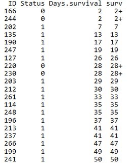
```


生存时间数据有两种类型：

* 完全数据 (complete data)指被观测对象从观察起点到出现终点事件所经历的时间; 一般用状态值1或TRUE表示。
* 截尾数据 (consored data)或删失数据，指在出现终点事件前，被观测对象的观测过程终止了。由于被观测对象所提供的信息是不完全的，只知道他们的生存事件超过了截尾时间。截尾主要由于失访、退出和终止产生。一般用状态值0或FALSE表示。
* TCGA中的临床数据标记也符合这个规律，在下面软件运行时也可修改状态值的含义, 但一般遵循这个规律。

生存概率 (survival probability)指某段时间开始时存活的个体至该时间结束时仍然存活的可能性大小。

`生存概率=某人群活过某段时间例数/该人群同时间段期初观察例数。`

生存率 (Survival rate)，用`S(t)`表示，指经历`t`个单位时间后仍存活的概率，若无删失数据，则为活过了`t`时刻仍然存活的例数/观察开始的总例数。如果有删失数据，分母则需要按时段进行校正。

生存分析一个常用的方法是寿命表法。

寿命表是描述一段时间内生存状况、终点事件和生存概率的表格，需计算累积生存概率即每一步生存概率的乘积 (也可能是原始生存概率)，可完成对病例随访资料在任意指定时点的生存状况评价。

```{r,echo=F}
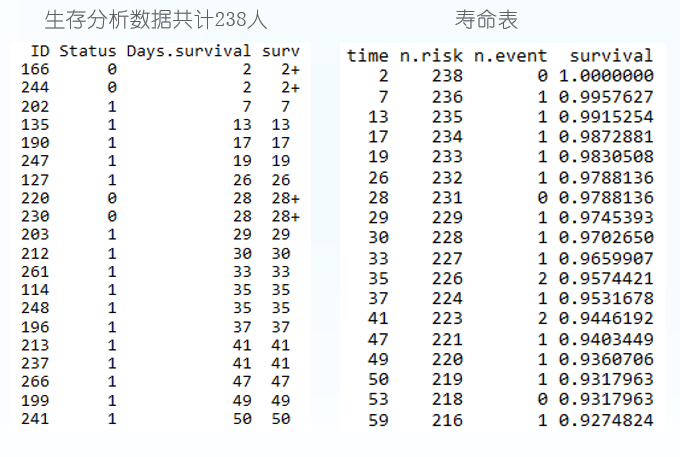
```

### R做生存分析 {#survival1}

R中做生存分析需要用到包`survival`和`survminer`。输入数据至少两列，`存活时间`和`生存状态`，也就是测试数据中的`Days.survial`和`vital_status`列。如果需要比较不同组之间的差异，也需要提供个体的分组信息，如测试数据中的`PAM50`列。对应TCGA的数据，一般根据某个基因的表达量或突变有无对个体进行分组。

读入数据

```{r}
library(survival)
BRCA <- read.table('data/BRCA.tsv', sep="\t", header=T)
head(BRCA)
```


简单地看下每一列都有什么内容，方便对数据整体有个了解，比如有无特殊值。

```{r}
summary(BRCA)
```


计算寿命表

```{r}
# Days.survival：跟踪到的存活时间
# vital_status: 跟踪到的存活状态
# ~1表示不进行分组
fit <- survfit(Surv(Days.survival, vital_status)~1, data=BRCA)

# 获得的survial列就是生存率 
summary(fit)
```

绘制生存曲线，横轴表示生存时间，纵轴表示生存概率，为一条梯形下降的曲线。下降幅度越大，表示生存率越低或生存时间越短。

```{r}
library(survminer)
# conf.int：是否显示置信区间
# risk.table: 对应时间存活个体总结表格
ggsurvplot(fit, conf.int=T,risk.table=T)
```


`PAM50`是通过50个基因的表达量把乳腺癌分为四种类型 (Luminal A, Luminal B, HER2-enriched, and Basal-like)作为预后的标志。根据`PAM50`属性对病人进行分组，评估比较两组之间生存率的差别。

```{r, fig.height=11, fig.width=14}
# 这三步不是必须的，只是为了方便，选择其中的4个确定了的分组进行分析
# 同时为了简化图例，给列重命名一下，使得列名不那么长
BRCA_PAM50 <- BRCA[grepl("Basal|Her2|LumA|LumB",BRCA$PAM50Call_RNAseq),]
BRCA_PAM50 <- droplevels(BRCA_PAM50)
colnames(BRCA_PAM50)[colnames(BRCA_PAM50)=="PAM50Call_RNAseq"] <- 'PAM50'
# 按PAM50分组
fit <- survfit(Surv(Days.survival, vital_status)~PAM50, data=BRCA_PAM50)
# 绘制曲线
ggsurvplot(fit, conf.int=F,risk.table=T, risk.table.col="strata", pval=T)
```


简化`Stage`信息，先只查看大的阶段

```{r, fig.height=11, fig.width=14}
BRCA_PAM50$pathologic_stage <- gsub('(i+v*).*', "\\1", BRCA_PAM50$pathologic_stage)
BRCA_PAM50$pathologic_stage <- as.factor(BRCA_PAM50$pathologic_stage)
colnames(BRCA_PAM50)[colnames(BRCA_PAM50)=="pathologic_stage"] <- 'PS'
fit <- survfit(Surv(Days.survival, vital_status)~PS, data=BRCA_PAM50)
# 绘制曲线
ggsurvplot(fit, conf.int=F,risk.table=T, risk.table.col="strata", pval=T)
```

## 一步作图的优势 {#survival2}

目前这部分已不再更新，具体见后面提到的在线绘图网站（在绘制每个图的同时，也提供了这个图的绘制代码）

一步作图相比于直接写R代码有什么好处呢？

1. 模块化好。数据处理和可视化分开；一步作图，只是作图，不做无关的处理，更随意。

2. 易用性强。敲代码，总不如给改数来得快。

3. 重用性强。假如我要做十几个分开的基因集合呢？一段段复制代码？改错了或忘记改某个地方了怎么办？

4. 快速出图。先快速出个原型，再接着调整。

获取地址 <https://github.com/Tong-Chen/s-plot>.

在线绘图 <http://www.ehbio.com/ImageGP/>

`s-plot`可以绘制的图的类型还有一些，列举如下；

```bash
Usage:

s-plot options

Function:

This software is designed to simply the process of plotting and help
researchers focus more on data rather than technology.

Currently, the following types of plot are supported.

#### Bars
s-plot barPlot

#### Lines
s-plot lines

#### Dots
s-plot pca
s-plot scatterplot3d
s-plot scatterplot2
s-plot scatterplotColor
s-plot scatterplotContour
s-plot scatterplotLotsData
s-plot scatterplotMatrix
s-plot scatterplotDoubleVariable
s-plot contourPlot
s-plot density2d

#### Distribution
s-plot areaplot
s-plot boxplot
s-plot densityHistPlot

#### Cluster
s-plot hcluster_gg (latest)

#### Heatmap
s-plot heatmapS
s-plot heatmapM
s-plot heatmap.2
s-plot pheatmap
s-plot prettyHeatmap

#### Others
s-plot volcano
s-plot vennDiagram
s-plot upsetView
```

## 不改脚本的热图绘制 {#survival3365}

绘图时通常会碰到两个头疼的问题：
1. 需要画很多的图，唯一的不同就是输出文件，其它都不需要修改。如果用R脚本，需要反复替换文件名，繁琐又容易出错。 

2. 每次绘图都需要不断的调整参数，时间久了不用，就忘记参数放哪了；或者调整次数过多，有了很多版本，最后不知道用哪个了。

为了简化绘图、维持脚本的一致，我用`bash`对`R`做了一个封装，然后就可以通过修改命令好参数绘制不同的图了。

先看一看怎么使用

首先把测试数据存储到文件中方便调用。数据矩阵存储在`heatmap_data.xls`文件中；行注释存储在`heatmap_row_anno.xls`文件中；列注释存储在`heatmap_col_anno.xls`文件中。

```{r}
# tab键分割，每列不加引号
write.table(data, file="heatmap_data.xls", sep="\t", row.names=T, col.names=T,quote=F)
# 如果看着第一行少了ID列不爽，可以填补下
system("sed -i '1 s/^/ID\t/' heatmap_data.xls")

write.table(row_anno, file="heatmap_row_anno.xls", sep="\t", row.names=T, 
		col.names=T,quote=F)
write.table(col_anno, file="heatmap_col_anno.xls", sep="\t", row.names=T, 
		col.names=T,quote=F)
```

然后用程序`sp_pheatmap.sh`绘图。

```bash
# -f: 指定输入的矩阵文件
# -d：指定是否计算Z-score，<none> (否), <row> (按行算), <col> (按列算)
# -P: 行注释文件
# -Q: 列注释文件
ct@ehbio:~/$ sp_pheatmap.sh -f heatmap_data.xls -d row -P heatmap_row_anno.xls \
		-Q heatmap_col_anno.xls
```

```{r, echo=F}
knitr::include_graphics("images/pheatmap_6.png")
```

字有点小，是因为图太大了，把图的宽和高缩小下试试。

```bash
# -f: 指定输入的矩阵文件
# -d：指定是否计算Z-score，<none> (否), <row> (按行算), <col> (按列算)
# -P: 行注释文件
# -Q: 列注释文件
# -u: 设置宽度，单位是inch
# -v: 设置高度，单位是inch
ct@ehbio:~/$ sp_pheatmap.sh -f heatmap_data.xls -d row -P heatmap_row_anno.xls \
		-Q heatmap_col_anno.xls -u 8 -v 12
```

```{r, echo=F}
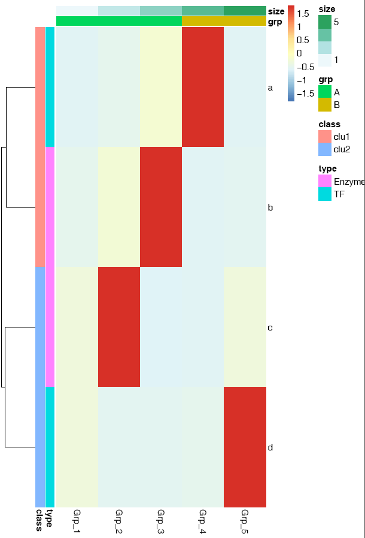
```

横轴的标记水平放置

```bash
# -A: 0, X轴标签选择0度
# -C: 自定义颜色，注意引号的使用，最外层引号与内层引号不同，引号之间无交叉
# -T: 指定给定的颜色的类型；如果给的是vector (如下面的例子), 则-T需要指定为vector; 
#     否则结果会很怪异，只有俩颜色。
# -t: 指定图形的题目，注意引号的使用；参数中包含空格或特殊字符等都要用引号引起来作为一个整体。
ct@ehbio:~/$ sp_pheatmap.sh -f heatmap_data.xls -d row -P heatmap_row_anno.xls \
	-Q heatmap_col_anno.xls -u 8 -v 12 -A 0 -C 'c("white", "blue")' -T vector \
	-t "Heatmap of gene expression profile" 
```

`sp_pheatmap.sh`的参数还有一些，可以完成前面讲述过的所有热图的绘制，具体如下：

```bash
***CREATED BY Chen Tong (chentong_biology@163.com)***

----Matrix file--------------
Name	T0_1	T0_2	T0_3	T4_1	T4_2
TR19267|c0_g1|CYP703A2	1.431	0.77	1.309	1.247	0.485
TR19612|c1_g3|CYP707A1	0.72	0.161	0.301	2.457	2.794
TR60337|c4_g9|CYP707A1	0.056	0.09	0.038	7.643	15.379
TR19612|c0_g1|CYP707A3	2.011	0.689	1.29	0	0
TR35761|c0_g1|CYP707A4	1.946	1.575	1.892	1.019	0.999
TR58054|c0_g2|CYP707A4	12.338	10.016	9.387	0.782	0.563
TR14082|c7_g4|CYP707A4	10.505	8.709	7.212	4.395	6.103
TR60509|c0_g1|CYP707A7	3.527	3.348	2.128	3.257	2.338
TR26914|c0_g1|CYP710A1	1.899	1.54	0.998	0.255	0.427
----Matrix file--------------

----Row annorarion file --------------
------1. At least two columns--------------
------2. The first column should be the same as the first column in
         matrix (order does not matter)--------------
Name	Clan	Family
TR19267|c0_g1|CYP703A2	CYP71	CYP703
TR19612|c1_g3|CYP707A1	CYP85	CYP707
TR60337|c4_g9|CYP707A1	CYP85	CYP707
TR19612|c0_g1|CYP707A3	CYP85	CYP707
TR35761|c0_g1|CYP707A4	CYP85	CYP707
TR58054|c0_g2|CYP707A4	CYP85	CYP707
TR14082|c7_g4|CYP707A4	CYP85	CYP707
TR60509|c0_g1|CYP707A7	CYP85	CYP707
TR26914|c0_g1|CYP710A1	CYP710	CYP710
----Row annorarion file --------------

----Column annorarion file --------------
------1. At least two columns--------------
------2. The first column should be the same as the first row in
---------matrix (order does not matter)--------------
Name	Sample
T0_1	T0
T0_2	T0
T0_3	T0
T4_1	T4
T4_2	T4
----Column annorarion file --------------


Usage:

sp_pheatmap.sh options

Function:

This script is used to do heatmap using package pheatmap.

The parameters for logical variable are either TRUE or FALSE.

OPTIONS:
	-f	Data file (with header line, the first column is the
 		rowname, tab seperated. Colnames must be unique unless you
		know what you are doing.)[NECESSARY]
	-t	Title of picture[Default empty title]
		["Heatmap of gene expression profile"]
	-a	Display xtics. [Default TRUE]
	-A	Rotation angle for x-axis value (anti clockwise)
		[Default 90]
	-b	Display ytics. [Default TRUE]
	-H	Hieratical cluster for columns.
		Default FALSE, accept TRUE
	-R	Hieratical cluster for rows.
		Default TRUE, accept FALSE
	-c	Clustering method, Default "complete". 
		Accept "ward.D", "ward.D2","single", "average" (=UPGMA), 
		"mcquitty" (=WPGMA), "median" (=WPGMC) or "centroid" (=UPGMC)
	-C	Color vector. 
		Default pheatmap_default. 
		Aceept a vector containing multiple colors such as 
		<'c("white", "blue")'> will be transferred 
		to <colorRampPalette(c("white", "blue"), bias=1)(30)>
		or an R function 
		<colorRampPalette(rev(brewer.pal(n=7, name="RdYlBu")))(100)>
		generating a list of colors.
		
	-T	Color type, a vetcor which will be transferred as described in <-C> [vector] or
   		a raw vector [direct vector] or	a function [function (default)].
	-B	A positive number. Default 1. Values larger than 1 will give more color
   		for high end. Values between 0-1 will give more color for low end.	
	-D	Clustering distance method for rows.
		Default 'correlation', accept 'euclidean', 
		"manhattan", "maximum", "canberra", "binary", "minkowski". 
	-I	Clustering distance method for cols.
		Default 'correlation', accept 'euclidean', 
		"manhattan", "maximum", "canberra", "binary", "minkowski". 
	-L	First get log-value, then do other analysis.
		Accept an R function log2 or log10. 
		[Default FALSE]
	-d	Scale the data or not for clustering and visualization.
		[Default 'none' means no scale, accept 'row', 'column' to 
		scale by row or column.]
	-m	The maximum value you want to keep, any number larger willl
		be taken as this given maximum value.
		[Default Inf, Optional] 
	-s	The smallest value you want to keep, any number smaller will
		be taken as this given minimum value.
		[Default -Inf, Optional]  
	-k	Aggregate the rows using kmeans clustering. 
		This is advisable if number of rows is so big that R cannot 
		handle their hierarchical clustering anymore, roughly more than 1000.
		Instead of showing all the rows separately one can cluster the
		rows in advance and show only the cluster centers. The number
		of clusters can be tuned here.
		[Default 'NA' which means no
		cluster, other positive interger is accepted for executing
		kmeans cluster, also the parameter represents the number of
		expected clusters.]
	-P	A file to specify row-annotation with format described above.
		[Default NA]
	-Q	A file to specify col-annotation with format described above.
		[Default NA]
	-u	The width of output picture.[Default 20]
	-v	The height of output picture.[Default 20] 
	-E	The type of output figures.[Default pdf, accept
		eps/ps, tex (pictex), png, jpeg, tiff, bmp, svg and wmf)]
	-r	The resolution of output picture.[Default 300 ppi]
	-F	Font size [Default 14]
	-p	Preprocess data matrix to avoid 'STDERR 0 in cor(t(mat))'.
		Lowercase <p>.
		[Default TRUE]
	-e	Execute script (Default) or just output the script.
		[Default TRUE]
	-i	Install the required packages. Normmaly should be TRUE if this is 
		your first time run s-plot.[Default FALSE]
```


### 箱线图 - 一步绘制 {#survival3367}

首先把测试数据存储到文件中方便调用。数据矩阵存储在`boxplot.normal.data`、`sampleGroup`和`boxplot.melt.data`文件中 (TAB键分割，内容在文档最后。如果你手上有自己的数据，也可以拿来用)。

使用正常矩阵默认参数绘制箱线图

```
# -f: 指定输入的矩阵文件，第一列为行名字，第一行为header
	  列数不限，列名字不限；行数不限，行名字默认为文本
sp_boxplot.sh -f boxplot.normal.data
```

箱线图出来了，但有点小乱。

```{r, echo=F}
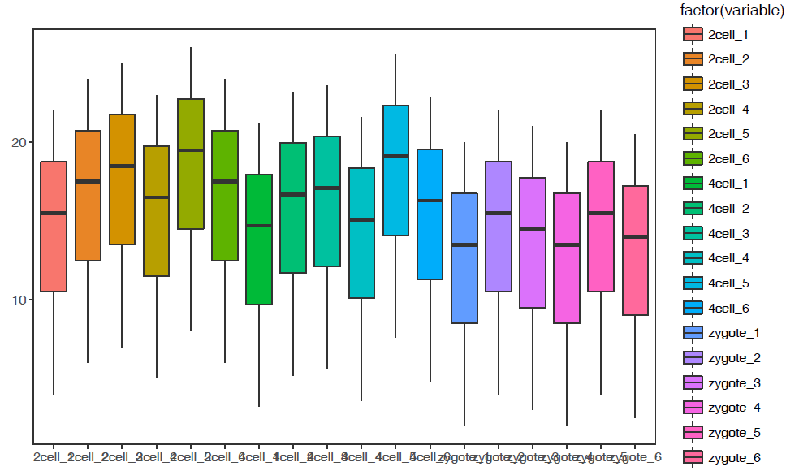
```

```
# -f: 指定输入的矩阵文件，第一列为行名字，第一行为header
	  列数不限，列名字不限；行数不限，行名字默认为文本
# -P: none, 去掉legend (uppercase P)
# -b: X-axis旋转45度
# -V: TRUE 绘制小提琴图
sp_boxplot.sh -f boxplot.normal.data -P none -b 45 -V TRUE
```

```{r, echo=F}
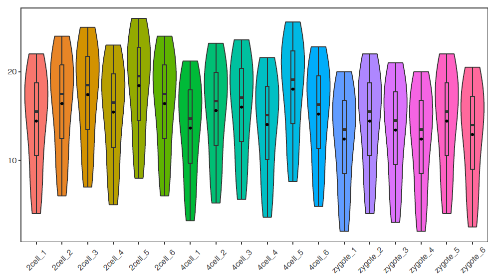
```

绘制单个基因的小提琴图加抖动图

```
# -q: 指定某一行的名字，此处为基因名，绘制基因A的表达图谱
# -Q: 指定样本分组，绘制基因A在不同样品组的表达趋势
# -F Group: sampleGroup中第二列的名字，指代分组信息，根据需要修改
# -J TRUE: 绘制抖动图 jitter plot
# -L: 设置X轴样品组顺序
# -c TRUE -C "'red', 'pink', 'blue'": 指定每个箱线图的颜色
sp_boxplot.sh -f boxplot.normal.data -q A -Q sampleGroup -F Group -V TRUE -J TRUE \
		-L "'zygote','2cell','4cell'" -c TRUE -C "'red', 'pink', 'blue'" -P none
```

```{r, echo=F}
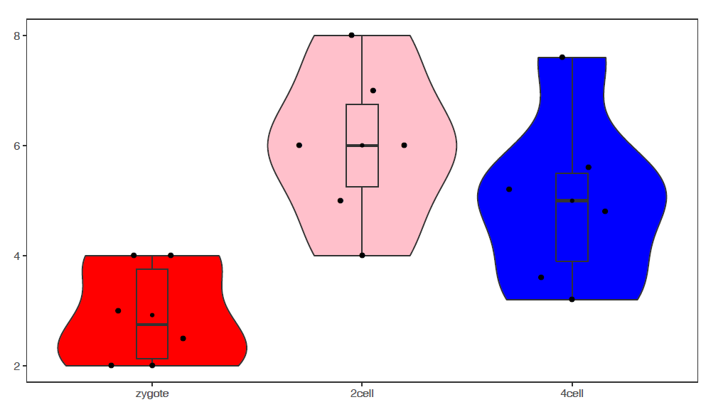
```

使用melted矩阵默认参数绘箱线图

```
# -f: 指定输入文件
# -m TRUE: 指定输入的矩阵为melted format
# -d Expr：指定表达值所在的列
# -F Rep: 指定子类所在列，也就是legend 
# -a Group：指定X轴分组信息
# -j TRUE: jitter plot
sp_boxplot.sh -f boxplot.melt.data -m TRUE -d Expr -F Rep -a Group  -j TRUE
```

```{r, echo=F}
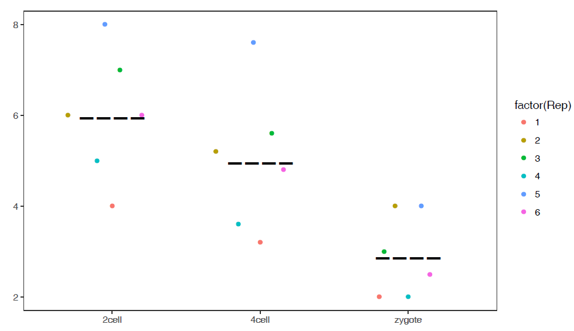
```

```
# 如果没有子类，则-a和-F指定为同一值
# -R TRUE: 旋转boxplot
sp_boxplot.sh -f boxplot.melt.data -m TRUE -d Expr -a Group -F Group -J TRUE -R TRUE
```

```{r, echo=F}
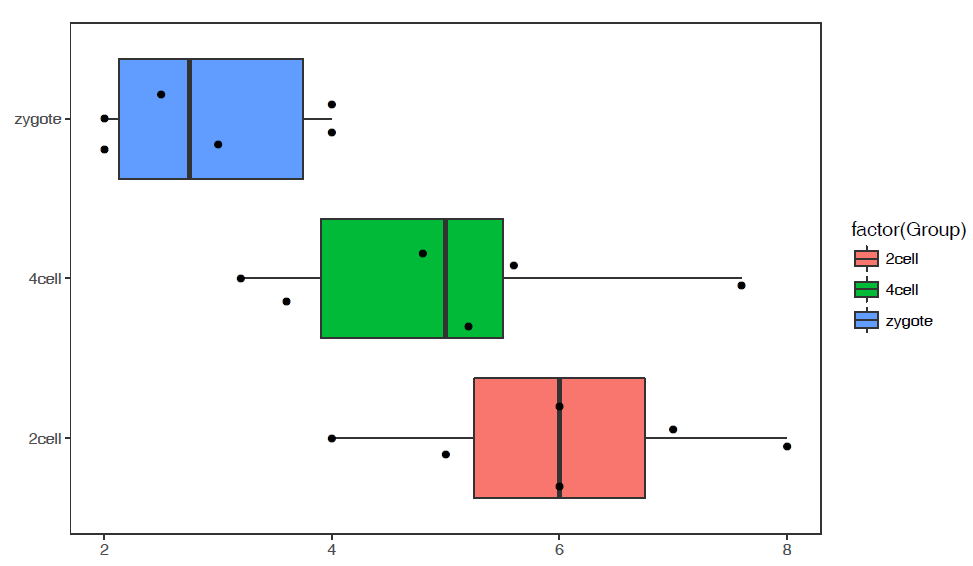
```

参数中最需要注意的是**引号**的使用：

* 外层引号与内层引号不能相同
* 凡参数值中包括了`空格`，`括号`，`逗号`等都用引号括起来作为一个整体。


```
#boxplot.normal.data
Name	2cell_1	2cell_2	2cell_3	2cell_4	2cell_5	2cell_6	4cell_1	4cell_2	4cell_3	4cell_4	4cell_5	4cell_6	zygote_1	zygote_2	zygote_3	zygote_4	zygote_5	zygote_6
A	4	6	7	5	8	6	3.2	5.2	5.6	3.6	7.6	4.8	2	4	3	2	4	2.5
B	6	8	9	7	10	8	5.2	7.2	7.6	5.6	9.6	6.8	4	6	5	4	6	4.5
C	8	10	11	9	12	10	7.2	9.2	9.6	7.6	11.6	8.8	6	8	7	6	8	6.5
D	10	12	13	11	14	12	9.2	11.2	11.6	9.6	13.6	10.8	8	10	9	8	10	8.5
E	12	14	15	13	16	14	11.2	13.2	13.6	11.6	15.6	12.8	10	12	11	10	12	10.5
F	14	16	17	15	18	16	13.2	15.2	15.6	13.6	17.6	14.8	12	14	13	12	14	12.5
G	15	17	18	16	19	17	14.2	16.2	16.6	14.6	18.6	15.8	13	15	14	13	15	13.5
H	16	18	19	17	20	18	15.2	17.2	17.6	15.6	19.6	16.8	14	16	15	14	16	14.5
I	17	19	20	18	21	19	16.2	18.2	18.6	16.6	20.6	17.8	15	17	16	15	17	15.5
J	18	20	21	19	22	20	17.2	19.2	19.6	17.6	21.6	18.8	16	18	17	16	18	16.5
L	19	21	22	20	23	21	18.2	20.2	20.6	18.6	22.6	19.8	17	19	18	17	19	17.5
M	20	22	23	21	24	22	19.2	21.2	21.6	19.6	23.6	20.8	18	20	19	18	20	18.5
N	21	23	24	22	25	23	20.2	22.2	22.6	20.6	24.6	21.8	19	21	20	19	21	19.5
O	22	24	25	23	26	24	21.2	23.2	23.6	21.6	25.6	22.8	20	22	21	20	22	20.5
```


```
#boxplot.melt.data

Gene	Sample	Group	Expr	Rep
A	zygote_1	zygote	2	1
A	zygote_2	zygote	4	2
A	zygote_3	zygote	3	3
A	zygote_4	zygote	2	4
A	zygote_5	zygote	4	5
A	zygote_6	zygote	2.5	6
A	2cell_1	2cell	4	1
A	2cell_2	2cell	6	2
A	2cell_3	2cell	7	3
A	2cell_4	2cell	5	4
A	2cell_5	2cell	8	5
A	2cell_6	2cell	6	6
A	4cell_1	4cell	3.2	1
A	4cell_2	4cell	5.2	2
A	4cell_3	4cell	5.6	3
A	4cell_4	4cell	3.6	4
A	4cell_5	4cell	7.6	5
A	4cell_6	4cell	4.8	6
```

```
#sampleGroup
Sample	Group
zygote_1	zygote
zygote_2	zygote
zygote_3	zygote
zygote_4	zygote
zygote_5	zygote
zygote_6	zygote
2cell_1	2cell
2cell_2	2cell
2cell_3	2cell
2cell_4	2cell
2cell_5	2cell
2cell_6	2cell
4cell_1	4cell
4cell_2	4cell
4cell_3	4cell
4cell_4	4cell
4cell_5	4cell
4cell_6	4cell
```

### 线图 - 一步绘制 {#survival3719}

首先把测试数据存储到文件中方便调用。数据矩阵存储在`line_data.xls`和`line_data_melt.xls`文件中 (直接拷贝到文件中也可以，这里这么操作只是为了随文章提供个测试文件，方便使用。如果你手上有自己的数据，也可以拿来用)。

```{r}
profile = "Pos;H3K27ac;CTCF;Enhancer;H3K4me3;polII
-5000;8.7;10.7;11.7;10;8.3
-4000;8.4;10.8;11.8;9.8;7.8
-3000;8.3;10.5;12.2;9.4;7
-2000;7.2;10.9;12.7;8.4;4.8
-1000;3.6;8.5;12.8;4.8;1.3
0;3.6;8.5;13.4;5.2;1.5
1000;7.1;10.9;12.4;8.1;4.9
2000;8.2;10.7;12.4;9.5;7.7
3000;8.4;10.4;12;9.8;7.9
4000;8.5;10.6;11.7;9.7;8.2
5000;8.5;10.6;11.7;10;8.2"

profile_text <- read.table(text=profile, header=T, row.names=1, quote="",sep=";")
# tab键分割，每列不加引号
write.table(profile_text, file="line_data.xls", sep="\t", row.names=T, col.names=T,quote=F)
# 如果看着第一行少了ID列不爽，可以填补下
#system("sed -i '1 s/^/ID\t/' line_data.xls")
```

```{r}
profile = "Pos;variable;value;set
-5000;H3K27ac;8.71298;A
-4000;H3K27ac;8.43246;A
-3000;H3K27ac;8.25497;A
-2000;H3K27ac;7.16265;A
-1000;H3K27ac;3.55341;A
0;H3K27ac;3.5503;A
1000;H3K27ac;7.07502;A
2000;H3K27ac;8.24328;A
3000;H3K27ac;8.43869;A
4000;H3K27ac;8.48877;A
-5000;CTCF;10.6913;A
-4000;CTCF;10.7668;A
-3000;CTCF;10.5441;A
-2000;CTCF;10.8635;A
-1000;CTCF;8.45751;A
0;CTCF;8.50316;A
1000;CTCF;10.9143;A
2000;CTCF;10.7022;A
3000;CTCF;10.4101;A
4000;CTCF;10.5757;A
-5000;H3K27ac;8.71298;B
-4000;H3K27ac;8.43246;B
-3000;H3K27ac;8.25497;B
-2000;H3K27ac;7.16265;B
-1000;H3K27ac;3.55341;B
0;H3K27ac;3.5503;B
1000;H3K27ac;7.07502;B
2000;H3K27ac;8.24328;B
3000;H3K27ac;8.43869;B
4000;H3K27ac;8.48877;B
-5000;CTCF;10.6913;B
-4000;CTCF;10.7668;B
-3000;CTCF;10.5441;B
-2000;CTCF;10.8635;B
-1000;CTCF;8.45751;B
0;CTCF;8.50316;B
1000;CTCF;10.9143;B
2000;CTCF;10.7022;B
3000;CTCF;10.4101;B
4000;CTCF;10.5757;B"

profile_text <- read.table(text=profile, header=T, quote="",sep=";")
# tab键分割，每列不加引号
write.table(profile_text, file="line_data_melt.xls", sep="\t", row.names=T, col.names=T,quote=F)
# 如果看着第一行少了ID列不爽，可以填补下
# system("sed -i '1 s/^/ID\t/' line_data_melt.xls")
```

使用正常矩阵默认参数绘制个线图

```
# -f: 指定输入的矩阵文件，第一列为行名字，第一行为header
	  列数不限，列名字不限；行数不限，行名字默认为文本
# -A FALSE: 指定行名为数字
sp_lines.sh -f line_data.xls -A FALSE
```

```{r, echo=F}
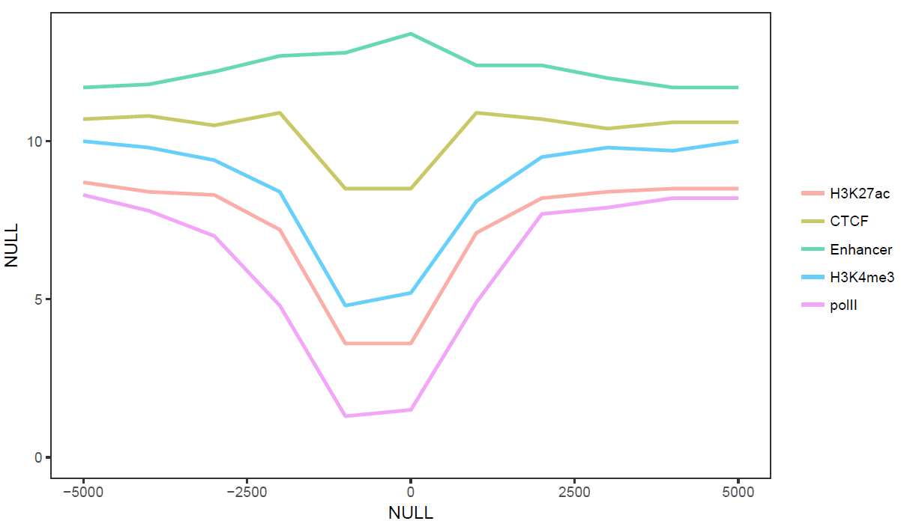
```

```
# -l: 设定图例的顺序
# -o TRUE: 局部拟合获得平滑曲线
# -A FALSE: 指定行名为数字
# -P: 设置legend位置，相对于原点的坐标
# -x, -y指定横纵轴标记
sp_lines.sh -f line_data.xls -l "'CTCF','Enhancer','polII','H3K4me3','H3K27ac'" \
	-P 'c(0.8,0.3)' -o TRUE -A FALSE -x 'Up and down 5 kb of TSS' -y 'Relative density'
```

```{r, echo=F}
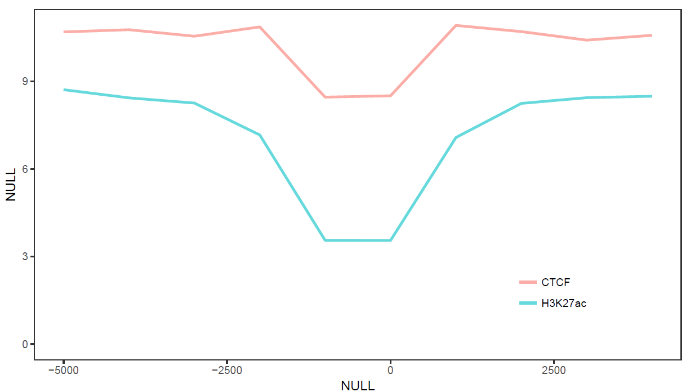
```

```
# -A FALSE: 指定行名为数字
# -V 'c(-1000, 500)': 设置垂线的位置
# -D: 设置垂线的文本标记，参数为引号引起来的vector，注意引号的嵌套
# -I: 设置横轴的标记的位置
# -b: 设置横轴标记的文字
sp_lines.sh -f line_data.xls -A FALSE -V 'c(-1000,500)' -D "c('+1 kb','-0.5 kb')" \
	-I "c(-5000,0,5000)" -b "c('-5 kb', 'TSS', '+5 kb')"
```


```{r, echo=F}
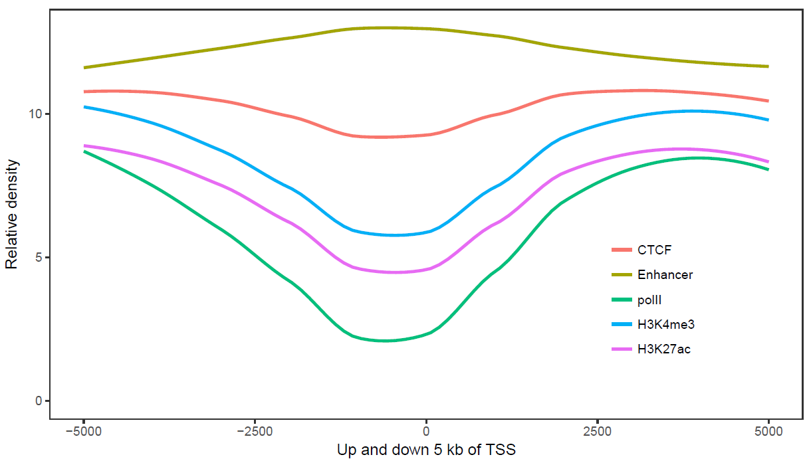
```


使用melted矩阵默认参数绘制个线图 (除需要改变文件格式，指定`-m TRUE`, `-a xvariable`外其它与正常矩阵一样)

```
# -f: 指定输入文件
# -m TRUE: 指定输入的矩阵为melted format, 三列，第一列为Pos (给-a)
#          第二列为variable (给-H，-H默认即为variable)
#          第三列为value，名字不可修改
# -A FALSE: 指定行名为数字
# -P 'c(0.8,0.2)': 设置legend位置，相对于原点的坐标
sp_lines.sh -f line_data_melt.xls -a Pos -m TRUE -A FALSE -P 'c(0.8,0.2)'
```

```{r, echo=F}
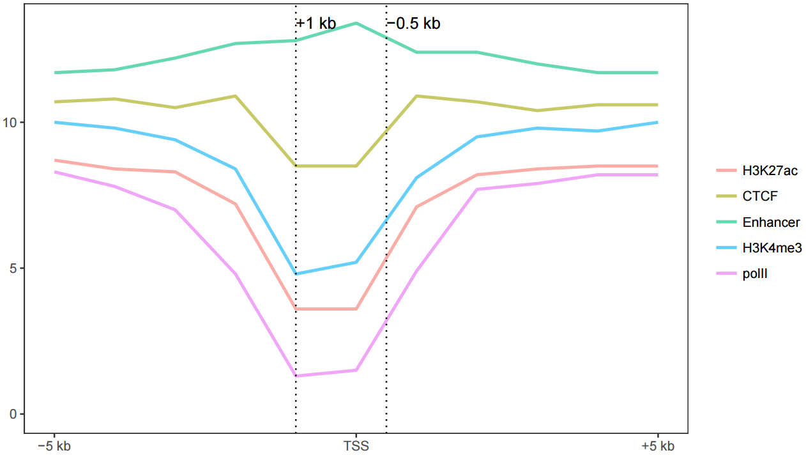
```


完整的图

```
# -C: 自定义线的颜色
sp_lines.sh -f line_data_melt.xls -a Pos -m TRUE -A FALSE -P 'c(0.8,0.2)' -o TRUE \
	-V 'c(-1000,500)' -D "c('+1 kb','-0.5 kb')" \
	-I "c(-5000,0,4000)" -b "c('-5 kb', 'TSS', '+4 kb')" \
	-x 'Up 5 kb and down 4 kb of TSS' -y 'Relative density' -C "'pink', 'blue'"
```

```{r, echo=F}
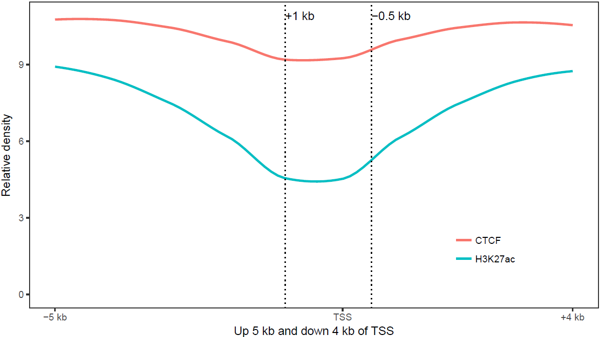
```

参数中最需要注意的是**引号**的使用：

* 外层引号与内层引号不能相同
* 凡参数值中包括了`空格`，`括号`，`逗号`等都用引号括起来作为一个整体。

完整参数列表如下：

```bash
ct@ehbio:~ $sp_lines.sh

***CREATED BY Chen Tong (chentong_biology@163.com)***

Usage:

/MPATHB/self/s-plot/sp_lines.sh options

Function:

This script is used to draw a line or multiple lines using ggplot2.
You can specify whether or not smooth your line or lines.

Two types of input files are supported, normal matrix or melted matrix format. Column separator for both types of input files is **tab**. 

Here is an example of normal matrix format. The first column will be treated as X-axis variables and other columns represents each type of lines. The number of columns is unlimited and names of columns is unlimited.

**Set** column is not needed. If given, <facet_plot> (multiple plots in one page) could be displayed. 

------------------------------------------------------------
Pos	H3K27ac	CTCF	Enhancer	H3K4me3	polII
-5000	8.71298	10.69130	11.7359	10.02510	8.26866
-4000	8.43246	10.76680	11.8442	9.76927	7.78358
-3000	8.25497	10.54410	12.2470	9.40346	6.96859
-2000	7.16265	10.86350	12.6889	8.35070	4.84365
-1000	3.55341	8.45751	12.8372	4.84680	1.26110
0	3.55030	8.50316	13.4152	5.17401	1.50022
1000	7.07502	10.91430	12.3588	8.13909	4.88096
2000	8.24328	10.70220	12.3888	9.47255	7.67968
3000	8.43869	10.41010	11.9760	9.80665	7.94148
4000	8.48877	10.57570	11.6562	9.71986	8.17849
------------------------------------------------------

------------With SET------------------------------------------
Pos	H3K27ac	CTCF	Enhancer	H3K4me3	polII	Set
-5000	8.71298	10.69130	11.7359	10.02510	8.26866	1
-4000	8.43246	10.76680	11.8442	9.76927	7.78358	1
-3000	8.25497	10.54410	12.2470	9.40346	6.96859	1
-2000	7.16265	10.86350	12.6889	8.35070	4.84365	1
-1000	3.55341	8.45751	12.8372	4.84680	1.26110	1
0	3.55030	8.50316	13.4152	5.17401	1.50022	1
1000	7.07502	10.91430	12.3588	8.13909	4.88096	1
2000	8.24328	10.70220	12.3888	9.47255	7.67968	1
3000	8.43869	10.41010	11.9760	9.80665	7.94148	1
4000	8.48877	10.57570	11.6562	9.71986	8.17849	1
-5000	8.71298	10.69130	11.7359	10.02510	8.26866	2
-4000	8.43246	10.76680	11.8442	9.76927	7.78358	2
-3000	8.25497	10.54410	12.2470	9.40346	6.96859	2
-2000	7.16265	10.86350	12.6889	8.35070	4.84365	2
-1000	3.55341	8.45751	12.8372	4.84680	1.26110	2
0	3.55030	8.50316	13.4152	5.17401	1.50022	2
1000	7.07502	10.91430	12.3588	8.13909	4.88096	2
2000	8.24328	10.70220	12.3888	9.47255	7.67968	2
3000	8.43869	10.41010	11.9760	9.80665	7.94148	2
4000	8.48877	10.57570	11.6562	9.71986	8.17849	2
-------------------------------------------------------------

For matrix format, example command lines include:

* Attribute of X-axis value (first column of matrix) is <number>

	s-plot lines -f matrix.file -A FALSE

* Attribute of X-axis value (first column of matrix) is <text>
	s-plot lines -f matrix.file 

* Attribute of X-axis value (first column of matrix) is numbers, change legned order (default alphabet order)

	s-plot lines -f matrix.file -l "'polII', 'CTCF', 'Enhancer', 'H3K27ac', 'H3K4me3'"

* Attribute of X-axis value (first column of matrix) is numbers, change legned order (default alphabet order), smooth lines to look better (Pay attention to whether this will change the data trend)

	s-plot lines -f matrix.file -l "'polII', 'CTCF', 'Enhancer', 'H3K27ac', 'H3K4me3'" -o TRUE

* Attribute of X-axis value (first column of matrix) is numbers, with <Set> (Set is column name) column
	
	s-plot lines -f matrix.file -F "+facet_grid(Set ~ ., scale='free_y')"


FILEFORMAT when -m is true
#The name "value" shoud **not** be altered.
#variable can be altered using -H
#Actually this format is the melted result of last format.
--------------------------------------------------------------
Pos variable    value
-5000	H3K27ac	8.71298
-4000	H3K27ac	8.43246
-3000	H3K27ac	8.25497
-2000	H3K27ac	7.16265
-1000	H3K27ac	3.55341
0	H3K27ac	3.55030
1000	H3K27ac	7.07502
2000	H3K27ac	8.24328
3000	H3K27ac	8.43869
4000	H3K27ac	8.48877
-5000	CTCF	10.69130
-4000	CTCF	10.76680
-3000	CTCF	10.54410
-2000	CTCF	10.86350
-1000	CTCF	8.45751
0	CTCF	8.50316
1000	CTCF	10.91430
2000	CTCF	10.70220
3000	CTCF	10.41010
4000	CTCF	10.57570
-------------------------------------------------------------

* Attribute of X-axis value (melt format) is <number>

	s-plot lines -f matrix.file -m TRUE -a Pos -A FALSE

* Attribute of X-axis value (first column of matrix) is <text>

	s-plot lines -f matrix.file -m TRUE -a Pos

* If the name of the second column is <type> not <variable>, one should specify with <-H>. 
	
	s-plot lines -f matrix.file -A FALSE -m TRUE -a Pos -H type

* Attribute of X-axis value (first column of matrix) is numbers, change legned order (default alphabet order)

	s-plot lines -f matrix.file -m TRUE -a Pos -l "'polII', 'CTCF', 'Enhancer', 'H3K27ac', 'H3K4me3'"

* Attribute of X-axis value (first column of matrix) is numbers, change legned order (default alphabet order), smooth lines to look better (Pay attention to whether this will change the data trend)

	s-plot lines -f matrix.file -m TRUE -a Pos -l "'polII', 'CTCF', 'Enhancer', 'H3K27ac', 'H3K4me3'" -o TRUE

* Attribute of X-axis value (first column of matrix) is numbers, with <Set> (Set is column name) column
	
	s-plot lines -f matrix.file -F "+facet_grid(Set ~ ., scale='free_y')"


OPTIONS:
	-f	Data file (with header line, the first column would be be treated as rownames for
		normal matrix. No rownames for melted format. Columns are tab seperated)
		[NECESSARY]
	-m	When true, it will skip melt preprocesses. But the format must be
		the same as listed before.
		[Default FALSE, accept TRUE]
	-a	Name for x-axis variable
		[Only needed when <-m> is <TRUE>.  
		For the melted data, 'Pos' should be given here. 
		For normal matrix,  default the first column will be used,
		program will assign an value 'xvariable' to represent it.
	   	]]
	-A	Are x-axis variables numbers.
		[Default <TRUE>, meaning X-axis label is <text>.
		<FALSE> means X-axis label is <numerical>.]
	-H	Name for legend variable.
		[Default variable, this should only be set when -m is TRUE]
	-J	Name for color variable.
		[Default same as -H, this should only be set when -m is TRUE]
	-l	Set orders of legend variable.
		[Default column order for normal matrix, accept a string like
		"'CTCF','H3K27ac','Enhancer'" to set your own order. 
		Pay attention to the usage of two types of quotes. 
		***When -m is TRUE, default order would be alphabet order.********* 
	   	]
	-P	Legend position[Default right. Accept
		top, bottom, left, none, or 'c(0.08,0.8)'.]
	-L	Levels for x-axis variable, suitable when x-axis is not treated as numerical. 
		[Default the order of first column for normal matrix. 
		Accept a string like "'g','a','j','x','s','c','o','u'" to set your own oder.
	   	This will only be considered when -A is TRUE.
		***When -m is used, this default order would be alphabet order.********* 
		]
	-o	Smooth lines or not.
		[Default FALSE means no smooth. Accept TRUE to smooth lines.]
	-O	The smooth method you want to use.
		[smoothing method (function) to use,  eg. lm, glm, gam, loess,rlm.
		For datasets with n < 1000 default is 'loess'. 
		For datasets with 1000 or more observations defaults to 'gam'.
		]
	-V	Add vertical lines.[Default FALSE, accept a series of
		numbers in following format "c(1,2,3,4,5)" or other
		R code that can generate a vector.]
	-D	Add labels to vlines.
		[Default same as -V.
		Accept a series of numbers in following format "c(1,2,3,4,5)" or other R code
		that can generate a vector as labels.
		Or one can give '1' to disallow labels]
	-j	Add horizontal lines.[Default FALSE, accept a series of
		numbers in following format "c(1,2,3,4,5)" or other
		R code that can generate a vector]
	-d	Add labels to hline.
		[Default same as -j
		Accept a series of numbers in following format "c(1,2,3,4,5)" or other R code
		that can generate a vector as labels.
		Or one can give '1' to disallow labels]
	-I	Manually set the position of xtics.
		[Default FALSE,  accept a series of
		numbers in following format "c(1,2,3,4,5)" or other R code
		that can generate a vector to set the position of xtics]
	-b	Manually set the value of xtics when -I is specified.
		[Default the content of -I when -I is specified, 
		accept a series of numbers in following format "c(1,2,3,4,5)" or other R code
		that can generate a vector to set the position of xtics]
	-X	Display xtics. [Default TRUE]
	-Y	Display ytics. [Default TRUE]
	-R	Rotation angle for x-axis labels (anti clockwise)
		[Default 0]
	-B	line size. [Default 1. Accept a number.]
	-t	Title of picture[Default empty title]
	-x	xlab of picture[Default empty xlab]
	-y	ylab of picture[Default empty ylab]
	-c	Manually set colors for each line.[Default FALSE, meaning using ggplot2 default.]
	-C	Color for each line.
		When -c is TRUE, one has two options:

		1. Supplying a function to generate colors, 
		like "rainbow(11)" or "rainbow(11, alpha=0.6)", 
		    rainbow is an R color palletes, 
		    11 is the number of colors you want to get, 
			0.6 is the alpha value.
		The R palletes include <heat.colors>, <terrain.colors>,
			<topo.colors>, <cm.colors>.

		2. Supplying a list of colors in given format, 
		the number of colors should be equal to the number of
		bars like "'red','pink','blue','cyan','green','yellow'" or
		"rgb(255/255,0/255,0/255),rgb(255/255,0/255,255/255),
		 rgb(0/255,0/255,255/255),rgb(0/255,255/255,255/255),
		 rgb(0/255,255/255,0/255),rgb(255/255,255/255,0/255)"
		

		One can use R fucntion <colors()> to list all available colors.
	-s	Scale y axis
		[Default null. Accept TRUE. This function is depleted. 
		But if the supplied number after -S is not 0, this parameter will be set to TRUE]
	-F	The formula for facets.[Default no facets, 
		"+facet_grid(level ~ .)" means divide by levels of 'level' vertically.
		"+facet_grid(. ~ level)" means divide by levels of 'level' horizontally.
		"+facet_grid(lev1 ~ lev2)" means divide by lev1 vertically and lev2 horizontally.
		"+facet_wrap(~level, ncol=2)" means wrap horizontally with 2 columns.

		#Pay attention to the single quote for parameters in function for scale.
		Example: "+facet_wrap(~Size,ncol=6,scale='free')"
		Example: "+facet_grid(Size ~ .,scale='free_y')"
		]
	-G	If facet is given, you may want to specifize the order of
		variable in your facet, default alphabetical order.
		[Accept sth like (one level one sentence, separate by';') 
		'data$size <- factor(data$size, levels=c("l1", "l2",...,"l10"), ordered=T)' ]
	-v	If scale is TRUE, give the following 'scale_y_log10()'[default], 'coord_trans(y="log10")', 
		or other legal command for ggplot2 or simply 'log2'.]
	-S	A number to add if scale is used.
		[Default 0. If a non-zero number is given, -s would be set to TRUE.]	
	-p	Other legal R codes for gggplot2 could be given here.
		[Begin with '+' ]
	-w	The width of output picture (cm).[Default 20]
	-u	The height of output picture (cm).[Default 12] 
	-E	The type of output figures.[Default pdf, accept
		eps/ps, tex (pictex), png, jpeg, tiff, bmp, svg and wmf)]
	-r	The resolution of output picture.[Default 300 ppi]
	-z	Is there a header. Must be TRUE. [Default TRUE]
	-e	Execute or not[Default TRUE]
	-i	Install depended packages[Default FALSE]

```


### 一网打进散点图绘制 {#survival4137}

假如有一个输入数据如下所示(存储于文件scatterplot.xls中)

```
Samp	Gene1	Gene2	Color	Size	GC_quality	Base_quality
a	1	1	grp1	10	PASS	PASS
b	2	2	grp1	10	PASS	PASS
c	1	3	grp1	10	WARN	PASS
d	3	1	grp2	15	WARN	WARN
e	2	2	grp2	15	PASS	WARN
f	3	3	grp3	5	PASS	PASS
g	2	1	grp3	5	WARN	PASS
```

想绘制样品在这两个Gene为轴的空间的分布，并标记样品的属性，只需要运行如下命令

```bash
# -f: 指定输入文件，列数不限，顺序不限; 第一行为列名字，第一列无特殊要求，必选
# -X: 指定哪一列为X轴信息，必选
# -Y: 指定哪一列为Y轴信息，必选
# -c: 指定用哪一列标记颜色，可选
# -s: 指定哪一列标记大小，一般为数字列，可选
# -S: 指定哪一列标记形状，可选
# -L: 指定哪一列用来作为文本标记
# -w, -u: 指定图的长宽
sp_scatterplot2.sh -f scatterplot.xls -X Gene1 -Y Gene2 -c Color -s Size \
		-S GC_quality -L Samp -w 10 -u 10
```

```{r, echo=F}
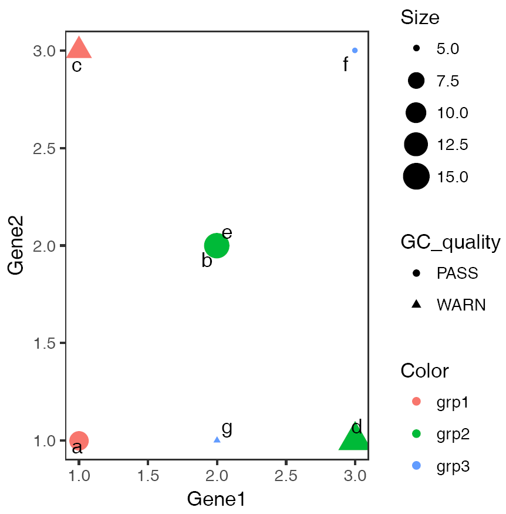
```

如果横纵轴为字符串，且有重复, 则需指定参数`-J TRUE`以错开重叠的点，具体如下

```bash
# -O: 指定X轴变量的顺序, 默认是字母顺序
# 其它列或其它属性的顺序也可以用相应的方式指示，具体看程序的帮助提示
# -c Gene1: 用特定基因的表达对点着色，单细胞分析图中常用
# -J TRUE: 见上
# -Z FALSE：默认使用geom_text_repel添加点的标记，及其智能，不会出现标签过多覆盖的情况
# 但对jitterplot，会有些冲突，所以在`-J TRUE`且出来的图中点的标签不符合预期时，设定
# 次参数为FALSE，使用geom_text标记点。

sp_scatterplot2.sh -f scatterplot.xls -X GC_quality -Y Base_quality \
		-O "'WARN', 'PASS'" -c Gene1 -w 10 -u 10 -J TRUE -L Samp -Z FALSE
```

```{r, echo=F}
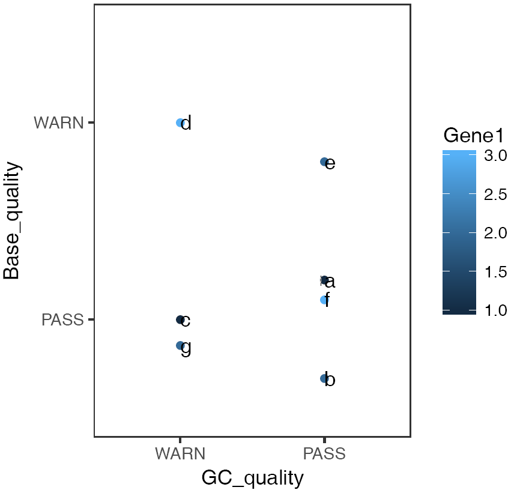
```

只有想不到，没有做不到，`sp_scatterplot2.sh`还可以完成更多你想做的散点图，而且只需调参数，无需改代码，简单可重用。

## 参考资料

* <http://rpubs.com/xuefliang/153247>
* <http://www.sthda.com/english/wiki/survminer-r-package-survival-data-analysis-and-visualization>
* <https://stackoverflow.com/questions/52446477/r-hclust-common-order-for-multiple-trees>
* <https://www.biostars.org/p/237067/>

