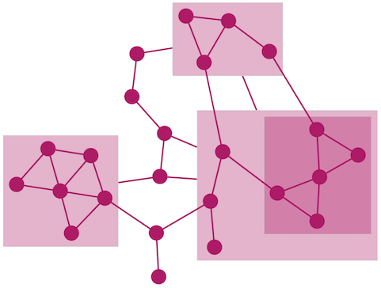

# 网络图 {#cytoscape}

Cytoscape已成为网络图绘制的核心工具，基因表达调控网络、蛋白互作网络、miRNA-gene调节关系、分析流程、组织架构等任何与网络、结构、层级有关系的事情都可以用Cytoscape来绘制。前期的教程中有[Cytoscape的基本使用](http://mp.weixin.qq.com/s/ZSoW7-qWs3BuSB7bkDnfmA)，[早期录制的Cytoscape视频教程, 含安装和基本使用](http://mp.weixin.qq.com/s/Q30mdC26UqffBcbtFxpnXg)，[更新录制的Cytoscape视频教程](http://mp.weixin.qq.com/s/sKEy_Pn9qnWw4W-aXraA5g)等。


这次主要以实际操作的形式来讲述Cytoscape的使用，内容以PPT教案为主。


下面是补充内容。

本次三个视频，截取不同的角度 (更多Cytoscape视频在B站: <https://space.bilibili.com/362709786>)。

### 基本操作 {#basic}

利用一个简单的组织构建图展示Cytoscape的基本使用，导入网络、导入节点属性，更改点的形状、颜色，在点上插入图片、绘制饼图、柱状图、加入颜色条纹，点的手动对齐、横向分布等。

网络文件和节点属性文件都是正常矩阵格式，若有中文需使用UTF-8编码；若非EXCEL文件，不能有xls后缀。

<https://imgcache.qq.com/tencentvideo_v1/playerv3/TPout.swf?max_age=86400&v=20161117&vid=p0541x250n9&auto=0>


### miRNA-mRNA调控网络 {#mirna}

Cytoscape可用于绘制基因共表达网络，这儿选取miRNA-gene调控网络 (含miRNA-gene表达相关性数据)做为例子，涉及到根据表达变化倍数对每个点进行着色、根据表达相关性对线进行着色、miRNA和靶基因采用不同的形状表示、微调获得合适的展示图形、结果导出PDF格式、导出图例等。

<https://imgcache.qq.com/tencentvideo_v1/playerv3/TPout.swf?max_age=86400&v=20161117&vid=z0541oby69q&auto=0>

### 不同的布局的调试和修改 {#layout}

网络绘制根据网络图的大小、展示的用意可以选择合适的布局。Cytoscape提供了多种布局算法，具体见[http://manual.cytoscape.org/en/stable/Navigation_and_Layout.html](http://manual.cytoscape.org/en/stable/Navigation_and_Layout.html)。

下面列出几种示例

#### Attribute Circle Layout {#circle}

属性环展示方式所有的节点都在环上，适用于点比较少的时候。环上点的顺序可以根据某一列来调整。

```{r, echo=F}

```

#### Group Attributes Layout

先按某一列的值对点进行分组，每个分组的点成为一个独立的环。在区分上下调基因时，可以按这个来分类，看不同类的基因的调控关系。


```{r, echo=F}
knitr::include_graphics("images/group_by_attributes_layout.png")
```

#### Prefuse Force Directed Layout

通常也可以获得比较好的结果，相连的点邻接，其它点较远。同时可以根据某一列设置边的强度作为连线的长度。

```{r, echo=F}
knitr::include_graphics("images/force_layout.png")
```

#### Compound Spring Embedder Layout

复杂网络适用这个，尤其是连线特别多时。

```{r, echo=F}

```

#### Edge-weighted Spring-Embedded Layout

所有的边视为连接2个节点的弹簧。每一个弹簧有一个松弛状态下的期望长度 (resting length)和压缩强度。算法会迭代所有的弹簧，并进行仿真模拟获得每个弹簧的最佳长度。是比较常用的一种，其获得结果也是一个环，但对空间的利用比下面两种要好。

```{r, echo=F}

```

#### yFiles Organic Layout

也是一种Spring-embeded的算法，可以展示网络图的聚类结构。

```{r, echo=F}
knitr::include_graphics("images/yOrganic.png")
```


https://imgcache.qq.com/tencentvideo_v1/playerv3/TPout.swf?max_age=86400&v=20161117&vid=w05410fbsys&auto=0


## 参考

1. [Cytoscape的基本使用](http://mp.weixin.qq.com/s/ZSoW7-qWs3BuSB7bkDnfmA)
2. [早期录制的Cytoscape视频教程, 含安装和基本使用](http://mp.weixin.qq.com/s/Q30mdC26UqffBcbtFxpnXg)
3. [http://blog.genesino.com/2012/04/cytoscape-basic-usage/](http://blog.genesino.com/2012/04/cytoscape-basic-usage/)
4. [http://manual.cytoscape.org/en/stable/Navigation_and_Layout.html](http://manual.cytoscape.org/en/stable/Navigation_and_Layout.html)
5. [https://www.slideshare.net/keiono/introduction-to-biological-network-analysis-and-visualization-with-cytoscape-part1](https://www.slideshare.net/keiono/introduction-to-biological-network-analysis-and-visualization-with-cytoscape-part1)
6. [新出炉的Cytoscape视频教程](http://mp.weixin.qq.com/s?__biz=MzI5MTcwNjA4NQ==&mid=2247484194&idx=1&sn=61bcbe1c48e195c5c830396865789723&chksm=ec0dc6a8db7a4fbeaa9cdd7245127edd382f3e4d13a61636c2cbc52062b32d7565bf282fca5e#rd)
