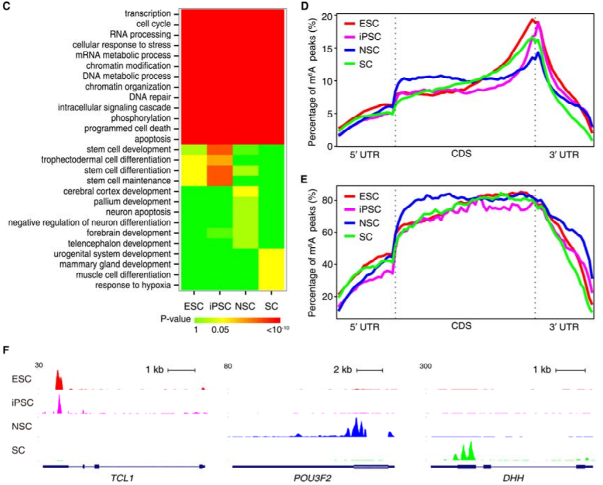
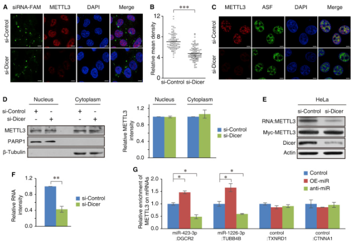
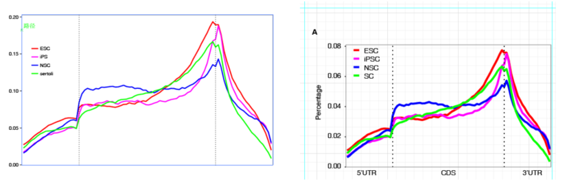
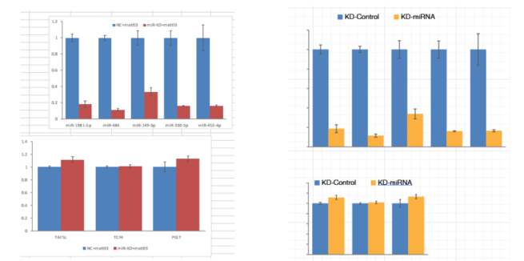
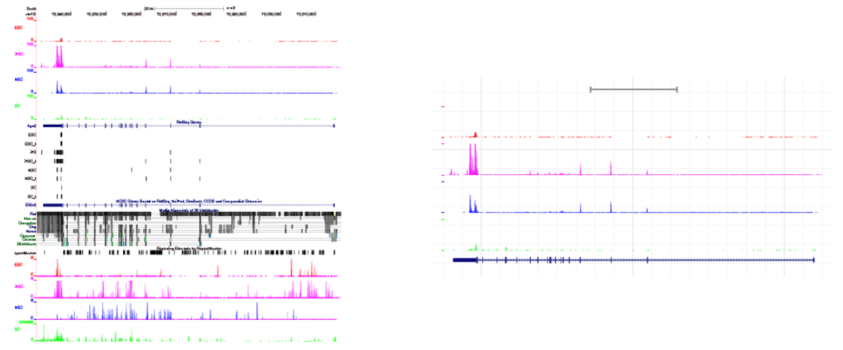
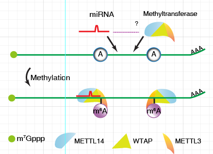

# 图形排版 {#AI}

成果发表是科研过程中不可缺的一部分，发表成果又少不了图形展示。文章图表排版是否整齐规范、协调一致、重点突出对一篇文章的发表也是有不少贡献的。此外做科研的人都爱看脸，文章中的图表是重要的颜面之一。生信宝典系列文章中，[R作图](https://mp.weixin.qq.com/s/bsvB1k17Izom2ldgdwXrdg)也是受到最多欢迎的一部分。

读文献时，看到文章中的图，就一直好奇是怎么拼出来的，尤其是怎么保证图形中字体的大小一致的。如果是统一用R画图，也许可以实现这一点，设置一样的字体、一样的长宽，这样只要图形缩放比例一致，字体理论上也一致。或者使用`cowplot`, `gridExtra`, `ggpubr`等工具也可以组合多个图倒一起 (像前面的示例)。但不同的图有不同的边缘设置，实际操作起来，却也不总是顺利。高手们，比如推出[生信宝典傻瓜系列](http://mp.weixin.qq.com/s/LPWaxbKuS-XlvzkSE-MupQ)的海哥擅用PPT进行修改排版，我学了下，没学会。后来查阅资料，发现有这么一款工具很强大，`Adobe Illustrator`简称`AI`~~，翻译成汉语就是`人工智能`~~。

著名的`Adobe`公司出品，应该都不陌生。试用后（买不起，也只能用试用版；如果有钱，还是推荐购买正版，维护原作者的权益），发现果然很强大。


### 矢量图和标量图

**矢量图**是使用直线和曲线来描述图形, 这些图形的元素是一些点、线、矩形、多边形、圆和弧线等等, 它们都是通过数学公式计算获得的。矢量图形最大的优点是无论放大、缩小或旋转等不会失真；最大的缺点是难以表现色彩层次丰富的逼真图像效果。常见的矢量图有`PDF`, `SVG`, `EPS`等格式。如果图形中有文字, 并且文字可以复制, 则可初步判断为矢量图。

矢量图的任何一个地方都可以挑出来修改，某个边框不好看，删掉；线条的粗细不统一，设置成一样的；某条线的颜色想重点突出下，单独修改 (这部分最好还是在画图时就修改好，会更协调，当然AI也没问题)；图中有了多余的元素，删掉；添加文字、设置成统一字体、统一大小更没问题；画个简单的模式图，没问题；不同的子图拼在一起，没问题；自此，再也不愁文章的拼图了。


与矢量图相对应的就是**标量图**了, 常见的`png`, `jpg`, `gif`格式等, 是由像素点构成, 放大到一定程度会出现马赛克效果。图中的文字不可复制, 元素不可拆分。

### 矢量图的制作

* 常规图：
    * `Excel`, 生成的图可以直接拷贝到`AI`里面修改
    * `R`, `Perl`, `Python`等程序语言输出`pdf`, `eps`格式的图 (详见公众号中[R作图系列](http://mp.weixin.qq.com/s/zUS5dSa6cAQqR48XVJrt-g))

* 常用工具的出图
    * 二代测序出图  `UCSC` – `PDF`; `IGV` – `SVG`; `epigenomegateway` - `SVG`; 在高通量数据可视化文章中也有介绍
    * Motif   `Weblogo` - `eps` 
    * 作图软件 Graphpad

	
### 矢量图编辑工具

主要有 `Gimp`, `Adobe illustrator`, `Inkscape`, `image magik`, `photoshop`, `latex`。适用之后, 从稳定性还是易用性来讲, `Adobe illustrator`是最好的一款。但是是收费软件, 在线会有一些试用版, 供测试时用。


### 作图基本原则

* 图形中文字的字体保持统一, 一般使用`Helevetica`或`Arial`
* 符号一般使用`Symbol`字体, 常见符号有 `′`, `β`等
* Panel的字号(A,B,C,D)一般比其余的文字大一号, 上下左右对齐
* 文字特别密集的地方字体可适当缩小, 原则是看着协调
* 图和图之间的距离在空间允许的情况下尽可能的大

```{r, echo=F}

```

* 一篇文稿所有柱状图理论上柱子的宽度保持一致
* 柱状图的`Error bar`宽度一致
* 坐标轴上的刻度尺宽度, 长度一致
* 坐标轴的宽度、颜色一致
* 胶图的泳道对齐

```{r, echo=F}

```

### 作图中的要点注意

* 标准化, 便于位置调整
    * 从最开始作图, 到文章投稿、修改、定稿, 中间会不断调整, 子图会根据文章需要不断删减, 调整位置。因此标准化之后, 就可以很简单的互换位置就可以了
    * 每个子图的长宽尽量一致
    * 每个相似子图内部元素的特征一致, 比如柱子的宽度 (`6 mm`), 柱子之间的距离, 坐标轴的刻度的宽度 (`0.7 mm`), 误差线的宽度 (`1 mm`), P-value连接线宽度 (`6 mm`), 胶图泳道的宽度等

* 合理利用对齐工具, 左右对齐、横向分布、纵向分布等, 即保证对齐效果, 又免去人为调整的繁琐
* 在选择单个元素时尽量使用直接选择工具
* 作图要做到自己满意, 自己对自己负责；当你觉得一个地方不合适需要调整时, 一定要及时修改；如果怕麻烦现在没调整, 过几天别人发现或自己觉得不舒服也还是会再调整的。所有要做好充足的准备和充足的工作
* 保留备份, 保留备份, 保留备份.每次大的修改都要保留原始版本, 因为不知道明天是否还会改回来


### `Adobe Illustrator`中的基本概念和操作描述

1. **编组**：性质相似或者需要同时修改的部分可以编为一组，方便处理。双击一组内容，就可以进入编组内部，对编组的每个元素修改；并且编组外的元素处于屏蔽状态，操作起来不会受到干扰。
2. **剪切蒙版**：如果想剪切掉图中的某一部分，可以绘制一个矩形、圆形或任意不规则形状覆盖住**需要保留**的部分，然后同时选中这两个元素（绘制的形状框在被剪切的图之上），按右键，选择剪切蒙版，就可以完成剪切操作。而在修改图时，也可以不断的释放剪切蒙版，方便对不同图层的操作。
3. **直接选择工具**：可以无视编组和剪切蒙版，对选中并且只是选中的部分进行操作。这在删除多余的内容和边框时会经常用到。
4. **魔棒工具**： 选择类似属性的组分，统一操作。
5. **吸管工具**：给一个组分赋予另一个组分的属性。
6. **对齐工具**：用于组分的对齐和分布，在设置坐标轴的标记文字时很有用，省去了一个个手动对齐的操作。只要对齐两端，按一下按钮中间的内容就自动与刻度线对齐了。
7. 其它的就靠大家不断的尝试、体验、操作了。多选、多点、多查，慢慢就都熟练了。


另外翻阅到之前准备文章期间做的图形排版教程。当时每天都在不断的调整图和排版, 心得体会比现在更多些, 也录制了视频, 但是无声版, 录制完之后为`EXE`格式。如果您已观看过[文章用图的修改和排版](http://mp.weixin.qq.com/s/IJNyhinakY0lSXgCN7b9ug)视频教程, 也自己操作过, 有了一定基础, 还想进一步的了解, 可以看看这份无声版的记录是否能有些帮助。


### 视频教程

(更多视频在B站：<https://space.bilibili.com/362709786>)

第一个视频以[绘制的线图](http://mp.weixin.qq.com/s/D0b1gBoho5bnuDdsBRpA4g)为例，展示如果修改、调整矢量图的每个部分。`ggplot2`出品的矢量图整体逻辑比较清晰，一层层的叠加，修改起来也比较方便，没有太多难点；关键是熟悉用到的按钮的使用方式和快捷键的操作。

<https://imgcache.qq.com/tencentvideo_v1/playerv3/TPout.swf?max_age=86400&v=20161117&vid=m0548j1ufql&auto=0>

第二个视频以[UCSC绘制的测序峰图](http://mp.weixin.qq.com/s/b7Cppdm-vMTgZfFVC3Q1lQ)为例，展示如何对稍微复杂一些的图进行修改、删除多余内容。

<https://imgcache.qq.com/tencentvideo_v1/playerv3/TPout.swf?max_age=86400&v=20161117&vid=z0548i168ie&auto=0>


第三个视频是剪切蒙版的使用和针对其它不同类型图的特殊操作。

<https://imgcache.qq.com/tencentvideo_v1/playerv3/TPout.swf?max_age=86400&v=20161117&vid=e0548h4prm2&auto=0>

### 动图教程

左边是修改前的, 右边是成品或近成品截图。

1. AI编辑线图.exe

```{r, echo=F}

```
2. AI_柱状图.exe

```{r,echo=F}

```

3. AI_UCSC.exe

```{r,echo=F}

```

4. AI_设计.exe

```{r, echo=F}

```

5. 图形导出

   可以导出为PDF、TIFF格式；最好用**PhotoShop**导出, 分辨率高, 文件小。

6. 视频文件统一下载地址：链接: <https://pan.baidu.com/s/1dFcWadV> 密码: (b4mw)


## 参考

1. [教师节献礼 - 文章用图的修改和排版](https://mp.weixin.qq.com/s/IJNyhinakY0lSXgCN7b9ug)
2. [简单强大的在线绘图](http://mp.weixin.qq.com/s?__biz=MzI5MTcwNjA4NQ==&mid=2247484624&idx=1&sn=7f97f3cd03d6891f71ac3bb778ad84bb&chksm=ec0dc15adb7a484c0c1a3cfe25892c22d3ffc21276d7ac8ed5794f020b99003a86b3c6d5bc31#rd)
3. [文章用图的修改和排版(二)](http://mp.weixin.qq.com/s/HTsufk71U3wf14OOWSKEeQ)
4. [论文图表基本规范](http://mp.weixin.qq.com/s/SCT4oso_vI0UNIJZTaG95g)


