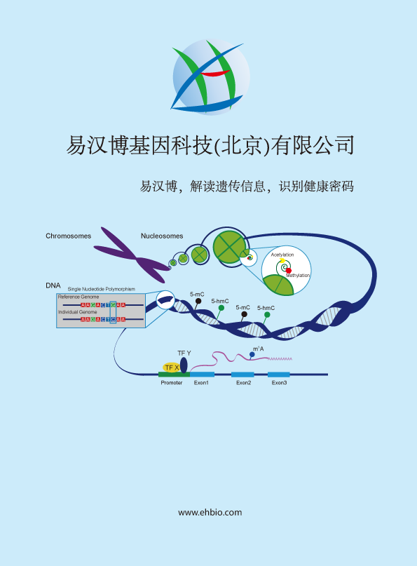

--- 
title: "R Cytoscape AI生信作图分析培训"
author: 
- "易生信培训团队"
- "联系我们: train@ehbio.com"
date: "`r Sys.Date()`"
documentclass: article
site: bookdown::bookdown_site
---

```{r setup1, include=FALSE}
library(knitr)
output <- "html"
html = FALSE
latex = FALSE
opts_chunk$set(echo = TRUE, out.width="100%", fig.align="center", fig.show="hold", warning=FALSE, message=TRUE)
if (output=="html") {
	html = TRUE
}
if (output=="latex") {
	opts_chunk$set(out.width="95%", out.height='0.7\\textheight', out.extra='keepaspectratio', fig.pos='H')
	latex = TRUE
}
knitr::opts_chunk$set(cache=TRUE, autodep=TRUE)
mtime <- function(files){
  lapply(Sys.glob(files), function(x) file.info(x)$mtime)
}
set.seed(0304)
```

```{asis, echo=html}

# EHBIO Gene Technology {-}

```

```{r cover, echo=F, eval=html, out.width="99%"}


```

